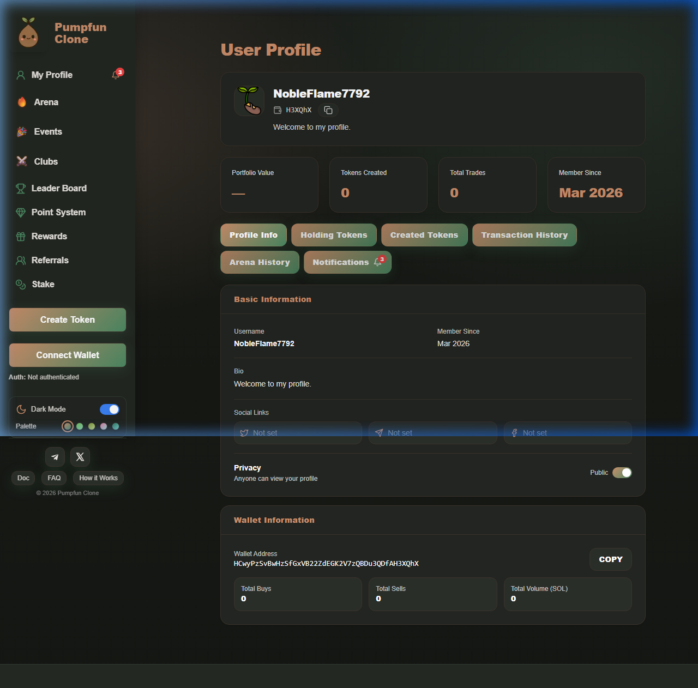
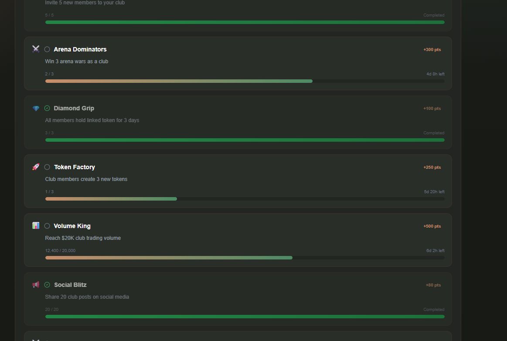

# Tổng quan chức năng

-   FR-001: Danh sách Token
    
-   FR-002: Chi tiết Token
    
-   FR-003: Chức năng Buy/Sell
       
-   FR-004: Hồ sơ của tôi (My Profile) - **NEW: Privacy Settings**
    
-   FR-005: Hồ sơ Công khai (Public profile của một user bất kỳ) - **NEW: Private Profile Handling**
    
-   FR-006: Bảng điều khiển Creator (Quản lý token cho creator)
    
-   FR-007: Tạo Token
    
-   FR-008: Màn hình Leaderboard (top token)

-   FR-009: Phần thưởng & Games (Rewards)
    
-   FR-010: Giới thiệu (Referrals)
    
-   FR-011: Điểm thưởng (Points)

-   FR-012: Arena / Prediction Market

-   FR-013: Events & Quests

-   FR-014: Clubs

-   FR-015: Staking *(⚠️ xem xét bỏ khỏi MVP)*

 ----------   

# GLOBAL COMPONENTS

## G.1. Sidebar Navigation

**Mô tả:**  
Sidebar cố định bên trái.

**Yêu cầu:**
- Logo + Brand
- My Profile (badge notification count)
- Arena, Events, Clubs
- Leader Board, Point System, Rewards, Referrals, Stake
- CTA buttons: "Create Token" (green), "Connect Wallet" (green)
- Auth status: "Auth: Not authenticated" / "Auth: Authenticated"
- Dark/Light Mode toggle
- Palette selector (5 options: Seed, Sprout, Bud, Bloom, Canopy)

## G.2. Wallet Connection

**Mô tả:**  
Modal cho phép user connect wallet để sử dụng các chức năng yêu cầu xác thực.

**Yêu cầu:**
- Hỗ trợ các ví như: **Phantom**, **Solflare**
- Khi chưa connect: các chức năng bị blocked: Create Token, Point System, Rewards & Games, Chat

## G.3. Theme System

**Mô tả:**  
Hệ thống theme cho phép user tùy chỉnh giao diện.

**Yêu cầu:**
- Dark/Light toggle
- 5 color palettes thay đổi tone chủ đạo: Seed, Sprout, Bud, Bloom, Canopy

## G.4. Top Banner

**Mô tả:**  
Banner marquee chạy liên tục ở đầu trang.

**Yêu cầu:**
- Text marquee: ví dụ: "MEMECONOMY • FAIR LAUNCH • NO BOT DRAMA • PUMP FUN CLONE..."
- Token list carousel phía dưới

----------


# FR-001: DANH SÁCH TOKEN

## 1. Mô tả

Trang chính để users khám phá, lọc và tìm kiếm tokens. Hiển thị danh sách tokens dưới dạng cards hoặc grid với các thông tin quan trọng như giá, market cap, volume, và trust level.

**User Story:**

```
Là một user,
Tôi muốn duyệt danh sách tokens với nhiều cách filter và search khác nhau,
Để có thể tìm được tokens phù hợp để mua.
```
## 2. Giao diện


## 3. ĐIỂM TRUY CẬP (ENTRY POINTS)

Users có thể truy cập Token List từ:

1.  **Home page** - Landing page mặc định
2.  **Navigation menu** - Click logo của web

**Default:** Tab Discover được active khi vào lần đầu *(Hiện tại đang là Trending)*

## 4. YÊU CẦU CHỨC NĂNG

### 3.1. Danh sách các Tabs

**FR-TL-001.1: Hiển thị Tab Navigation**

**Mô tả:**  
Cung cấp 5 tabs để users chọn cách xem tokens khác nhau: *(Đang lệch so với FRD: Discover/Trending/Top Volume/Graduated/Favorite → Trending/Market Cap/Finalized/New/Trending Arena)*

**Yêu cầu:**

- Hiển thị 5 tabs:
  1. Discover (mặc định)
  2. Trending
  3. Top Volume
  4. Graduated
  5. Favorite

- Active tab có visual indicator rõ ràng (background, underline, hoặc border)
- Chuyển tab reset pagination về page 1
- Chuyển tab giữ nguyên filters và search query

**Empty States theo Tab:**
-   **Graduated:** "Chưa có token nào đạt graduation ($69K MC)"
-   **Favorite:** "Bạn chưa có token yêu thích nào"

**Acceptance Criteria:**

-   [ ] 5 tabs hiển thị token đúng theo quy định của tab đó
-   [ ] Điều kiện filter, sort hiện tại được giữ nguyên khi refresh
----------

### 3.2. Công thức hiển thị của các tab

**FR-TL-001.2: Tính toán DiscoverScore**

**Công thức:**

```
DiscoverScore = BuyVolume24h × (1 + PriceChange24h / 100) + TrustBonus
```

**TrustBonus:** *(3 badges: LP Lock, Audit, Freeze Disabled)*

| Badge | Bonus |
|---|---|
| Không có | +0 |
| 1 badge | +10 |
| 2 badges | +20 |
| 3 badges | +30 |

**Ví dụ:**

| Token | BuyVol24h (SOL) | PriceChange24h | TrustBonus | DiscoverScore |
|---|---|---|---|---|
| BONK2 | 500 | +40% | +30 (3 badges) | 500 × 1.4 + 30 = **730** |
| DOGE3 | 800 | -20% | +0 | 800 × 0.8 + 0 = **640** |
| MOON | 200 | +100% | +10 (1 badge) | 200 × 2.0 + 10 = **410** |
| PEPE9 | 50 | +5% | +20 (2 badges) | 50 × 1.05 + 20 = **72.5** |

→ Xếp hạng: BONK2 > DOGE3 > MOON > PEPE9

**Cơ chế hiển thị (slot 80/20):**

Mỗi trang 20 token:
- **16 slot Hot** → DiscoverScore cao nhất
- **4 slot Big** → Market Cap cao nhất (chưa có trong Hot)
- Xen kẽ đều: cứ 5 token thì 1 token Big

```
Hot Hot Hot Hot [Big] Hot Hot Hot Hot [Big] Hot Hot Hot Hot [Big] Hot Hot Hot Hot [Big]
```

**Vận hành:**
- Tính lại mỗi **10 phút**, cache kết quả
- Không có ngưỡng loại — token yếu tự rơi cuối

**Acceptance Criteria:**

-   [ ] DiscoverScore tính đúng theo công thức
-   [ ] Slot 80/20 xen kẽ đúng pattern
-   [ ] Scores recalculate mỗi 10 phút
-   [ ] Cache hoạt động đúng

**FR-TL-001.3: Tab trending**

**Mô tả:**  
Tính toán công thức để đưa token vào tab Trending

**Công thức:**

```
TrendingScore = (Vol24h * 5) + (BuyCount24h * 3) + (PriceChange24h% * 2)
```


**Yêu cầu:**

```
- Tính TrendingScore cho mọi token
- Sắp xếp tokens theo TrendingScore giảm dần
- Tính lại scores mỗi 10 phút
- Cache scores để tránh tính lại mỗi request
- Update danh sách mà không làm gián đoạn scroll của user
```

**Acceptance Criteria:**

-   [ ] TrendingScore tính đúng theo công thức
-   [ ] Tokens sắp xếp giảm dần theo TrendingScore
-   [ ] Scores recalculate mỗi 10 phút
-   [ ] Cache hoạt động đúng

**FR-TL-001.4: Tab Top Volumn, Graduated, Favorite**

**Mô tả:**  
Hiển thị đúng như tên gọi.

----------

### 3.3. Hiển thị Token Card ở màn list

**FR-TL-001.5: Token Card Information**

**Mô tả:**  
Mỗi token hiển thị dưới dạng card với các thông tin quan trọng để user đánh giá nhanh.

**UI:**  

**Yêu cầu:**


Mỗi token card hiển thị:

1. Avatar Token

2. Tên Token
   - Typography: Bold, prominent

3. Symbol Token
   - Chữ hoa
   - Có thể có prefix

4. Token short statement

> **⚠️ MVP:** Statement ❌ chưa hiển thị trên card

5. Price
   - Format theo giá trị:
     * < $0.01: 6 decimals ($0.000123)
     * $0.01 - $1: 4 decimals ($0.1234)
     * >= $1: 2 decimals ($12.34)
   - Prefix: $

> **⚠️ MVP:** Price USD ❌ chưa hiển thị trên card

5. Market Cap
   - Rút gọn K/M/B:
     * < 1K: Full number
     * >= 1K: $12.5K
     * >= 1M: $1.2M
     * >= 1B: $2.3B
   - 2 decimals sau rút gọn
   - Label: "MC: "

6. Volume 24h
   - Format giống Market Cap
   - Label: "Vol: "
   - Update mỗi 30s

7. Price Change 24h
   - Format: ±X.XX%
   - Màu sắc:
     * Dương (>0): Xanh lá
     * Âm (<0): Đỏ 
     * Bằng 0: Xám 
   - Icon: ↑ hoặc ↓

> **⚠️ MVP:** Price Change 24h ❌ chưa hiển thị trên card

8. Trust Level Badges (nếu có)
   - Hiển thị badges nếu đạt tiêu chí:
     * 🔒 LP Locked---
     * ✓ Audited
     * 🛡️ Freeze Disabled
   - Tooltip chi tiết khi hover
   - Compact display (icons only hoặc short text)

> **⚠️ MVP:** Trust Badges ❌ chưa triển khai

9. Favorite Button
   - Icon: ♡ (rỗng) hoặc ♥ (đầy)
   - Position: Top-right corner
   - Click toggle favorite

> **⚠️ MVP:** Favorite ❌ chưa có (cả nút và tab Favorite)
  
10. Tiến độ tốt nghiệp (Progress to DEX) *(✏️ edited: thêm chi tiết)*
    - Progress bar từ 0% đến 100%
    - Hiển thị tỷ lệ hoàn thành đến graduation

11. Created time *(✏️ new)*
    - Thời gian tạo token
    - Relative format: "2h ago"

Và card PHẢI:
- Clickable toàn bộ (trừ favorite icon)
- Hover effect: Shadow hoặc scale nhẹ

**Acceptance Criteria:**

- [ ] Tất cả các trường hiển thị đúng format
- [ ] Giá format theo các mức giá trị
- [ ] Rút gọn K/M/B hoạt động chính xác
- [ ] Price change màu sắc đúng
- [ ] Card hover effects mượt
- [ ] Layout responsive
- [ ] Performance tốt với 100+ cards


### 3.4. Nút Filter

**FR-TL-001.6: Custom Filters**

**Mô tả:**  
Users có thể áp dụng filters bổ sung trên kết quả tab để thu hẹp danh sách tokens.

**UI:**


**Yêu cầu:**

```
Hệ thống có 4 filters:

1. NSFW Content
   Loại: Toggle switch
   Tùy chọn: Hiện / Ẩn
   Mặc định: Ẩn (OFF)
   Hành vi:
   - OFF: Loại bỏ tokens được đánh dấu NSFW
   - ON: Bao gồm cả NSFW tokens

2. Market Cap và Volumn 24h Range *(Đang lệch: MVP chưa có)*
   Loại: Thanh trượt slide và ô textbox nhập giá trị trực tiếp. Giá trị phổ của slide của MC là từ 0 đến 50M+ usd. Của Volumn là từ 0 đến 50K+ usd.
   
3. Trust Level (nếu có) *(Đang lệch: MVP chưa có)*
   Loại: Multi-select checkboxes
   Tùy chọn:
   □ LP Locked
   □ Audited
   □ Freeze Authority Disabled
   □ Unverified (hiện tất cả)
   Mặc định: Tất cả checked
   Hành vi: OR logic - hiện tokens thỏa BẤT KỲ tiêu chí nào
   Nếu "Unverified" checked: Bỏ qua các trust filters khác

4. Live Toggle *(✏️ new: MVP có, FRD gốc không có)*
   Loại: Toggle switch
   Mặc định: OFF
   Hành vi:
   - ON: Chỉ hiển tokens đang có giao dịch active
   - OFF: Hiển tất cả tokens
   
VÀ filters PHẢI:
- Kết hợp với logic AND giữa các loại filter
  (NSFW filter) AND (MC filter) AND (Volume filter) AND (Trust filter)
- Áp dụng TRÊN kết quả tab hiện tại
- Flow: Tab → Filter → Search → Sort → Display
- Trigger refresh danh sách ngay khi thay đổi
- Reset pagination về page 1 khi thay đổi
- Hiển thị badge số filters đang active
- Có nút "Reset Filters" để xóa tất cả
```

**Acceptance Criteria:**

- [ ] 4 filters hiển thị và hoạt động đúng
- [ ] Filters kết hợp với AND logic
- [ ] Badge đếm active filters chính xác
---

### 3.5. Chức năng sắp xếp (Sorting)

> **⚠️ MVP:** Chức năng Sort ❌ chưa có nút Sort riêng biệt trên UI hiện tại.

**FR-TL-001.7: Sort Functionality**

**Mô tả:**  
Users có thể sắp xếp danh sách tokens theo các tiêu chí khác nhau qua việc click vào button Sort -> mở giao diện Sort Panel.

**Giao diện:**


**Yêu cầu:**

```
CHO user xem danh sách tokens
KHI user click nút Sort (bên cạnh nút Filter)
THÌ hệ thống PHẢI mở Sort Panel với:

Các tùy chọn sort:
○ Không sắp xếp (default)
○ Giá
○ Market Cap
○ Volume 24h
○ Ngày tạo

Toggle Direction Behavior:
- Mặc định: Tăng dần
- Click lần 1: Giảm dần (Cao → Thấp) ↓
- Click lần 2: Tăng dần (Thấp → Cao) ↑


VÀ sort PHẢI:
- Áp dụng cùng với: Tab → Filter → Search → Sort
- Không reset pagination (giữ scroll position)
- Hiển thị sort hiện tại trên nút Sort

Khi sort sẽ override hiển thị của tab hiện tại
```

**Acceptance Criteria:**

- [ ] Sort options hiển thị và hoạt động đúng
---

### 3.6. Tìm kiếm (Search)

**FR-TL-001.8: Search**

**Mô tả:**  
Tính năng search tiến hành search và cập nhật danh sách đầy đủ khi nhấn Enter.

**Giao diện:**


**Yêu cầu:**

```
CHO user ở Token List page
KHI user gõ vào search field và nhấn Enter

Hiển thị Search Results (Enter)

Khi user nhấn Enter hoặc click Search button:
- Xóa danh sách hiện tại
- Hiển thị loading skeleton
- Hiển thị kết quả bên dưới

Kết quả search:
- Bao gồm tất cả tokens khớp query
- Tuân filter constraints

VÀ search PHẢI:
- Hoạt động trên tất cả tabs
- Hỗ trợ ký tự đặc biệt trong query
```

**Business Rules:**

- Chỉ tokens public 


**Acceptance Criteria:**
- [ ] Enter update main list với results
- [ ] Số kết quả hiển thị chính xác


# FR-002: CHI TIẾT TOKEN

## 1. Mô tả

Trang chi tiết token hiển thị đầy đủ thông tin về một token cụ thể bao gồm chart giá, metrics, trust level, community chat, danh sách holders, lịch sử giao dịch, và trading panel.

**User Story:**

```
Là một trader,
Tôi muốn xem chi tiết đầy đủ về một token,
Để đánh giá và quyết định có nên mua/bán token này không.
```

----------

## 2. Giao diện


**MVP thực tế:**

## 3. ĐIỂM TRUY CẬP (ENTRY POINTS)

Users có thể truy cập Token Detail từ:

1. **Token List (FR-001)** - Click vào token card
2. **My Profile (FR-004)** - Holdings/Created/Staking tabs
3. **Public Profile (FR-005)** - Holdings/Created tabs
4. **Leaderboard (FR-008)** - Click vào token trong bảng xếp hạng
5. **Direct URL** - /token/[address]

----------

## 4. YÊU CẦU CHỨC NĂNG

### 4.1. Hiển thị meta data của Token

**FR-TD-002.1: Thông tin meta data của token**

**Mô tả:**  
Hiển thị thông tin cơ bản của token ở đầu trang.

**Yêu cầu:**

```
Header hiển thị:

1. Avatar Token
   - Ảnh đại diện token
   - Fallback: Default avatar nếu không có

2. Tên Token + Symbol
   - Format: "Token Name ($SYMBOL)"
   - Typography: Large, prominent

3. Creator Info
   - Avatar creator (nhỏ)
   - Username hoặc wallet address (rút gọn)
   - Click → Navigate to Public Profile (FR-005)
     * If creator's profile is PRIVATE: Show limited profile (lock icon message + created tokens only)
     * If creator's profile is PUBLIC: Show full profile based on granular settings
   - Label: "Created by"

> **⚠️ MVP:** Creator Info ❌, Description ❌, Favorite ❌, Social Links ❌ chưa hiển thị. Chỉ có: Avatar + Tên + Symbol, Progress to DEX, Contract Address + Copy + Solscan, Deployer Address, Created date, Current Price, Share button.

4. Token description (statement)

5. Favorite Button
   - Icon: ♡ (chưa favorite) / ♥ (đã favorite)
   - Click toggle → Update state
   - Login required
   - Sync với danh sách Favorite

6. Social Links (nếu có)
   - Website, Twitter, Telegram, Discord
   - Icon buttons
   - Click → Open in new tab

```

**Acceptance Criteria:**

- [ ] Hiển thị đầy đủ thông tin
- [ ] Creator link navigate đúng
- [ ] Social links mở đúng

----------

### 4.2. Biểu đồ Giá

**FR-TD-002.2: Price Chart**

**Mô tả:**  
Hiển thị biểu đồ giá token với các timeframe khác nhau.

**Giao diện:**
Dev tự quyết định  

**Yêu cầu:**
Dev tự quyết định

**Acceptance Criteria:**

- [ ] Chart hiển thị chính xác
- [ ] Timeframe switch hoạt động
- [ ] Interactions mượt
- [ ] Real-time updates đúng

----------

### 4.4. Trust Level (To be decided)

**FR-TD-002.4: Mức độ Tin cậy**

> **⚠️ MVP:** Trust Level / Trust Score ❌ chưa được triển khai. Không có score badge, không có trust badges trên UI.

**Mô tả:**  
Hiển thị overall trust score và các badges bảo mật.

**Yêu cầu:**

```
Trust Level hiển thị:

1. Overall TrustScore
   - Score: 0-100
   - Visual: Progress bar hoặc score badge
   - Color coding:
     * 0-49: Low (Red)
     * 50-79: Medium (Yellow)
     * 80-100: High (Green)

2. Trust Badges
   Hiển thị badges nếu đạt tiêu chí:
   
   A. LP Locked 🔒
      - % LP locked
      - Lock duration
      - Unlock date
   
   B. Audited ✓
      - Audit firm name
      - Audit date
      - Link to audit report
   
   C. Freeze Authority Disabled 🛡️
      - Confirmation status

3. Badge Details
   - Click badge → Tooltip hiển thị giải thích

```

**Acceptance Criteria:**

- [ ] TrustScore tính đúng
- [ ] Badges hiển thị chính xác
- [ ] Color coding đúng
- [ ] Tooltips hoạt động

----------

### 4.5. Community Chat

**FR-TD-002.5: Chat Tab**

**Mô tả:**  
Tab Chat nằm trong nhóm 3 tabs (Trades | Chat | Holders) bên dưới chart. Cho phép users comment về token.

**Yêu cầu:**

```
1. Message List
   - Hiển thị danh sách messages theo thời gian
   - Format mỗi message:
     * Avatar user
     * Username (click → Public Profile)
     * Nội dung message
     * Timestamp (relative: "2m ago")
   - Scroll up để load thêm history

2. Send Message
   - Input field dưới cùng
   - Yêu cầu đăng nhập (Connect Wallet)
   - Enter to send

3. Empty State
   - Khi chưa có message: hiển thị "No comments yet"
```

**Acceptance Criteria:**

- [ ] Tab Chat hiển thị đúng trong nhóm Trades/Chat/Holders
- [ ] Messages hiển thị đúng format
- [ ] Yêu cầu login khi gửi message
- [ ] Click username → navigate to profile

----------

### 4.6. Holders List

**FR-TD-002.6: Danh sách Holders**

**Mô tả:**  
Hiển thị top holders của token với thông tin chi tiết.

**Giao diện:**


**MVP thực tế:**


**Yêu cầu:**

```
Holders List hiển thị:

1. Summary Stats
   - Total holders
   - Top 10 concentration % (risk indicator - top 10 chiếm bao nhiêu phần trăm)

2. Top 100 Holders Table
   Columns:
   - Rank
   - Avatar + Username/Address
   - Balance (số lượng tokens)
   - % of supply
   - Badges (xem xét):
     * 👑 Creator
     * 🐋 Whale (>5% supply)
     * 💎 Diamond Hands (hold >30 days)

3. Features
   - Click holder → Public Profile (FR-005)
     * If holder's profile is PRIVATE: Show limited profile (lock icon + created tokens)
     * If holder's profile is PUBLIC: Show full profile based on privacy settings


VÀ holders list PHẢI:
- Top 100 only (performance)

```

> *Xem xét sau: hiển thị tỉ lệ phân bố holders (Top 10 concentration %)*

**Acceptance Criteria:**

- [ ] Holders list hiển thị đúng
- [ ] Click holder → navigate to profile

----------

### 4.7. Transaction History

**FR-TD-002.7: Lịch sử Giao dịch**

**Mô tả:**  
Hiển thị 50 transactions gần nhất của token.

**Giao diện:**


**Yêu cầu:**

```
Transaction History hiển thị:

1. Transaction List (50 gần nhất)
   Columns:
   - Type: BUY (green) / SELL (red)
   - Timestamp (relative: "5m ago")
   - Trader:
     * Username (nếu có)
     * Address rút gọn (nếu không có username)
     * Click → Public Profile (FR-005)
   - Amount (số tokens)
   - Total Value (USD)
   - TX Hash:
     * Rút gọn
     * Click → Solana Explorer (new tab)

2. Highlights
   - Whale transactions (>5% of 24h volume):
     * 🐋 icon
   - First trade ever:
     * ⭐ icon

```

**Acceptance Criteria:**

- [ ] 50 transactions load đúng
- [ ] Trader links navigate đúng
- [ ] TX hash links đúng explorer
- [ ] Whale highlights đúng

----------

### 4.8. Trading Panel

**FR-TD-002.8: Panel Giao dịch**

**Mô tả:**  
Trading panel hiển thị cố định bên phải.

**Yêu cầu:**

```
Trading Panel:
- Position: Fixed bên phải màn hình
- Luôn visible khi scroll
- Chi tiết xem FR-003: Chức năng Buy/Sell

Buttons:
- BUY button: Enabled luôn (login + wallet required)
- SELL button: Enabled khi user có balance > 0

VÀ trading panel PHẢI:
- Sync với token hiện tại
- Display current price real-time
```

**Acceptance Criteria:**

- [ ] Panel hiển thị cố định bên phải
- [ ] BUY/SELL buttons state đúng


----------

**END OF FR-002**

# FR-003: CHỨC NĂNG BUY/SELL

## 1. Mô tả

Trading panel cho phép user mua (BUY) hoặc bán (SELL) token ngay lập tức với Market Order hoặc đặt lệnh với giá mục tiêu thông qua Limit Order.

**User Story:**

```
Là một trader,
Tôi muốn có thể mua hoặc bán token nhanh chóng.
```

----------

## 2. Giao diện


**MVP thực tế:** (Panel nằm trong Token Detail page)


----------

## 3. ĐIỂM TRUY CẬP (ENTRY POINTS)

Nằm trong màn hình Token Detail page (FR-002):

----------

## 4. YÊU CẦU CHỨC NĂNG

### 4.1. Trading Panel Layout

**FR-BS-003.1: Cấu trúc Panel**

**Mô tả:**  
Trading panel hiển thị với layout rõ ràng.

**Yêu cầu:**

```
Panel Structure:

1. Token Context
   - Token name + symbol
   - Current price (real-time)

2. Mode Selector - 2 tầng mode
   
   Tầng 1 - Buy/sell button:
   - [BUY] / [SELL] buttons
   - BUY: Green
   - SELL: Red
   - Click switch → Clear form
   
   Tầng 2 - Market order/Limit order:
   - Market / Limit toggle
   - Market: Default
   - Limit: Phụ, ít dùng hơn
   - Radio buttons hoặc small toggle

> **⚠️ MVP:** Market/Limit toggle ❌ không có. Chỉ có Market Order (swap đơn giản).

3. Form Area
   - Amount input
   - Preview card
   - Settings
   - Execute button
   - (Chi tiết ở sections sau)

VÀ panel PHẢI:
- Sticky scroll: Scroll cùng page hoặc fixed
- Responsive
```

----------

### 4.2. Market Order - Giao dịch Ngay

**FR-BS-003.2: Market Order Form**

**Mô tả:**  
Form giao dịch đơn giản, thực hiện ngay theo giá hiện tại.

**Giao diện:**


**Yêu cầu:**

```
Market Order Form bao gồm 4 phần:

═══════════════════════════════════════
PHẦN 1: AMOUNT INPUT
═══════════════════════════════════════

1. Currency Switch
   - Toggle: SOL ⇄ [TOKEN]
   - Default: SOL
   - Click để đổi currency
   - Position: Góc phải của label "Amount"

> **⚠️ MVP:** Currency Switch ❌, Quick Amount buttons ❌ chưa có. Chỉ có input số + MAX button.

2. Input Field
   - Type: Number

3. Quick Amount Buttons
   - SOL mode: 0.1 / 0.5 / 1 / MAX
   - Token mode: 25% / 50% / 75% / MAX
   - MAX = Balance - estimated fees

4. Balance Display
   - "Balance: X.XX SOL"
   - Real-time update
   - Small text dưới input

5. Swap Icon
   - Icon: ⇅
   - Click để swap From ↔ To

6. You Receive Field (Estimated)
   - Auto-calculate từ amount input
   - Format: ~XXX,XXX [TOKEN]


═══════════════════════════════════════
PHẦN 2: FEES (Collapsible)
═══════════════════════════════════════

Header:
- Chevron: ▼ (click to expand)

Content (khi expand):
- Solana network fee: ~0.00001 SOL
- Anti-MEV fee: 0.005 SOL (nếu enabled)
- Priority fee: +0.0001 SOL (nếu Fast)
- Priority fee: +0.0005 SOL (nếu Instant)

> **⚠️ MVP:** chưa có.

═══════════════════════════════════════
PHẦN 3: ADVANCED SETTINGS (Expandable)
═══════════════════════════════════════

Settings Icon (⚙️) - Click to expand/collapse:

A. Slippage Tolerance
   - Preset: 0.5% / 1% / 2% / 5% / Custom
   - Default: 2%
   - Range: 0.1% - 50%
   - Warnings:
     * < 0.5%: "May fail"
     * > 10%: "High slippage risk"

B. Anti-MEV Protection
   - Toggle: ON / OFF
   - Default: OFF
   - Fee: +0.5%
   - Update fees section khi toggle

C. Priority Fee (Speed)
   - Options: Normal (Free) / Fast / Instant
   - Default: Normal
   - Fast: +0.0001 SOL
   - Instant: +0.0005 SOL
   - Update fees section khi change

> **⚠️ MVP:** đang hiển thị Auto / Manual thay vì Normal / Fast / Instant

D. Auto-retry
   - Toggle: ON / OFF
   - Default: OFF
   - Max retries: 3

> **⚠️ MVP:** chưa có Auto-retry


═══════════════════════════════════════
PHẦN 4: EXECUTE BUTTON
═══════════════════════════════════════

Button:
- Text: "Buy [Amount] [Symbol]" / "Sell [Amount] [Symbol]"
- Color: Green (BUY) / Red (SELL)
- States:
  * Disabled: Invalid input
  * Enabled: Ready to trade
  * Loading: Transaction processing

VÀ market order PHẢI:
- Login + wallet required

```

> **⚠️ MVP:** Button chỉ hiển thị "Buy" / "Sell", chưa kèm Amount và Symbol

**Acceptance Criteria:**

- [ ] Form inputs work correctly
- [ ] Currency switch SOL ↔ Token works *(⚠️ MVP: chưa có)*
- [ ] Quick buttons set correct amounts *(⚠️ MVP: chỉ có MAX)*
- [ ] You Receive updates real-time
- [ ] Fees section expands/collapses *(⚠️ MVP: chưa có)*
- [ ] Advanced Settings expand/collapse
- [ ] Validation messages clear

----------

### 4.3. Limit Order - Đặt lệnh

> **⚠️ MVP:** Limit Order ❌ đã chốt bỏ khỏi MVP. Chỉ có Market Order (swap).

**FR-BS-003.3: Limit Order Form**

**Mô tả:**  
Form đặt lệnh với giá mục tiêu, thực hiện khi đạt giá.

**Giao diện:**


**Yêu cầu:**

```
Limit Order Form = Market Order Form + Target Price

═══════════════════════════════════════
Những phần khác ở LIMIT ORDER
═══════════════════════════════════════

1. TARGET PRICE/PERCENT FIELD (2 Input Modes)

   Toggle Button: [USD ⇄]
   - Click để switch giữa USD và % modes
   
   ────────────────────────────────────
   MODE A: Absolute Price (USD)
   ────────────────────────────────────
   Label: "Target Price [USD ⇄]"
   
   Input Display:
   ┌─────────────────────┐
   │ $ [0.00150_______]  │
   └─────────────────────┘
   
   Info Display (dưới input):
   - "+21.9% from current" (nếu target > current)
   - "-15.5% from current" (nếu target < current)
   - Color: Green (tăng) / Red (giảm)
   
   Reference:
   - "Current: $0.00123"
   
   User Action:
   - Nhập giá tuyệt đối mong muốn
   - System auto-calculate % difference
   
   ────────────────────────────────────
   MODE B: Percentage Change (%)
   ────────────────────────────────────
   Label: "Target Price [% ⇄]"
   
   Input Display:
   ┌─────────────────────┐
   │ [+21.9_______] %    │
   └─────────────────────┘
   
   Info Display (dưới input):
   - "= $0.00150" (calculated price)
   - Color: Always neutral
   
   Reference:
   - "Current: $0.00123"
   
   User Action:
   - Nhập % tăng/giảm
   - Dương (+20): Tăng 20%
   - Âm (-10): Giảm 10%
   - System auto-calculate price
   
   ────────────────────────────────────
   Toggle Behavior:
   ────────────────────────────────────
   - Click [USD ⇄] → Switch mode
   - USD → %: Label changes, input re-format
   - % → USD: Label changes, input re-format
   - Calculation updates real-time

2. FEES SECTION (Collapsible)
   
   Header:
   - Label: "Fees (when executed)"
   - Chevron: ▼ (click to expand)
   - Mặc định: Collapsed (ẩn)
```

**Business Rules:**

```
Order Placement Flow:

1. User fills Amount + Target Price
2. System validates:
   - Amount > 0 and ≤ Available Balance
3. Send notification to user when order is executed

Order Lifecycle:

┌─────────────┐
│   CREATED   │ User places order
└──────┬──────┘
       │
       ▼
┌─────────────┐
│   ACTIVE    │ Monitoring price
└──┬───────┬──┘
   │       │
   │       └─────────────┐
   │                     │
   ▼                     ▼
┌─────────────┐   ┌─────────────┐
│  COMPLETED  │   │  CANCELLED  │
└─────────────┘   └─────────────┘
(Price reached)   (User cancelled)
```

**Acceptance Criteria:**

- [ ] Target Price field hiển thị đúng
- [ ] USD ⇄ % toggle works smoothly
- [ ] % difference calculated accurately
- [ ] Order placement flow được tiến hành đúng

----------
**Error Handling:**

```
Common Errors:

1. Insufficient Balance
   - Message: "Insufficient SOL balance"
   - Action: none

2. Slippage Exceeded
   - Message: "Price moved too much. Transaction failed."
   - Action: Retry button
   - Auto-retry if enabled

3. Network Error
   - Message: "Network error. Please retry."
   - Action: Retry button

4. Transaction Timeout
   - Message: "Transaction timeout. Check your wallet."
   - Action: Retry button

Retry Logic (if auto-retry ON):
- Retry up to 3 times
- Show retry attempt: "Retry 1/3..."
- If all retries fail → Show final error
```

**Success Flow:**

```
Market Order Success:

1. Success Modal Content:
   - ✅ "Transaction Successful!"
   - Transaction hash (clickable → Solana Explorer)
   - You Paid: X.XX SOL
   - You Received: XXX,XXX PSEED
   - 🎟️ +1 Reward Ticket earned
   - Close button

2. Auto Updates:
   - User balance updated
   - Token metrics refreshed
   - Transaction appears in history
   - Form cleared

3. User Actions:
   - Close modal → Continue trading
   - Click TX hash → View on explorer

───────────────────────────────────────

Limit Order Success:

1. Success Modal Content:
   - ✅ "Order Placed Successfully!"
   - Order ID
   - Target Price: $X.XXXX
   - Reserved Balance: X.XX SOL
   - "View in My Profile" button
```

**Acceptance Criteria:**

- [ ] Market order flow completes successfully
- [ ] Limit order flow saves to database
- [ ] Success modal shows correct info
- [ ] Error messages helpful and actionable
- [ ] Retry logic works (if enabled)
- [ ] Balance updates after trades

----------

### 4.5. Real-time Updates

**FR-BS-003.5: Cập nhật Real-time**

**Mô tả:**  
Trading panel updates real-time để reflect current market.

**Yêu cầu:**

```
Real-time Updates:

1. Current Price (Token Header)

2. Min Received (Market Order)

3. You Receive (Market Order)

4. Balance

5. Fees Section Content
   - Update when:
     * Anti-MEV toggled ON/OFF
     * Speed changed (Normal/Fast/Instant)
```

**Acceptance Criteria:**

- [ ] Price updates every xx second
- [ ] Min Received recalculates on input
- [ ] Balance updates after trades

----------

## 5. ĐIỀU KIỆN CHẤP NHẬN (ACCEPTANCE CRITERIA)

**Overall Trading Panel:**

- [ ] BUY/SELL toggle works
- [ ] Market/Limit toggle works *(⚠️ MVP: Limit Order đã chốt bỏ)*
- [ ] All inputs validate properly
- [ ] Preview calculates accurately
- [ ] Settings expand/collapse
- [ ] Transactions process successfully
- [ ] Error handling works
- [ ] Real-time updates smooth

**Data Accuracy:**

- [ ] Prices accurate
- [ ] Fees calculated correctly *(⚠️ MVP: chưa có Fees section)*
- [ ] Slippage applied properly
- [ ] Balance checks work

**User Experience:**

- [ ] Form clear and intuitive
- [ ] Error messages helpful

----------

**END OF FR-003**

# FR-004: HỒ SƠ CỦA TÔI (MY PROFILE)

## 1. Mô tả

Trang hồ sơ cá nhân cho phép user xem các token đang nắm giữ, token đã tạo, token đang stake, chỉnh sửa thông tin cá nhân, và quản lý các limit orders đang hoạt động.

**User Story:**

```
Là một user,
Tôi muốn xem và quản lý hồ sơ cá nhân của mình,
Để theo dõi portfolio, chỉnh sửa thông tin, và quản lý các lệnh đang chờ.
```

----------

## 2. Giao diện


**MVP thực tế:**


----------

## 3. ĐIỂM TRUY CẬP (ENTRY POINTS)

Users có thể truy cập My Profile từ:

1. **Main Navigation** - Click avatar/username hoặc "My Profile" menu
2. **Direct URL** 

**Default:** Mở tab "Holding Tokens"

----------

## 4. YÊU CẦU CHỨC NĂNG

### 4.1. Page Layout

**FR-MP-004.1: Cấu trúc Trang**

**Mô tả:**  
Layout trang profile với tabs navigation.

**Yêu cầu:**

```
Page Structure:

1. Header Section
   - Avatar (large)
   - Username
   - Wallet address (rút gọn)
   - Copy wallet button
   - Bio (nếu có)

2. Stats Bar
   - Portfolio Value
   - Tokens Created
   - Total Trades
   - Member Since

3. Tabs Navigation (6 tabs)
   - Profile Info
   - Holding Tokens
   - Created Tokens
   - Transaction History
   - Arena History
   - Notifications (có badge count)
   
   Default: Profile Info tab active

VÀ page PHẢI:
- Login required (redirect if not)
```

**Acceptance Criteria:**

- [ ] Header hiển thị đúng thông tin user
- [ ] Stats bar hiển thị đúng
- [ ] 6 tabs hiển thị đầy đủ
- [ ] Tab switching mượt
- [ ] Default tab là Profile Info

----------

### 4.2. Holding Tokens Tab

**FR-MP-004.2: Danh sách Token đang Nắm giữ**

**Mô tả:**  
Hiển thị tất cả tokens mà user đang nắm giữ (balance > 0).

**Giao diện:**


**MVP thực tế:**


**Yêu cầu:**

```
Holding Tokens List:

1. Portfolio Stats (Top)
   - Total Value: $XXX,XXX
   - 24h Change: ±X.XX%
   - Total P&L: +$XXX (+X.X%)

2. Token List
   Mỗi token hiển thị:
   - Avatar
   - Name + Symbol
   - Balance (số lượng)
   - Value (USD)
   - Current Price
   - 24h Change (%)
   - P&L (Profit/Loss):
     * Amount: +$XXX hoặc -$XXX
     * %: +X.X% hoặc -X.X%
     * Color: Green/Red/Gray

3. Empty State
   - "No holding tokens."

4. Click Behavior
   - Click token → Token Detail

```

**P&L Calculation:**

```
Cost Basis = Average purchase price × Balance
Current Value = Current price × Balance
P&L = Current Value - Cost Basis
P&L % = (P&L / Cost Basis) × 100
```

**Acceptance Criteria:**

- [ ] Portfolio stats chính xác
- [ ] P&L calculation đúng
- [ ] Click navigate đúng

----------

### 4.3. Created Tokens Tab

**FR-MP-004.3: Danh sách Token đã Tạo**

**Mô tả:**  
Hiển thị tất cả tokens mà user đã tạo (read-only view).

**Giao diện:**


**Yêu cầu:**

```
Created Tokens List:

1. Token Cards
   Mỗi token hiển thị:
   - Avatar
   - Name + Symbol
   - Created date (relative: "3 days ago")
   - Status: Active / Graduated
   - Market Cap (MC: $XXK)
   - Holders count
   - Volume (Vol: $XXK)

2. Join Arena
   - Toggle: ON / OFF
   - Label: "Join Arena"
   - Sub-label: "Not participating in arena" / "Participating in arena"

3. Empty State
   - "No created tokens."

4. Click Behavior
   - Click token → Token Detail

Note: 
- Đây chỉ là list view, READ-ONLY
- Quản lý token ở màn Creator Dashboard

```

**Acceptance Criteria:**

- [ ] List hiển thị all created tokens
- [ ] Click navigate đúng

----------

### 4.4. Transaction History Tab

**FR-MP-004.4: Lịch sử Giao dịch**

**Mô tả:**  
Hiển thị lịch sử giao dịch BUY/SELL của user.

**Giao diện:**


**Yêu cầu:**

```
Transaction History List:

1. Transaction Items
   Mỗi transaction hiển thị:
   
   - Type Badge:
     * BUY (green)
     * SELL (red)
   
   - Token Info:
     * Avatar
     * Name
   
   - Timestamp:
     * Relative time: "2h ago", "1 day ago"
   
   - Transaction Details:
     * Amount: +10,000 PSEED (BUY) hoặc -10,000 PSEED (SELL)
     * Value: 0.5 SOL
     * TX Hash (rút gọn): 7xK9...mP3q
   
2. TX Hash Link
   - Click → Solana Explorer (new tab)

3. Sorting
   - Mặc định: Newest first
   - Load more: Pagination

4. Empty State
   - "No transactions yet"
   - "Start trading to see your history"

5. Click Behavior
   - Click transaction → Solana Explorer

```

**Acceptance Criteria:**

- [ ] List hiển thị transactions chính xác
- [ ] Type badges (BUY/SELL) đúng màu
- [ ] TX hash links work
- [ ] Timestamps accurate
- [ ] Empty state helpful

----------

### 4.5. Profile Info Tab

**FR-MP-004.5: Thông tin hồ sơ & Wallet**

**Mô tả:**  
Tab hiển thị thông tin cá nhân và thông tin wallet. Có nút Edit Profile để chỉnh sửa.

> *👤 Đây là view của **owner** (xem profile chính mình). Khác với visitor view ở FR-005 § 4.2: owner có nút **Edit Profile** và thấy **Trading Stats** (Total Buys/Sells/Volume); visitor không có 2 mục này.*

**MVP thực tế:**


**Yêu cầu:**

```
Profile Info gồm 2 sections:

═══════════════════════════════════════
SECTION 1: BASIC INFORMATION
═══════════════════════════════════════

1. Username
   - Hiển thị username hiện tại
   - Chỉ set 1 lần duy nhất (lock sau khi save)

2. Member Since
   - Format: "Mar 2026"

3. Bio
   - Hiển thị bio của user
   - Chỉnh sửa qua nút Edit Profile

4. Social Links
   - Twitter (icon + URL hoặc "Not set")
   - Telegram (icon + URL hoặc "Not set")
   - Discord (icon + URL hoặc "Not set")

5. Privacy
   - Label: "Anyone can view your profile"
   - Toggle: Public (default) / Private
   - Public: Hiện full profile
   - Private: Ẩn profile, chỉ hiện created tokens

6. Edit Profile Button
   - Full-width button gradient
   - Click → mở form chỉnh sửa (Username, Bio, Social Links, Avatar)

═══════════════════════════════════════
SECTION 2: WALLET INFORMATION
═══════════════════════════════════════

1. Wallet Address
   - Hiển thị full address
   - COPY button

2. Trading Stats
   - Total Buys: số lượng
   - Total Sells: số lượng
   - Total Volume (SOL): tổng volume

```

**Acceptance Criteria:**

- [ ] Basic Information hiển thị đúng
- [ ] Social Links hiển thị icon + value
- [ ] Privacy toggle works (Public/Private)
- [ ] Edit Profile button mở form chỉnh sửa
- [ ] Wallet Address full + COPY works
- [ ] Trading stats hiển thị đúng

----------

### 4.6. Arena History Tab

**FR-MP-004.6: Lịch sử Arena**

**Mô tả:**  
Hiển thị lịch sử tham gia prediction market của user.

**MVP thực tế:**


**Yêu cầu:**

```
Arena History:

1. Stats Bar
   - Total Bets
   - Wins
   - Losses
   - Total Payout (SOL)

2. Bet List
   Mỗi bet hiển thị:
   - Icon trạng thái:
     * ↑ xanh  → WON
     * ↓ đỏ   → LOST
     * ⏱ vàng  → Pending/LIVE
   - Arena title (ví dụ: "BTC vs ETH — Weekly Showdown")
   - Pick: [choice] · [X days ago]
   - Bet amount: "Bet: X.X SOL"
   - Result badge: WON (xanh) / LOST (đỏ) / LIVE (cam)
   - Payout:
     * WON: +X.XX SOL (xanh)
     * LOST: -X.XX SOL (đỏ)
     * LIVE: "Pending" (vàng)

3. Load More
   - Button ở cuối danh sách

4. Empty State
   - "No arena bets yet"
```

> *Xem xét sau: thêm Filter (lọc theo ngày). MVP chưa có.*

----------

### 4.7. Notifications Tab

**FR-MP-004.7: Thông báo**

**Mô tả:**  
Hiển thị các thông báo liên quan đến hoạt động của user.

**MVP thực tế:**


**Yêu cầu:**

```
Notifications:
   
1. Badge Count
   - Hiển thị trên tab Notifications (ví dụ: 🔔3)
   - Cũng hiển thị trên sidebar "My Profile"
   - Chỉ đếm unread notifications

2. Notification List
   Mỗi notification hiển thị:
   - Icon theo loại:
     * 🎁 Rewards (Spin Reward Claimed, Tickets Converted)
     * ✕  Arena (Arena Bet Won, Arena Bet Lost)
     * ○  Events / System (New Event, Profile Updated)
     * 📈 Trading (Buy Order Filled, Sell Order Filled)
     * ⭐ Points (Daily Points Earned, Trading Volume Milestone)
   - Title (bold) + 🔴 red dot nếu unread
   - Description text
   - Timestamp (relative: "26 days ago")

3. Unread State
   - Background đậm hơn cho unread items
   - Red dot (●) cạnh title
   - Click vào → mark as read

4. Load More
   - Button ở cuối danh sách

5. Empty State
   - "No notifications yet"
```

**Acceptance Criteria:**

- [ ] Badge count đúng số unread
- [ ] Notification items hiển thị đúng icon + content
- [ ] Unread/read state phân biệt rõ
- [ ] Load more works

----------

## 5. ĐIỀU KIỆN CHẤP NHẬN (ACCEPTANCE CRITERIA)

**Overall:**

- [ ] All tabs functional
- [ ] Tab switching smooth
- [ ] Login required
- [ ] Responsive layout


**Interactions:**

- [ ] All clicks work
- [ ] Forms validate
- [ ] Empty states helpful

----------

**END OF FR-004**

# FR-005: HỒ SƠ CÔNG KHAI (PUBLIC PROFILE) *(⏳ Cần xác nhận MVP đã làm chưa)*

> **⚠️ MVP:** FR-004 và FR-005 đã **gộp thành 1 trang duy nhất** tại `/profile/[wallet_address]`. Không có trang riêng cho My Profile vs Public Profile. Cùng 1 layout, quyền edit chỉ hiển khi xem profile của mình.

## 1. Mô tả

Trang hồ sơ công khai hiển thị thông tin của một user bất kỳ, cho phép xem holdings, created tokens, và transaction history của 1 user bât kỳ.

**User Story:**

```
Là một user,
Tôi muốn xem thông tin công khai của users khác,
Để tìm hiểu về traders/creators và quyết định có follow strategies của họ không.
```

----------

## 2. Giao diện


**MVP thực tế:** (Gộp với FR-004, cùng layout)


----------

## 3. ĐIỂM TRUY CẬP (ENTRY POINTS)

Users có thể truy cập Public Profile từ:

1. **Token Detail (FR-002)** - Click creator info hoặc holder name
2. **Community Chat (FR-002)** - Click username trong chat
3. **Holders List (FR-002)** - Click holder name
4. **Transaction History (FR-002)** - Click trader name
5. **Referrals (FR-010)** - Click referred user
6. **Direct URL** 

**Default:** Mở tab "Profile Info"

----------

## 4. YÊU CẦU CHỨC NĂNG

### 4.1. Page Layout

**FR-PP-005.1: Cấu trúc Trang**

**Mô tả:**  
Layout trang public profile - entirely read-only.

**Yêu cầu:**

```
Page Structure:

1. Header Section 
   - Avatar 
   - Username
   - Display name
   - Wallet address (rút gọn)
   - Copy wallet button

2. Stats Overview (Below header)
   - Tokens Created: X
   - Total Trades: X
   - Member Since: Date

3. Tabs Navigation (4 tabs)
   - Profile Info
   - Holding Tokens
   - Created Tokens
   - Transaction History
   
   Default: Profile Info tab active

VÀ page PHẢI:
- No login required to view
- Handle private profiles gracefully
```

**Acceptance Criteria:**

- [ ] Header hiển thị đúng user info
- [ ] Stats overview correct
- [ ] 4 tabs accessible (if profile is public)
- [ ] Private profile handled correctly

----------

### 4.1.1. Private Profile Handling

> **⚠️ MVP:** UI toggle Privacy (Public/Private) ✅ có. Logic handling (ẩn profile khi người khác truy cập) ⏳ **cần xác nhận lại với MVP** — vì chưa verify được trang Public Profile hoạt động như thế nào.

**FR-PP-005.1.1: Private Profile Display**

**Mô tả:**  
Xử lý hiển thị khi user đã set profile thành private.

**Yêu cầu:**

```
Private Profile Check:

1. Profile Visibility Check
   
   IF user.hiddenProfile === ON (Hidden):
   → Show Private Profile View (see below)
   → Hide all tabs except Created Tokens
   
   IF user.hiddenProfile === OFF (Public):
   → Show Full Profile View
   → Respect granular privacy settings

2. Private Profile View Layout
   
   A. Header (Still Visible)
      - Avatar (default/placeholder if not set)
      - Username
      - Wallet address (rút gọn)
      - Copy wallet button
      - No badges shown
   
   C. Main Content Area bị ẩn toàn bộ
      - Header vẫn hiển thị (Avatar + Username + Wallet)
      - Nội dung: Large lock icon 🔒 (centered)
      - Title: "This profile is private"
      - Subtitle: "This user has chosen to keep their profile private"

3. What's Hidden When Private
   - Stats overview (Portfolio value, Total trades, etc.)
   - Profile Info tab
   - Holdings tab
   - Created Tokens tab
   - Transaction History tab
   - All badges (Creator, Whale)

4. What's Visible When Private
   - Avatar
   - Username
   - Wallet address
   - Lock icon + "This profile is private" message

VÀ private profile PHẢI:
- Clear privacy message with lock icon
- Respect user's privacy choice completely
- Ẩn toàn bộ nội dung (kể cả created tokens)
- Clean, centered layout for privacy message
- No access to any personal data
```

**Acceptance Criteria:**

- [ ] Private profile shows lock icon and message
- [ ] Tất cả nội dung bị ẩn khi profile private (kể cả created tokens)
- [ ] Stats overview hidden when private
- [ ] Clear, user-friendly privacy message
- [ ] Wallet address still copyable

----------

### 4.2. Profile Info Tab

**FR-PP-005.2: Thông tin Cá nhân**

**Mô tả:**  
Hiển thị metadata của user (read-only).

> *👥 Đây là view của **visitor** (xem profile người khác). Khác với owner view ở FR-004 § 4.5: visitor **không thấy** nút Edit Profile và không thấy Trading Stats (Total Buys/Sells/Volume).*
> 
> **⚠️ MVP:** Hiện tại MVP **chưa phân biệt** owner vs visitor — bất kỳ ai truy cập `/profile/[wallet]` đều thấy giống nhau, kể cả Edit Profile button và Trading Stats. Cần implement logic kiểm tra `currentUser === profileOwner` để ẩn/hiện đúng.

**MVP thực tế:**


**Yêu cầu:**

```
Profile Info Display:

1. Basic Info
   - Username
   - Display Name
   - Bio
   - Member Since: Date

2. Social Links (nếu có)
   - Twitter/X (clickable)
   - Telegram (clickable)
   - Website (nếu có)

3. Wallet Info
   - Wallet Address (full, với copy button)
   - Total Transactions: X

4. Activity Stats
   - Tokens Held: X
   - Tokens Created: X

VÀ profile info PHẢI:
- Social links open in new tab
- Privacy-aware (không hiển thị thông tin nhạy cảm)
```

**Acceptance Criteria:**

- [ ] All info displayed correctly
- [ ] Social links work
- [ ] Copy wallet works
- [ ] Stats accurate

----------

### 4.3. Holding Tokens Tab

**FR-PP-005.3: Token đang Nắm giữ**

**Mô tả:**  
Hiển thị tokens mà user này đang nắm giữ (read-only).

> **⚠️ MVP:** Chưa verify được tab này trên public profile do chưa có account khác để test.

**Yêu cầu:**

```
Holding Tokens List (Read-only):

1. Token List
   Mỗi token hiển thị:
   - Avatar
   - Name + Symbol
   - Balance (số lượng)
   - Value (USD) - nếu public
   - Current Price

2. Click Behavior
   - Click token → Token Detail (FR-002)

Note:
- This tab is HIDDEN if profile is PRIVATE
- Không hiển thị P&L (private info)
- Chỉ show holdings, không show cost basis
```

----------

### 4.4. Created Tokens Tab

**FR-PP-005.4: Token đã Tạo**

**Mô tả:**  
Hiển thị tokens mà user này đã tạo.

> **⚠️ MVP:** Chưa verify. Nội dung nên đồng bộ với FR-004 § 4.3 (visitor sẽ không có Join Arena toggle).

```
Created Tokens List (Read-only):

1. Token Cards
   Mỗi token hiển thị:
   - Avatar
   - Name + Symbol
   - Created date (relative: "3 days ago")
   - Status: Active / Graduated
   - Market Cap (MC: $XXK)
   - Holders count
   - Volume (Vol: $XXK)
   (Không có Join Arena toggle — chỉ owner mới thấy)

2. Empty State
   - "This user hasn't created any tokens yet"

3. Click Behavior
   - Click token → Token Detail (FR-002)

```

**Acceptance Criteria:**

- [ ] List shows all created tokens
- [ ] Empty state helpful
- [ ] Click navigates correctly

----------

### 4.5. Transaction History Tab

**FR-PP-005.5: Lịch sử Giao dịch**

**Mô tả:**  
Hiển thị lịch sử giao dịch BUY/SELL của user này.

> **⚠️ MVP:** Chưa verify. Cần thêm chức năng: khi `privateProfile = true` → ẩn toàn bộ tab này, hiển thị thông báo "🔒 This profile is private".

**Yêu cầu:**

> Cấu trúc hiển thị giống hệt FR-004 § 4.4 — xem chi tiết tại đó.
> 
> Điểm khác biệt duy nhất: **khi `privateProfile = true` → ẩn toàn bộ tab, hiển thị "🔒 This profile is private"**.

**Acceptance Criteria:**

- [ ] Hiển thị đúng như FR-004 § 4.4
- [ ] Ẩn tab khi profile private

----------

## 5. ĐIỀU KIỆN CHẤP NHẬN (ACCEPTANCE CRITERIA)

**Overall:**

- [ ] No login required to view
- [ ] All tabs functional
- [ ] Privacy settings respected
- [ ] Responsive layout

**Privacy:**

- [ ] Profile hidden when private *(⚠️ MVP: chưa implement)*
- [ ] Full info shown when public
- [ ] Owner vs visitor view khác nhau *(⚠️ MVP: chưa implement — hiện ai cũng thấy giống nhau)*

**Navigation:**

- [ ] All clicks work
- [ ] External links open new tab
- [ ] Token navigation correct

----------

**END OF FR-005**

# FR-006: BẢNG ĐIỀU KHIỂN CREATOR (CREATOR DASHBOARD) *(⚠️ MVP: chưa có)*

> **⚠️ MVP:** Toàn bộ FR-006 chưa được triển khai trên MVP.

## 1. Mô tả

Bảng điều khiển cho creators quản lý tokens đã tạo, theo dõi revenue, và tương tác với community.

**User Story:**

```
Là một creator,
Tôi muốn quản lý các tokens đã tạo và thu revenue,
Để theo dõi performance và tương tác với community.
```

----------

## 2. Giao diện


↓


**MVP thực tế:**


----------

## 3. ĐIỂM TRUY CẬP (ENTRY POINTS)

Users có thể truy cập Creator Dashboard từ:

1. **Main Navigation** - Sidebar menu "Creator Dashboard"
2. **Direct URL** 

**Default:** Mở - Created Tokens tab

----------

## 4. YÊU CẦU CHỨC NĂNG

### 4.1. - Creator Dashboard

**FR-CD-006.1: Dashboard Overview**

**Mô tả:**  
Trang tổng quan quản lý tất cả tokens đã tạo và revenue.

**Giao diện:**


**Yêu cầu:**

```
Page Structure:

1. Header
   - Title: "Creator Dashboard"

2. Tabs Navigation (2 tabs)
   - Created Tokens
   - Creator Revenue
   
   Default: Created Tokens tab active

VÀ dashboard PHẢI:
- Login required
```

> **⚠️ MVP:** Dashboard hiện chỉ có 2 tabs đơn giản: **Tokens Held** + **Tokens Created** + section "Recent Transactions". Tất cả đều empty state. Thiếu: Creator Revenue tab, Token Management, Sidebar link. Chưa có **Manage Token** button.

**Acceptance Criteria:**

- [ ] Header hiển thị đúng
- [ ] 2 tabs functional
- [ ] Default tab correct

----------

### 4.2. Created Tokens Tab

**FR-CD-006.2: Danh sách Tokens**

**Mô tả:**  
Hiển thị tất cả tokens creator đã tạo với "Manage Token" button.

**Giao diện:**


**Yêu cầu:**

```
Token List:

1. Token Items
   Mỗi token hiển thị:
   - Avatar
   - Name + Symbol
   - Created date
   - Status badge: Active / Graduated
   - "Manage Token" button

2. Status Badges
   - Active (green): Token đang trong bonding curve
   - Graduated (yellow): Đã đạt $69K MC

3. Click Behavior
   - Click "Manage Token" → Navigate to (Token Management)
   - Click token info → Token Detail (FR-002)

4. Empty State
   - "You haven't created any tokens yet"
   - "Create Token" button → FR-007

VÀ token list PHẢI:
- Show all tokens user created
- Sorted by created date (newest first)
- Real-time status updates
```

**Acceptance Criteria:**

- [ ] List shows all created tokens
- [ ] Status badges accurate
- [ ] Manage Token button navigates to Token Mananagement page
- [ ] Empty state helpful

----------

### 4.3. Creator Revenue Tab

**FR-CD-006.3: Quản lý Revenue**

**Mô tả:**  
Hiển thị tổng revenue và cho phép claim earnings.

**Giao diện:**


**Yêu cầu:**

```
Revenue Overview:

1. Stats Cards (3)
   - Total Revenue: X SOL (≈ $XXX)
   - Unclaimed Revenue: X SOL (≈ $XXX) - Green
   - Total Claimed: X SOL (≈ $XXX)

2. Claim Section
   - Title: "Claim Your Revenue"
   - Description: "Withdraw your unclaimed earnings to your wallet"
   - Button: "Claim X.X SOL"
   - Requires: Connected wallet
   - Action: Transfer unclaimed revenue to wallet

3. Revenue Breakdown
   - Title: "Revenue by Token"
   - List tokens với revenue per token:
     * Token name + symbol
     * Revenue amount: X SOL (≈ $XXX)
   - Sorted by revenue (highest first)

4. Empty State
   - "No revenue yet"
   - "Start trading to earn creator fees"

VÀ revenue PHẢI:
- Real-time updates
- Accurate calculations
- Wallet connection required for claim
```

**Acceptance Criteria:**

- [ ] Stats accurate
- [ ] Claim button works
- [ ] Wallet connection required
- [ ] Revenue breakdown correct
- [ ] Empty state helpful

----------

### 4.4. Token Management

**FR-CD-006.4: Token Detail Management**

> **⚠️ MVP:** Toàn bộ Token Management (Overview, Trusted Level, Community) ❌ chưa được triển khai. Không có breadcrumb, không có Manage Token button.

**Mô tả:**  
Quản lý chi tiết một token cụ thể với 3 tabs.

**Giao diện:**


**Yêu cầu:**

```
Page Structure:

1. Breadcrumb Navigation
   - "Creator Dashboard › [Token Name]"
   - Clickable link back to Dashboard

2. Back Button
   - "← Back to Dashboard"
   - Returns to Dashboard page

3. Token Header
   - Avatar (large)
   - Name + Symbol
   - Description
   - Status badge

4. Tabs Navigation (3 tabs)
   - Overview
   - Trusted Level
   - Community Management
   
   Default: Overview tab active

VÀ token management PHẢI:
- All changes save immediately
```

**Acceptance Criteria:**

- [ ] Breadcrumb navigation works
- [ ] Back button returns to Dashboard
- [ ] Token header accurate
- [ ] 3 tabs functional

----------

### 4.5. Overview Tab

**FR-CD-006.5: Token Metrics Overview**

**Mô tả:**  
Hiển thị metrics và thông tin chi tiết của token.

**Giao diện:**


**Yêu cầu:**

```
Overview Content:

1. Metrics Grid (6 cards)
   - Market Cap: $XX.XK
   - Price: $X.XXXXX
   - 24h Volume: $XX.XK
   - Holders: XXX
   - Total Supply: XXX
   - Liquidity (SOL): X.X SOL

2. Chart (Future)
   - Placeholder: "📈 Price Chart"

3. Token Information Section
   - Token Name (read-only)
   - Symbol (read-only)
   - Description (read-only)
   - Status (read-only)

```

**Acceptance Criteria:**

- [ ] Metrics accurate
- [ ] Real-time updates work
- [ ] Token info correct

----------

### 4.6. Trusted Level Tab

**FR-CD-006.6: Security Settings**

**Mô tả:**  
Quản lý các security features để tăng trust score.

**Giao diện:**


**Yêu cầu:**

```
Security Settings:

1. LP Lock
   - Toggle switch
   - Description: "Lock liquidity pool to prevent rug pulls"
   - Default: OFF
   - Action: Enable/disable LP lock

2. Audit Token
   - Button: "Request Audit"
   - Description: "Get your token audited by verified auditors"
   - Action: Submit audit request
   - Status: Not Audited / Pending / Audited

3. Freeze Authority
   - Toggle switch
   - Description: "Disable freeze authority to increase trust"
   - Default: ON (enabled)
   - Action: Disable freeze authority (permanent)

4. Info Box
   - "ℹ️ Trust Score Impact"
   - Explanation: "Enabling these security features will increase your token's trust score and make it more attractive to traders."

VÀ security settings PHẢI:
- Toggle changes save immediately
- Show confirmation for toggle actions
- Update trust score accordingly
```

----------

### 4.7. Community Management Tab

**FR-CD-006.7: Quản lý Posts**

**Mô tả:**  
Tạo và quản lý community posts.

> *Xem xét sau: MVP cần thêm quản lý sâu hơn — ví dụ tích hợp Clubs (quản lý thành viên, moderator, club settings). MVP hiện tại chưa có.*

**Giao diện:**


**Yêu cầu:**

```
Community Posts:

1. Create Post Button
   - "+ Create New Post"
   - Opens create post modal

2. Create Post Modal
   - Title field (required, max 100 chars)
   - Content field (required, max 1000 chars)
   - "Create" / "Cancel" buttons

3. Posts List
   Mỗi post hiển thị:
   - Title
   - Meta: "Posted X ago" + Pin status
   - Content preview
   - Actions:
     * Pin/Unpin button
     * Edit button
     * Delete button

4. Post Actions
   
   Pin/Unpin:
   - Max 1 pinned post at a time
   - Pinned post shows "📌 Pinned"
   - Pinned post appears first in list
   
   Edit:
   - Opens edit modal
   - Same fields as create
   - Save changes
   
   Delete:
   - Confirmation modal
   - "Are you sure?"
   - Permanent action

5. Empty State
   - "No posts yet"
   - "Create your first post to engage with your community"

VÀ community management PHẢI:
- Posts visible in Token Detail (FR-002)
```

**Acceptance Criteria:**

- [ ] Create post works
- [ ] Post list displays correctly
- [ ] Pin/Unpin works (max 1 pinned)
- [ ] Edit saves changes
- [ ] Delete confirmation shown
- [ ] Empty state helpful

----------

## 5. ĐIỀU KIỆN CHẤP NHẬN (ACCEPTANCE CRITERIA)

**Overall:**

- [ ] All tabs functional
- [ ] Login required
- [ ] Only accessible by token creators

**Dashboard:**

- [ ] Token list complete
- [ ] Revenue stats accurate
- [ ] Claim function works

**Token Management:**

- [ ] Navigation clear
- [ ] Metrics real-time
- [ ] Security settings work
- [ ] Community posts functional

----------

**END OF FR-006**

# FR-007: TẠO TOKEN (CREATE TOKEN)

## 1. Mô tả

Flow tạo token mới với 5 bước: Basic Info, Avatar, Security Settings, Initial Buy, và Review & Create.

> *(Đang lệch so với MVP: Chỉ có 3 steps: Basic Info (gộp Avatar + Social Links) → Advance Info (Security) → Buy. Bỏ Review step.)*

**User Story:**

```
Là một user,
Tôi muốn tạo token meme của riêng mình,
Để launch project và kiếm revenue từ trading fees.
```

----------

## 2. Giao diện


**MVP thực tế:**


----------

## 3. ĐIỂM TRUY CẬP (ENTRY POINTS)

Users có thể truy cập Create Token từ:

1. **Main Navigation** - Sidebar menu "Create Token"

**Default:** Mở Step 1 (Basic Info)

----------

## 4. YÊU CẦU CHỨC NĂNG

### 4.1. Overall Flow

**FR-CT-007.1: 5-Step Wizard**

> *(Đang lệch so với MVP: Chỉ có 3 steps, không có Avatar riêng và Review step)*

**Mô tả:**  
Wizard flow với progress indicator và navigation.

**Yêu cầu:**

```
Flow Structure:

1. Progress Steps (Top)
   - 5 steps indicator
   - Progress line animation
   - States:
     * Active (current step - green)
     * Completed (checkmark - green)
     * Pending (gray)

2. Navigation
   - Previous button (disabled on step 1)
   - Next button (validates before proceeding)
   - Step labels:
     1. Basic Info
     2. Avatar
     3. Security
     4. Initial Buy
     5. Review

3. Validation
   - Validate each step before Next
   - Show error messages inline
   - Required fields marked with *

VÀ wizard PHẢI:
- Save progress (draft)
- Allow Previous navigation
- Clear validation errors
- Smooth transitions
```

**Acceptance Criteria:**

- [ ] Progress indicator works
- [ ] Navigation buttons functional
- [ ] Validation before Next
- [ ] Draft saving works

----------

### 4.2. Step 1 - Basic Information

**FR-CT-007.2: Token Metadata**

**Mô tả:**  
Form nhập thông tin cơ bản của token.

**Giao diện:**


**Yêu cầu:**

```
Form Fields:

1. Token Name * (required)
   - Input text
   - Max 32 characters
   - Character counter
   - Placeholder: "e.g., Pepe Seed"
   - Validation: Not empty, unique

2. Symbol * (required)
   - Input text
   - Max 10 characters
   - Auto uppercase
   - Placeholder: "e.g., PSEED"
   - Validation: 2-10 chars, unique

3. Statement * (required)
   - Input text
   - Max 60 characters
   - Character counter
   - AI Assist button (top right)
   - Placeholder: "Short catchy phrase about your token"

4. Description * (required)
   - Textarea
   - Max 200 characters
   - Character counter
   - Placeholder: "Tell people what makes your token special..."
   - Validation: Not empty

5. Social Links (optional)
   - Website URL
   - Twitter/X URL
   - Telegram URL
   - Validation: URL format

6. NSFW Toggle
   - Checkbox: "Mark as NSFW"
   - Default: OFF
   - Khi ON: Token sẽ bị ẩn với user chưa bật NSFW filter

```

**AI Assist:**

> *⚠️ MVP: chưa có. Xem xét thêm vào sau.*

```
Click "✨ AI Assist" button: Gọi API tới AI để tự gen nội dung cho user, base trên các field đang được nhập lúc đó (token name, symbol, description, statement)
```

**Acceptance Criteria:**

- [ ] All fields validate correctly
- [ ] Symbol uniqueness check works


----------

### 4.3. Step 2 - Security Settings

> **⚠️ MVP:** Đổi tên thành **"Advance Info"**. Chi tiết của step này chưa xác nhận (step 1 chưa pass được vì cần upload ảnh).

**FR-CT-007.4: Trusted Level Initial Setup**

**Mô tả:**  
Cài đặt security features ban đầu.

**Giao diện:**


**Yêu cầu: (cần bàn sau)**

```
Security Features:

1. LP Lock (Toggle)
   - Default: ON (enabled)
   - Label: "LP Lock"
   - Description: "Lock liquidity pool to prevent rug pulls"
   - Impact: +20 trust score

2. Request Audit (Toggle)
   - Default: OFF
   - Label: "Request Audit"
   - Description: "Get your token audited by verified auditors"
   - Impact: +30 trust score when completed

3. Disable Freeze Authority (Toggle)
   - Default: OFF
   - Label: "Disable Freeze Authority"
   - Description: "Increase trust by disabling freeze (permanent)"
   - Impact: +25 trust score
   - Warning: Permanent action

VÀ security settings PHẢI:
- Toggles save state
- Show trust score impact
- Warn about permanent actions
```

**Acceptance Criteria:**

- [ ] Toggles work
- [ ] Default states correct
- [ ] Trust score displayed
- [ ] Warnings shown

----------

### 4.5. Step 4 - Initial Buy (Optional)

**FR-CT-007.5: Initial Purchase**

**Mô tả:**  
Option để mua tokens ngay khi tạo.

**Giao diện:**


**Yêu cầu:**

```
Initial Buy Form:

1. Amount Input
   - Label: "Amount (SOL)"
   - Input: Number, min 0, step 0.1
   - Unit: SOL
   - Validation: ≥ 0, ≤ wallet balance

2. Quick Amounts
   - Buttons: [0.1 SOL] [0.5 SOL] [1 SOL] [Skip]
   - Click fills amount input
   - Skip → Proceed without buying

3. Preview
   - "You will receive"
   - "~XXX,XXX tokens" (calculated)
   - Based on bonding curve formula

VÀ initial buy PHẢI:
- Calculate tokens accurately
- Check wallet balance
- Allow skip
- Update preview real-time
```

**Acceptance Criteria:**

- [ ] Amount input validates
- [ ] Quick buttons work
- [ ] Token calculation accurate
- [ ] Skip button works
- [ ] Balance check works

----------

### 4.6. Step 5 - Review & Create

> **⚠️ MVP:** Step Review ❌ đã bỏ. Không có màn hình review tổng hợp trước khi tạo token.

**FR-CT-007.6: Final Review**

**Mô tả:**  
Review tất cả thông tin trước khi create.

**Giao diện:**


**Yêu cầu:**

```
Review Content:

1. Summary Card
   - Avatar preview
   - Token info list:
     * Token Name
     * Symbol
     * Statement
     * Description (truncated)
     * LP Lock: ✓ Enabled / ✗ Disabled
     * Audit: ✓ Requested / ✗ Not Requested
     * Freeze: ✓ Disabled / ✗ Enabled
     * Initial Buy: X SOL or "Skipped"

2. Create Button
   - "Create Token 🚀"
   - Large, primary button
   - Requires wallet connection
   - Shows loading state

3. Transaction Flow
   - Click Create
   - Connect wallet (if not connected)
   - Sign transaction
   - Show loading: "Creating token..."
   - Deploy contract
   - Initialize bonding curve
   - Execute initial buy (if any)
   - Show success screen

```

**Acceptance Criteria:**

- [ ] Summary displays all info
- [ ] Create button works
- [ ] Wallet connection required
- [ ] Transaction processes
- [ ] Loading states shown

----------

### 4.7. Success Screen

**FR-CT-007.7: Token Created**

**Mô tả:**  
Celebration screen sau khi token được tạo thành công.

> **⚠️ MVP:** Chưa xác nhận được — chưa tạo được token trên MVP để verify flow này.

**Giao diện:**


**Yêu cầu:**

```
Success Content:

1. Celebration
   - Icon: 🎉 (large)
   - Title: "Token Created Successfully!"
   - Message: "Your token is now live on Solana"

2. Token Info Card
   - Token Name + Symbol
   - Contract Address (monospace, clickable)
   - Initial Market Cap (USD)

3. Action Buttons
   - "View Token Detail" (primary)
     → Navigate to Token Detail (FR-002)
   - "Share on Twitter" (secondary) -> cần xem xét
     → Open Twitter with pre-filled tweet

```

**Twitter Share Text:**

```
🚀 I just launched [TOKEN_NAME] ($[SYMBOL]) on @PumpFunSOL!

Contract: [ADDRESS]
Market Cap: $[MC]

Trade now: [URL]

#Solana #MemeCoin
```

**Acceptance Criteria:**

- [ ] Success message shows
- [ ] Token info accurate
- [ ] View Token works
- [ ] Share Twitter works
- [ ] Copy address works

----------

## 5. ĐIỀU KIỆN CHẤP NHẬN (ACCEPTANCE CRITERIA)

**Overall Flow:**

- [ ] 3 steps hoàn thành thành công (Basic Info → Advance Info → Initial Buy)
- [ ] Navigation giữa các bước hoạt động
- [ ] Validation ngăn lỗi trước khi submit

**Steps:**

- [ ] Step 1 (Basic Info): Validate tất cả fields, avatar upload, Social Links, NSFW toggle
- [ ] Step 2 (Advance Info): Security settings lưu đúng *(⚠️ MVP: chưa verify)*
- [ ] Step 3 (Initial Buy): Amount tính đúng

**Post-Creation:**

- [ ] Token được tạo thành công *(⚠️ MVP: chưa verify)*
- [ ] Success screen hiển thị *(⚠️ MVP: chưa verify)*

----------

**END OF FR-007**

# FR-008: BẢNG XẾP HẠNG (LEADERBOARD)

## 1. Mô tả

Bảng xếp hạng tokens theo Market Cap, hiển thị top 3 nổi bật và 17 tokens tiếp theo.

**User Story:**

```
Là một user,
Tôi muốn xem các tokens xếp hạng cao nhất,
Để phát hiện và trade các tokens tiềm năng.
```

----------

## 2. Giao diện


**MVP thực tế:** Trang tồn tại nhưng hiện "No data"

----------

## 3. ĐIỂM TRUY CẬP (ENTRY POINTS)

Users có thể truy cập Leaderboard từ:

1. **Main Navigation** - Sidebar menu "Leaderboard"
2. **Direct URL** - /leaderboard

**Default:** Hiển thị tất cả tokens ranked by công thức

----------

## 4. YÊU CẦU CHỨC NĂNG

### 4.1. Page Layout

**FR-LB-008.1: Cấu trúc Trang**

**Mô tả:**  
Layout với top 3 featured cards và table list.

**Giao diện:**


**Yêu cầu:**

```
Page Structure:

1. Header
   - Title: "Leaderboard"

2. Top 3 Featured Cards
   - Grid layout (3 columns)

3. Table List
   - Compact table format
   - 5 columns

VÀ leaderboard PHẢI:
- Rank theo công thức
- Real-time updates
- Responsive layout

**MVP thực tế:**


```

**Acceptance Criteria:**

- [ ] Header displays correctly
- [ ] Top 3 cards prominent
- [ ] Table shows rank #4+
- [ ] Layout responsive

----------

# FR-009: PHẦN THƯỞNG & GAMES (REWARDS)

> *Giả định theo MVP thực tế. Sẽ cập nhật thêm khi có thay đổi.*

## 1. Mô tả

Module rewards cho phép user sử dụng tickets/points để chơi mini-games và nhận phần thưởng SOL. Truy cập qua sidebar "Rewards" (không có standalone URL).

## 2. Giao diện

**MVP thực tế:**


----------

## 3. YÊU CẦU CHỨC NĂNG

### 3.1. Page Layout

```
Page Structure:
1. Broadcast Banner (top, scrolling)
   - Hiển thị recent wins: "[user] won X.XXX SOL Xd ago"
   - Auto-scroll ngang

2. Title: "Rewards"

3. Tabs (3):
   - Slot Machine (default)
   - Lucky Wheel
   - Club Rewards
```

----------

### 3.2. Tab 1: Slot Machine

```
Slot Machine:

1. Stats Cards (2)
   - SLOT REWARD: X.XXX SOL + CLAIM button
   - YOUR TICKETS: X + SPIN button

2. Slot Reels
   - 5 reels
   - 7 symbols với multipliers:
     * Seed: x1
     * Leaf: x1.5
     * Clover: x2
     * Flower: x3
     * Flame: x5
     * Gem: x10
     * Star: x25

3. Winning Rules
   - 3 same → 1× match multiplier
   - 4 same → 2× match multiplier
   - 5 same (Jackpot) → 5× match multiplier
   - Symbols không cần adjacent
   - Payout: base reward × symbol multiplier × match multiplier

4. Convert Points
   - Hiển thị current points
   - Đổi points → tickets
   - "Not enough points to convert tickets." nếu thiếu

5. History
   - Table: Time | Bet | Result | Payout
   - Empty: "No spins yet."

6. How to Collect SOL
   - Win → SOL pending → CLAIM → signed ticket → Reward Vault
```

----------

### 3.3. Tab 2: Lucky Wheel

```
Lucky Wheel:
- Chưa có chi tiết cụ thể trên MVP
- Cần bổ sung sau khi verify
```

----------

### 3.4. Tab 3: Club Rewards

```
Club Rewards:

1. Stats Cards (3)
   - CLUB POINTS: X (Earned from club missions)
   - REDEEMED: X (Points spent on rewards)
   - AVAILABLE: X (Ready to redeem)

2. Club Info
   - Club name + avatar
   - "Rewards are automatically distributed to club members"
   - "View Missions →" link

3. Reward Distribution
   - Method: Contribution % (members who contribute more earn larger share)
   - Distribution: Auto
   - Frequency: Weekly
   - Next: countdown (e.g. "4d 12h")

4. Auto Rewards (8 tiers)
   - Extra Spin Ticket: 100 pts
   - Lucky Wheel Spin: 150 pts
   - 2x Point Booster: 200 pts
   - Arena Free Entry: 300 pts
   - Club XP Badge: 500 pts
   - SOL Airdrop Entry: 800 pts
   - Exclusive NFT Mint: 1,500 pts
   - Club Treasury Share: 3,000 pts
   Status: Received (date) / Pending

5. Reward History
   - Table: Date | Reward | Contribution | Status
   - Status: Delivered (green) / Processing (yellow)

6. Cách Club Rewards hoạt động
   1. Hoàn thành club missions để kiếm Club Mission Points
   2. Rewards được phân phối tự động — không cần claim thủ công
   3. Phân phối theo contribution %, equal split, hoặc rank-based
   4. Rewards gồm: spin tickets, boosters, badges, SOL prizes
   5. Rewards tier cao hơn sẽ unlock khi club lên cấp
```

----------

## 4. ĐIỀU KIỆN CHẤP NHẬN (ACCEPTANCE CRITERIA)

- [ ] 3 tabs hiển thị đúng
- [ ] Slot Machine: spin, win, claim flow hoạt động
- [ ] Convert Points → Tickets hoạt động
- [ ] Club Rewards: auto distribution theo schedule
- [ ] Reward History hiển thị đúng
- [ ] Broadcast banner scrolling

----------

**END OF FR-009**

# FR-010: GIỚI THIỆU (REFERRALS)

## 1. Mô tả

Chương trình giới thiệu bạn bè, kiếm 20% từ trading fees của người được giới thiệu.

**User Story:**

```
Là một user,
Tôi muốn giới thiệu bạn bè và kiếm thêm thu nhập,
Để tăng earnings từ trading activities của họ.
```

----------

## 2. Giao diện

**MVP thực tế:**


----------

## 3. ĐIỂM TRUY CẬP (ENTRY POINTS)

1. **Main Navigation** - Sidebar "Referrals"
2. **Direct URL** - /referrals

----------

## 4. YÊU CẦU CHỨC NĂNG

### 4.1. Page Layout

```
Page Structure:

1. Title: "Referrals"

2. Stats Cards (3) + CLAIM button
   - Total Referrals: X
   - Total Volume: X SOL
   - Unclaimed Rewards: X SOL
   - CLAIM REWARD button (cạnh stats cards, nổi bật)

3. Referral Link Section
   - "How it works?"
   - "Refer friends and earn 20% of their trading fees."
   - Your referral link: [link] + GENERATE LINK button

4. Referred Users Table
   - Columns: Date Joined | Wallet | Trading Volume | Your Rewards
   - Empty State: "Share your referral link to start earning"
```

----------

### 4.2. Stats Cards

```
Stats Cards (3):

1. Total Referrals
   - Số user đã đăng ký qua link

2. Total Volume
   - Tổng trading volume (SOL) của tất cả referred users

3. Unclaimed Rewards
   - SOL chưa claim
   - CLAIM REWARD button (bên phải, nổi bật)
   - Requires wallet connection
   - Click → wallet signature → transfer to wallet
```

----------

### 4.3. Referral Link

```
Referral Link:

1. How it works?
   - "Refer friends and earn 20% of their trading fees."

2. Generate Link
   - Button: "🔗 GENERATE LINK"
   - Click → tạo unique referral link
   - Link format: https://[domain]/ref/[code]
   - Sau khi gen → hiển thị link + Copy button
   - Requires wallet connection

3. Copy Function
   - Click → Copy to clipboard
   - Show success: "✓ Copied!" (2 seconds)
```

----------

### 4.4. Referred Users Table

```
Referred Users:

1. Table Columns (4)
   
   Date Joined:
   - Format: relative time hoặc date
   
   Wallet:
   - Wallet address (rút gọn)
   - Nếu user đã set username → hiển thị username + avatar
     (giống list holders token) *(⚠️ MVP: chưa có, cần thêm)*
   
   Trading Volume:
   - SOL amount
   
   Your Rewards:
   - SOL earned từ user này

2. Empty State
   - "Share your referral link to start earning"
```

**Earnings Calculation:**

```
Công thức:
Referrer Earnings = Trading Volume của referred user × 1% (trading fee) × 20%

Ví dụ:
- Referred user trades: 100 SOL
- Trading fee (1%): 1 SOL
- Referrer earnings (20% of fee): 0.2 SOL
```

----------

## 5. ĐIỀU KIỆN CHẤP NHẬN (ACCEPTANCE CRITERIA)

- [ ] 3 stats cards hiển thị đúng
- [ ] GENERATE LINK tạo unique link
- [ ] Copy link hoạt động
- [ ] CLAIM REWARD hoạt động (requires wallet)
- [ ] Table hiển thị đúng referred users
- [ ] Table hiển thị username/avatar nếu user đã set
- [ ] Empty state hiển thị khi chưa có referrals
- [ ] Earnings tính đúng công thức (20% of 1%)

----------

**END OF FR-010**
# FR-011: ĐIỂM THƯỞNG (POINTS)

> *Giả định theo MVP thực tế. Sẽ cập nhật thêm khi có thay đổi.*

## 1. Mô tả

Hệ thống điểm thưởng khuyến khích users trade và tham gia activities, tiến bộ qua các ranks.

**User Story:**

```
Là một user,
Tôi muốn kiếm điểm và lên rank,
Để nhận rewards và unlock benefits.
```

----------

## 2. Giao diện

**MVP thực tế:**




----------

## 3. ĐIỂM TRUY CẬP (ENTRY POINTS)

1. **Main Navigation** - Sidebar "Point System"
2. **Requires:** Login (wallet connection)

----------

## 4. YÊU CẦU CHỨC NĂNG

### 4.1. Page Layout

```
Page Structure:

1. Header
   Left:
   - Title: "Point System"
   - Subtitle: "Earn points from quests, trading, and events!"
   - Wallet: [wallet address]
   
   Right (thay đổi theo tab đang active):
   - Daily Point tab: "Daily Points: X | Tickets: X | Current tier benefit: X tickets"
   - Trading Volume tab: "Trading Points: X | Volume: $X.XK"
   - Club Mission tab: "Club Points: X | Missions: X"

2. Tabs (3):
   - Daily Point (default)
   - Trading Volume
   - Club Mission

3. Rank Card (hiển thị ở tất cả tabs)
   - "🌱✨ Tier X · [Rank Name]"
   - "Progress (by points)"
   - Progress bar: X / Y pts in this tier
   - "X points away from Tier Y · [Next Rank]"
   - Next Tier: Y pts

4. Rewards Banner
   - Slot tab: "Spin to Win Rewards — Convert points → tickets → spin for SOL!" + "Go to Rewards" button
   - Trading tab: "Lucky Wheel Spin — Spin the lucky wheel with your trading rewards!" + "Go to Wheel" button
```

----------

### 4.2. Rank System

```
Rank Tiers (5):

Tier 1: 🌱 Seed
- Points: 0
- Reward: –

Tier 2: 🌿 Sprout
- Points: 500 pts
- Reward: 🎁 1 Ticket + 0.005 SOL

Tier 3: 🌳 Sapling
- Points: 2,000 pts
- Reward: 🎁 3 Tickets + 0.02 SOL

Tier 4: 🌲 Tree
- Points: 10,000 pts
- Reward: 🎁 5 Tickets + 0.05 SOL

Tier 5: 🪷 Ancient Tree
- Points: 50,000 pts
- Reward: 🎁 10 Tickets + 0.2 SOL
```

----------

### 4.3. Tab 1: Daily Point

```
Daily Point:

1. Point History
   - Table: DATE | TYPE | POINTS
   - Empty state: "You'll see your point history here"
   - "Nothing yet? Switch wallets or trade to earn Seed Points."

2. Cách kiếm Daily Points:
   (A) Referral Points
   - Công thức: NetVolume × 10
   - NetVolume = Total BUY - Total SELL

   (B) Trade Points
   - Công thức: Volume × 5

   (C) Token Creation Points
   - Create token: 20 pts
   - Upload image + full description: 10 pts
   - Token Trust Score: 20 pts
   - Token reaches 10 first buys: 30 pts
   - Tổng tối đa: 80 pts per token
   - Chỉ tính khi token ACTIVE (có 2nd buyer mua ≥ xx SOL)
```

----------

### 4.4. Tab 2: Trading Volume

```
Trading Volume:

1. Stats Cards (4)
   - MY VOLUME: $X.XK
   - MY TRADES: X
   - MY RANK: #X
   - TRADING POINTS: X

2. Volume Milestones (5 tiers, progress bars)
   - Starter — $100: 10 pts
   - Active Trader — $1.0K: 50 pts
   - Power Trader — $5.0K: 200 pts
   - Whale — $25.0K: 1,000 pts
   - Legend — $100.0K: 5,000 pts + NFT

3. Rewards Banner
   - "Lucky Wheel Spin — Spin the lucky wheel with your trading rewards!"
   - "Go to Wheel" button

4. Volume Leaderboard
   - Table: RANK | WALLET | VOLUME | TRADES | REWARD
   - Top 10 traders
   - Reward = SOL prizes (ví dụ: #1 = 100 SOL)
   - Wallet hiển thị rút gọn

5. Trading Point History
   - Table: DATE | TYPE | POINTS
   - Empty state giống Daily Point
```

----------

### 4.5. Tab 3: Club Mission

```
Club Mission:

1. Club Info Card
   - Club avatar + name
   - "Club Rank #X in Mission Leaderboard"
   - Stats: POINTS: X | COMPLETED: X/Y

2. Weekly Missions (7 missions, progress bars)
   Mỗi mission hiển thị:
   - Icon + status (○ in progress / ◉ completed)
   - Tên mission
   - Mô tả
   - Points reward (+X pts)
   - Progress bar: X / Y
   - Time left: "Xd Xh left" hoặc "Completed"
   - "⏰ Resets weekly"

   Danh sách missions:
   - Club Trading Sprint: "Club members trade $5K total volume this week" (+200 pts)
   - Recruit New Blood: "Invite 5 new members to your club" (+150 pts)
   - Arena Dominators: "Win 3 arena wars as a club" (+300 pts)
   - Diamond Grip: "All members hold linked token for 3 days" (+100 pts)
   - Token Factory: "Club members create 3 new tokens" (+250 pts)
   - Volume King: "Reach $20K club trading volume" (+500 pts)
   - Social Blitz: "Share 20 club posts on social media" (+80 pts)

3. Club Mission Leaderboard
   - Table: RANK | CLUB | POINTS | MISSIONS | MEMBERS

4. Club Point History
   - Table: DATE | TYPE | POINTS
```

----------

## 5. ĐIỀU KIỆN CHẤP NHẬN (ACCEPTANCE CRITERIA)

- [ ] 3 tabs hiển thị đúng
- [ ] Header stats thay đổi theo tab active
- [ ] Rank card hiển thị đúng tier + progress
- [ ] Daily Point history hiển thị
- [ ] Trading Volume: 4 stats cards + 5 milestones + leaderboard
- [ ] Club Mission: weekly missions với progress bars + leaderboard
- [ ] Points calculation chính xác
- [ ] Rewards banner link đúng đến Rewards page

----------

**END OF FR-011**

----------

# FR-012: ARENA / PREDICTION MARKET

> *Giả định theo concept hiện tại*

## 1. Mô tả

Arena là khu vực cá cược/dự đoán trên sàn, sử dụng mô hình **Pari-mutuel** (gom pool → trừ 5% fee → chia cho người thắng). Tất cả kèo đều event-based, không dùng composite score, không dùng random snapshot.

**Route:** `/arena`

**User Story:**

```
Là một user,
Tôi muốn đặt cược dự đoán vào các sự kiện (token, crypto, thể thao, thế giới),
Để kiếm lợi nhuận từ khả năng phân tích và dự đoán của mình.
```

----------

## 2. Giao diện

**MVP thực tế:**


----------

## 3. ĐIỂM TRUY CẬP (ENTRY POINTS)

1. **Main Navigation** - Sidebar "Arena"
2. **Direct URL** - /arena

----------

## 4. NGUYÊN TẮC CHUNG

```
Quy tắc toàn Arena:

1. Mô hình: Pari-mutuel (pool chung → trừ fee → chia winner)
2. Platform fee: 5% trên mỗi pool
3. Min bet: 0.01 SOL
4. Odds floor: 1.3x (cửa > 73% pool → đóng cửa đó)
5. Resolution: Event-based (on-chain / oracle / official source)
6. Void: Gần như không có — mỗi kèo luôn có cửa "phủ định" (No/Neither/Lower)
7. Admin tạo kèo: Tất cả kèo do admin tạo (V1)
8. Fee về: Reward Vault (self-funding — "mỡ nó rán nó")
```

**Phân loại theo đối tượng:**

```
TOKEN NỘI (sàn mình) → Flywheel engine
├── ⚔️ Duel       — 2 token đua
└── 🎯 Target     — 1 token dự đoán

THẾ GIỚI BÊN NGOÀI → Acquisition hook
├── 📈 Higher/Lower  — Crypto prices
├── ⚽ Sports        — Thể thao
└── 🎭 Events        — Real-world events
```

----------

## 5. YÊU CẦU CHỨC NĂNG

### 5.1. Page Layout — 6 Tabs

```
Arena Tabs:

1. 🔴 Live (default)
   - Tất cả kèo đang diễn ra từ mọi tab
   - Filter theo loại, thời gian, pool size
   - Sort: "sắp kết thúc" hoặc "pool lớn nhất"

2. ⚔️ Duel
   - 2 token đua nhau — con nào về đích trước

3. 🎯 Target
   - Dự đoán về 1 token (3 sub-format)

4. ⚽ Sports
   - Kèo thể thao (World Cup 1X2...)

5. 📈 Higher/Lower
   - Giá crypto lên hay xuống?

6. 🎭 Events
   - Sự kiện thế giới thật
```

----------

### 5.2. Tab: ⚔️ Duel — 1v1 Token vs Token

```
Duel:

1. Format: Race — "Con nào về đích trước?"
2. Đối tượng: Token NỘI sàn
3. Cửa: 3 (Token A / Token B / Neither)
4. Finish line: Race to +X% từ lúc start (V1 mặc định +50%)
5. Thời gian: 1-4h
6. Kết thúc:
   - Con nào chạm +X% trước → thắng ngay (event on-chain)
   - Hết giờ không ai chạm → Neither thắng
7. Anti-manipulation:
   - Muốn thắng phải bơm tiền thật → fee về vault → sàn hưởng lợi

Mở rộng sau (V2+):
- Race to MC
- Race to Holders
- Race to Volume
```

----------

### 5.3. Tab: 🎯 Target — Dự đoán 1 Token

```
Target — 3 sub-format trong cùng 1 tab:

1. Yes / No
   - Câu hỏi: "X có chạm $Y trong Zh?"
   - Số cửa: 2
   - Ví dụ: "PEPE2 chạm $30K trong 6h?"

2. Where?
   - Câu hỏi: "MC của X sẽ nằm ở đâu?"
   - Số cửa: 4-5 brackets
   - Ví dụ: "<$10K / $10-25K / $25-50K / $50K+"

3. When?
   - Câu hỏi: "Bao lâu X chạm mốc?"
   - Số cửa: 4
   - Ví dụ: "<1h / 1-6h / 6-24h / Không chạm"

Chung:
- Đối tượng: Token NỘI sàn
- Supply: Vô hạn — bất kỳ token nào cũng tạo được kèo
- Bearish play: Bet NO hoặc bracket thấp
```

----------

### 5.4. Tab: ⚽ Sports — Thể thao

```
Sports:

1. Format: 1X2 (Home / Draw / Away) cho bóng đá
   - 2 cửa cho các môn khác
2. Oracle: API-Football (kick-off time, kết quả)
3. Lock time: Kick-off → đóng cửa bet
4. Odds floor: Cửa nào > 73% pool → đóng cửa đó
   (đảm bảo min payout 1.3x)
```

----------

### 5.5. Tab: 📈 Higher/Lower — Giá Crypto

```
Higher/Lower:

1. Format: Binary — "Giá X trong Yh tới lên hay xuống?"
2. Đối tượng: Mọi crypto có oracle (BTC, ETH, SOL, BNB, DOGE, PEPE...)
3. Thời gian: 1h / 4h / 24h
4. Oracle: Pyth / Chainlink (auto-resolve)
5. Cửa: 2 (Higher / Lower)
```

----------

### 5.6. Tab: 🎭 Events — Sự kiện Thế giới

```
Events:

1. Format: Binary (Yes/No) hoặc Multi-choice
2. Đối tượng: Chính trị, giải trí, crypto ecosystem, tech
3. Ví dụ:
   - "Trump thắng 2028?"
   - "BlackPink tái hợp 2026?"
   - "BTC > $100K cuối 2026?"
4. Resolution: Nguồn official công khai (public rule từ khi tạo kèo)
5. Thời gian: Dài (tuần-tháng-năm)
6. Tiềm năng: Acquisition hook mạnh nhất — kéo user non-crypto vào sàn
```

----------

### 5.7. Tab: 🔴 Live — View Tổng hợp

```
Live:

1. Hiển thị TẤT CẢ kèo đang diễn ra từ mọi tab
2. Filter theo: loại, thời gian, pool size
3. Sort mặc định: "sắp kết thúc" hoặc "pool lớn nhất"
4. Arena Card:
   - Tiêu đề câu hỏi
   - Loại kèo badge (Duel/Target/Sports/H-L/Events)
   - Progress bar tỷ lệ cược
   - Pool size (Liquidity)
   - Deadline / Time remaining
   - Bet buttons (YES/NO hoặc multi-option)
5. Search + Sort controls
```

----------

## 6. ĐIỀU KIỆN CHẤP NHẬN (ACCEPTANCE CRITERIA)

- [ ] 6 tabs hiển thị đúng
- [ ] Pari-mutuel pool calculation chính xác
- [ ] 5% fee trừ đúng
- [ ] Odds floor 1.3x hoạt động (đóng cửa khi > 73%)
- [ ] Min bet 0.01 SOL enforce
- [ ] Duel: race format resolve đúng (chạm % hoặc timeout → Neither)
- [ ] Target: 3 sub-format hoạt động
- [ ] Sports: lock time đúng kick-off
- [ ] Higher/Lower: oracle auto-resolve
- [ ] Events: multi-choice resolve đúng
- [ ] Live tab aggregate đúng tất cả kèo
- [ ] Fee chuyển về Reward Vault

----------

**END OF FR-012**

# FR-013: EVENTS & QUESTS

> *Giả định theo MVP hiện tại*

## 1. Mô tả

Hệ thống events và quests gamify trải nghiệm user — khuyến khích trade, referral, và tham gia hoạt động hàng ngày.

**Route:** `/events`

----------

## 2. Giao diện

**MVP thực tế:**


----------

## 3. ĐIỂM TRUY CẬP (ENTRY POINTS)

1. **Main Navigation** - Sidebar "Events"
2. **Direct URL** - /events

----------

## 4. YÊU CẦU CHỨC NĂNG

### 4.1. Page Layout

```
Page Structure:

1. Header
   - Title: "Events"
   - Stats: "X live · Y upcoming"

2. Tabs (4):
   - All (default)
   - Live (badge count)
   - Upcoming
   - Ended
```

----------

### 4.2. Event Cards

```
Event Card:

1. Visual
   - Gradient background (gold, purple, teal — mỗi event khác nhau)
   - Icon bên phải (tùy loại event)

2. Badge
   - NEW (xanh lá) — event mới
   - HOT (đỏ) — event phổ biến

3. Nội dung
   - Tên event (bold)
   - Mô tả ngắn
   - Status: "● Live" (xanh) hoặc "Upcoming" / "Ended"
   - Joined count: "X,XXX joined"
   - "Ended" timestamp (nếu có deadline)

4. Action
   - "Join >" button (bên phải)
   - Click → tham gia event

5. Events mẫu trên MVP:
   - Daily Quest: "Complete daily tasks: login, trade & earn points!"
   - Daily Referrals: "Invite friends & receive SOL directly!"
   - Trading Volume Challenge: "Trade more, climb the leaderboard & win big!"
```

----------

### 4.3. Event Detail (sau khi Join)

```
Event Detail:
- Chưa verify chi tiết trên MVP
- Giả định: hiển thị progress, leaderboard, rewards cho event đó
```

----------

## 5. ĐIỀU KIỆN CHẤP NHẬN (ACCEPTANCE CRITERIA)

- [ ] 4 tabs hiển thị đúng (All/Live/Upcoming/Ended)
- [ ] Live badge count chính xác
- [ ] Event cards hiển thị đầy đủ thông tin
- [ ] Join button hoạt động
- [ ] Gradient backgrounds hiển thị đúng

----------

**END OF FR-013**

# FR-014: CLUBS

> *Giả định theo MVP hiện tại*

## 1. Mô tả

Hệ thống clubs cho phép users tạo và tham gia cộng đồng, thi đua giữa các clubs. Tích hợp với Point System (Club Mission tab) và Rewards (Club Rewards tab).

**Route:** `/clubs` | `/clubs/create`

----------

## 2. Giao diện

**MVP thực tế:**


----------

## 3. ĐIỂM TRUY CẬP (ENTRY POINTS)

1. **Main Navigation** - Sidebar "Clubs"
2. **Direct URL** - /clubs
3. **Create Club** - /clubs/create

----------

## 4. YÊU CẦU CHỨC NĂNG

### 4.1. Page Layout

```
Page Structure:

1. Header
   - Title: "Clubs"
   - Stats: "X clubs · X.XK members"
   - "+ Create Club" button (góc trên phải)

2. Top 3 Banner
   - 3 cards nổi bật: #1, #2, #3
   - Mỗi card: Avatar + Name + [Tag] + Rank
   - Stats: Members | Win Rate (WR) | Pts/Week (pts/w)

3. Category Tabs (7):
   - All (default)
   - Token Club
   - Creator
   - Meme
   - Football
   - Anime
   - Shitpost

4. Sort + Search
   - Sort dropdown: Rank (default)
   - Search: "Search clubs..."
```

----------

### 4.2. Club Card

```
Club Card:

1. Visual
   - Gradient/color background
   - Club avatar
   - Age badge (góc trên phải): "Xw" (tuần tuổi)
   - Rank: #X

2. Info
   - Name + [Tag]
   - Description (truncated)
   - Tags (labels): Meme, OG, Diamond Hands, L1, Speed, DeFi...

3. Stats (4 columns)
   - Members: X.XK
   - Win Rate: XX%
   - Pts/Week: XX.XK
   - Level: Lv.X
```

----------

### 4.3. Create Club

```
Create Club:
- Chưa verify chi tiết form trên MVP
- Giả định: Name, Tag, Description, Category, Avatar, Linked Token
```

----------

### 4.4. Tích hợp

```
Liên kết với modules khác:
- Point System → Club Mission tab (FR-011 § 4.5)
- Rewards → Club Rewards tab (FR-009 § 3.4)
- Arena → Club-based arena bets
```

----------

## 5. ĐIỀU KIỆN CHẤP NHẬN (ACCEPTANCE CRITERIA)

- [ ] Header stats chính xác
- [ ] Top 3 banner hiển thị đúng
- [ ] 7 category tabs hoạt động
- [ ] Search + Sort hoạt động
- [ ] Club cards hiển thị đầy đủ thông tin
- [ ] Create Club flow hoạt động
- [ ] Tích hợp đúng với Point System và Rewards

----------

**END OF FR-014**

# FR-015: STAKING

> **⚠️ Xem xét bỏ khỏi MVP — tính năng thừa, chưa cần thiết ở giai đoạn hiện tại.**

## 1. Mô tả

Staking SEED token để nhận rewards từ trading fees và airdrops.

**Route:** `/stake`

## 2. Giao diện


## 3. Ghi chú

```
Trang hiện có layout:
- Your Stake: Staked SEED + SEED in wallet + connect button
- Staking Rewards: Fees (SOL) + Claimed to date + Airdrops section
- Global Stats: Total fees earned ($2.2M) | Trading Volume ($911M) | Token graduated (1,048) | Token created (49,756)

Tuy nhiên: chưa hoạt động thực tế vì chưa có SEED token.
Xem xét loại bỏ hoặc tạm ẩn khỏi MVP.
```

----------

**END OF FR-015**

----------

# TÓM TẮT THAY ĐỔI FRD vs MVP

| FR | Module | Trạng thái |
|---|---|---|
| FR-001 | Token List | ✅ Đã sync với MVP |
| FR-002 | Token Detail | ✅ Đã sync với MVP |
| FR-003 | Buy/Sell | ✅ Đã sync với MVP |
| FR-004 | My Profile | ✅ Đã sync với MVP |
| FR-005 | Public Profile | ✅ Đã sync với MVP |
| FR-006 | Creator Dashboard | ⚠️ MVP chưa có |
| FR-007 | Create Token | ✅ Đã sync với MVP |
| FR-008 | Leaderboard | ✅ Đã sync với MVP |
| FR-009 | Rewards | ✅ Viết lại theo MVP |
| FR-010 | Referrals | ✅ Viết lại theo MVP |
| FR-011 | Points | ✅ Viết lại theo MVP |
| FR-012 | Arena | ✅ Viết theo concept |
| FR-013 | Events | ✅ Viết theo MVP |
| FR-014 | Clubs | ✅ Viết theo MVP |
| FR-015 | Staking | ⚠️ Xem xét bỏ khỏi MVP |
