# Tổng quan chức năng

-   FR-001: Danh sách Token
    
-   FR-002: Chi tiết Token
    
-   FR-003: Chức năng Buy/Sell
       
-   FR-004: Hồ sơ của tôi (My Profile) - **NEW: Privacy Settings**
    
-   FR-005: Hồ sơ Công khai (Public profile của một user bất kỳ) - **NEW: Private Profile Handling**
    
-   FR-006: Bảng điều khiển Creator (Quản lý token cho creator)
    
-   FR-007: Tạo Token
    
-   FR-008: Màn hình Leaderboard (top token)

-   FR-009: Màn hình Phần thưởng (chơi game)
    
-   FR-010: Màn hình Giới thiệu (referral)
    
-   FR-011: Màn hình Điểm (score của user)

 ----------   


# <span style="color:red">FR-001: DANH SÁCH TOKEN</span>

# 1. Mô tả

Trang chính để users khám phá, lọc và tìm kiếm tokens. Hiển thị danh sách tokens dưới dạng cards hoặc grid với các thông tin quan trọng như giá, market cap, volume, và trust level.

**User Story:**

```
Là một user,
Tôi muốn duyệt danh sách tokens với nhiều cách filter và search khác nhau,
Để có thể tìm được tokens phù hợp để mua.
```
# 2. Giao diện:

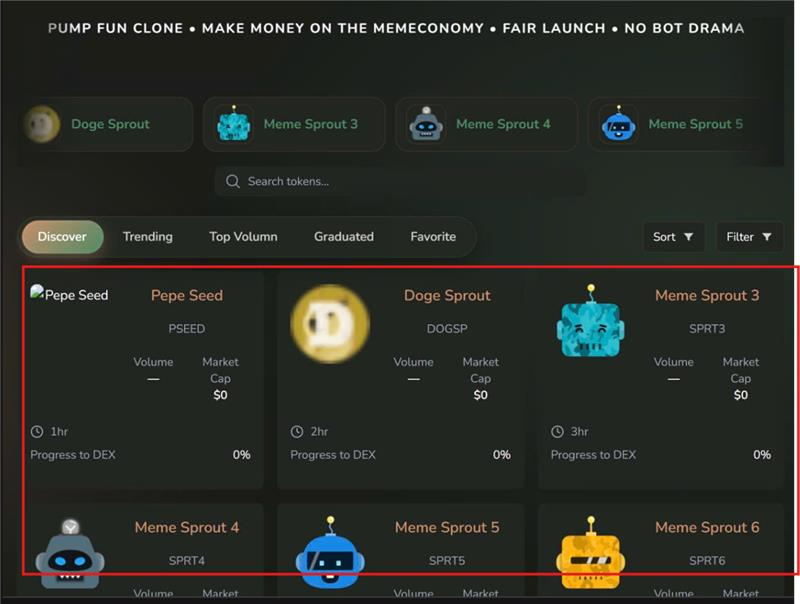

# 2. ĐIỂM TRUY CẬP (ENTRY POINTS)

Users có thể truy cập Token List từ:

1.  **Home page** - Landing page mặc định
2.  **Navigation menu** - Click logo của web

**Default:** Tab Discover được active khi vào lần đầu

# 3. YÊU CẦU CHỨC NĂNG

### 3.1. Danh sách các Tabs

**FR-TL-001.1: Hiển thị Tab Navigation**

**Mô tả:**  
Cung cấp 5 tabs để users chọn cách xem tokens khác nhau:
  1. Discover (mặc định)
  2. Trending
  3. Top Volume
  4. Graduated
  5. Favorite

**Yêu cầu:**

- Hiển thị 5 tabs:
  1. Discover (mặc định)
  2. Trending
  3. Top Volume
  4. Graduated
  5. Favorite

- Active tab có visual indicator rõ ràng (background, underline, hoặc border)
- Chuyển tab reset pagination về page 1
- Chuyển tab giữ nguyên filters và search query

**Empty States theo Tab:**
-   **Graduated:** "Chưa có token nào đạt graduation ($69K MC)"
-   **Favorite:** "Bạn chưa có token yêu thích nào"

**Acceptance Criteria:**

-   [ ] 5 tabs hiển thị token đúng theo quy định của tab đó
-   [ ] Discover là tab mặc định
-   [ ] Điều kiện filter, sort hiện tại được giữ nguyên khi refresh
----------

### 3.2. Công thức hiển thị của các tab

**FR-TL-001.2: Tính toán DiscoverScore**

**Mô tả:**  
Tính toán công thức để đưa token vào tab Discover, cân bằng giữa trending, quality và recency.

**Công thức:**

```
DiscoverScore =
  0.40 * TrendingScore +
  0.20 * LiquidityDepthPoints +
  0.20 * HoldersQualityPoints +
  0.10 * TrustScore +
  0.10 * RecencyPoints
Tất cả scores normalize về 0.0 - 1.0
```

**Chi tiết từng thành phần:**

**1. TrendingScore (40%)**

Đo lường momentum và viral potential của token.

```
TrendingScore = (Vol24h * 5) + (BuyCount24h * 3) + (PriceChange24h% * 2)
```

**2. LiquidityDepth (20%)**

Đo lường số SOL trong bonding curve.

```
Mapping:
LiquiditySOL → LiquidityDepthPoints
0      → 0
0.5    → 6
1      → 12
2      → 20
3      → 26
5      → 35
8      → 45
10     → 52
15     → 62
20     → 70
30     → 82
50     → 95
100    → 108
200+   → 120
```

**3. HoldersQualityScore (20%)**

Đo lường số holders của token.

```
Mapping HoldersQualityPoints
1    → 0
3    → 8
5    → 14
10   → 25
20   → 38
30   → 46
50   → 60
80   → 72
100  → 80
150  → 92
200  → 100
300  → 108
500+ → 120
```

**4. TrustScore (10%)**

Đo lường độ tin cậy dựa trên security features.

```
To be decided
```

**5. RecencyScore (10%)**

Boost cho tokens mới để khuyến khích discovery.

```
Dựa trên tuổi token (age_hours):

age_hours → RecencyPoints
<= 6h     → 60
<= 24h    → 50
<= 72h    → 35
<= 168h   → 20   (7 ngày)
<= 720h   → 8    (30 ngày)
> 720h    → 0
age_hours = (thời_gian_hiện_tại - created_at)
```

**Yêu cầu:**

```
- Tính DiscoverScore cho mọi token
- Sắp xếp tokens theo DiscoverScore giảm dần
- Tính lại scores mỗi 10 phút
- Cache scores để tránh tính lại mỗi request
- Update danh sách mà không làm gián đoạn scroll của user
```

**Acceptance Criteria:**

-   [ ] DiscoverScore tính đúng theo công thức
-   [ ] Tokens sắp xếp giảm dần theo DiscoverScore
-   [ ] Scores recalculate mỗi 10 phút
-   [ ] Cache hoạt động đúng

**FR-TL-001.3: Tab trending**

**Mô tả:**  
Tính toán công thức để đưa token vào tab Trending

**Công thức:**

```
TrendingScore = (Vol24h * 5) + (BuyCount24h * 3) + (PriceChange24h% * 2)
```


**Yêu cầu:**

```
- Tính TrendingScore cho mọi token
- Sắp xếp tokens theo TrendingScore giảm dần
- Tính lại scores mỗi 10 phút
- Cache scores để tránh tính lại mỗi request
- Update danh sách mà không làm gián đoạn scroll của user
```

**Acceptance Criteria:**

-   [ ] TrendingScore tính đúng theo công thức
-   [ ] Tokens sắp xếp giảm dần theo TrendingScore
-   [ ] Scores recalculate mỗi 10 phút
-   [ ] Cache hoạt động đúng

**FR-TL-001.4: Tab Top Volumn, Graduated, Favorite**

**Mô tả:**  
Hiển thị đúng như tên gọi.

----------

### 3.3. Hiển thị Token Card ở màn list

**FR-TL-001.5: Token Card Information**

**Mô tả:**  
Mỗi token hiển thị dưới dạng card với các thông tin quan trọng để user đánh giá nhanh.

**UI:**  
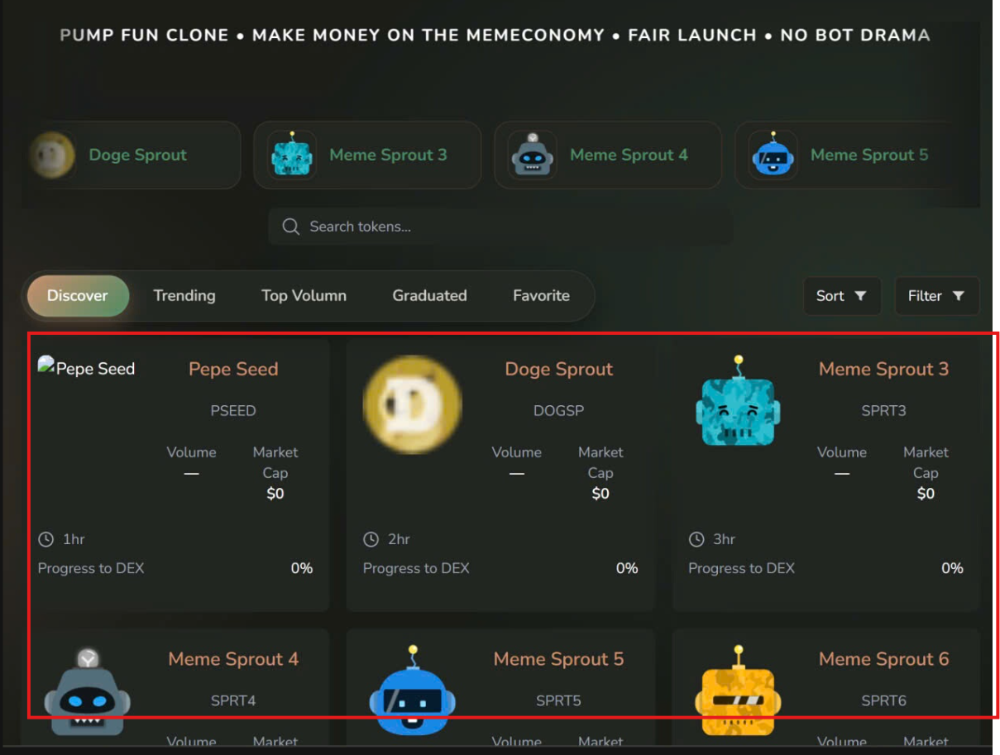
**Yêu cầu:**


Mỗi token card hiển thị:

1. Avatar Token

2. Tên Token
   - Typography: Bold, prominent

3. Symbol Token
   - Chữ hoa
   - Có thể có prefix

4. Token short statement

5. Price
   - Format theo giá trị:
     * < $0.01: 6 decimals ($0.000123)
     * $0.01 - $1: 4 decimals ($0.1234)
     * >= $1: 2 decimals ($12.34)
   - Prefix: $

5. Market Cap
   - Rút gọn K/M/B:
     * < 1K: Full number
     * >= 1K: $12.5K
     * >= 1M: $1.2M
     * >= 1B: $2.3B
   - 2 decimals sau rút gọn
   - Label: "MC: "

6. Volume 24h
   - Format giống Market Cap
   - Label: "Vol: "
   - Update mỗi 30s

7. Price Change 24h
   - Format: ±X.XX%
   - Màu sắc:
     * Dương (>0): Xanh lá
     * Âm (<0): Đỏ 
     * Bằng 0: Xám 
   - Icon: ↑ hoặc ↓

8. Trust Level Badges (nếu có)
   - Hiển thị badges nếu đạt tiêu chí:
     * 🔒 LP Locked---
     * ✓ Audited
     * 🛡️ Freeze Disabled
   - Tooltip chi tiết khi hover
   - Compact display (icons only hoặc short text)

9. Favorite Button
   - Icon: ♡ (rỗng) hoặc ♥ (đầy)
   - Position: Top-right corner
   - Click toggle favorite
  
10. Tiến độ tốt nghiệp

Và card PHẢI:
- Clickable toàn bộ (trừ favorite icon)
- Hover effect: Shadow hoặc scale nhẹ

**Acceptance Criteria:**

- [ ] Tất cả các trường hiển thị đúng format
- [ ] Giá format theo các mức giá trị
- [ ] Rút gọn K/M/B hoạt động chính xác
- [ ] Price change màu sắc đúng
- [ ] Card hover effects mượt
- [ ] Layout responsive
- [ ] Performance tốt với 100+ cards


### 3.4. Nút Filter

**FR-TL-001.6: Custom Filters**

**Mô tả:**  
Users có thể áp dụng filters bổ sung trên kết quả tab để thu hẹp danh sách tokens.

**UI:**

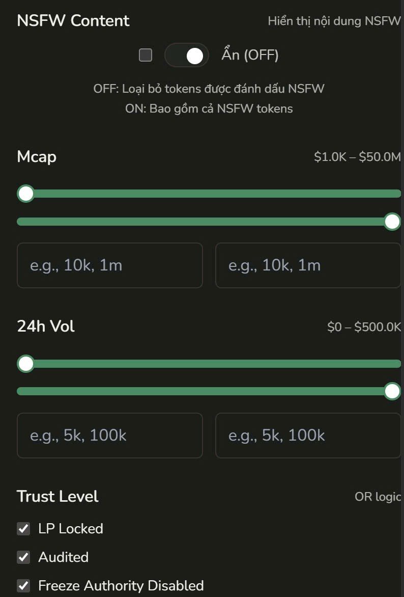

**Yêu cầu:**

```
Hệ thống có 4 filters:

1. NSFW Content
   Loại: Toggle switch
   Tùy chọn: Hiện / Ẩn
   Mặc định: Ẩn (OFF)
   Hành vi:
   - OFF: Loại bỏ tokens được đánh dấu NSFW
   - ON: Bao gồm cả NSFW tokens

2. Market Cap và Volumn 24h Range
   Loại: Thanh trượt slide và ô textbox nhập giá trị trực tiếp. Giá trị phổ của slide của MC là từ 0 đến 50M+ usd. Của Volumn là từ 0 đến 50K+ usd.
   
3. Trust Level (nếu có)
   Loại: Multi-select checkboxes
   Tùy chọn:
   □ LP Locked
   □ Audited
   □ Freeze Authority Disabled
   □ Unverified (hiện tất cả)
   Mặc định: Tất cả checked
   Hành vi: OR logic - hiện tokens thỏa BẤT KỲ tiêu chí nào
   Nếu "Unverified" checked: Bỏ qua các trust filters khác
   
VÀ filters PHẢI:
- Kết hợp với logic AND giữa các loại filter
  (NSFW filter) AND (MC filter) AND (Volume filter) AND (Trust filter)
- Áp dụng TRÊN kết quả tab hiện tại
- Flow: Tab → Filter → Search → Sort → Display
- Trigger refresh danh sách ngay khi thay đổi
- Reset pagination về page 1 khi thay đổi
- Hiển thị badge số filters đang active
- Có nút "Reset Filters" để xóa tất cả
```

**Filter Logic:**

```
Ví dụ:
Tab: Trending (1000 tokens)
Filter 1: NSFW = Hide → 900 tokens
Filter 2: MC = $10K-$100K → 300 tokens
Filter 3: Volume > $1K → 200 tokens
Filter 4: Trust = LP Locked OR Audited → 150 tokens
→ Kết quả cuối: 150 tokens
```

**Acceptance Criteria:**

- [ ] 4 filters hiển thị và hoạt động đúng
- [ ] Filters kết hợp với AND logic
- [ ] Badge đếm active filters chính xác
---

### 3.5. Chức năng sắp xếp (Sorting)

**FR-TL-001.7: Sort Functionality**

**Mô tả:**  
Users có thể sắp xếp danh sách tokens theo các tiêu chí khác nhau qua việc click vào button Sort -> mở giao diện Sort Panel.

**Giao diện:**

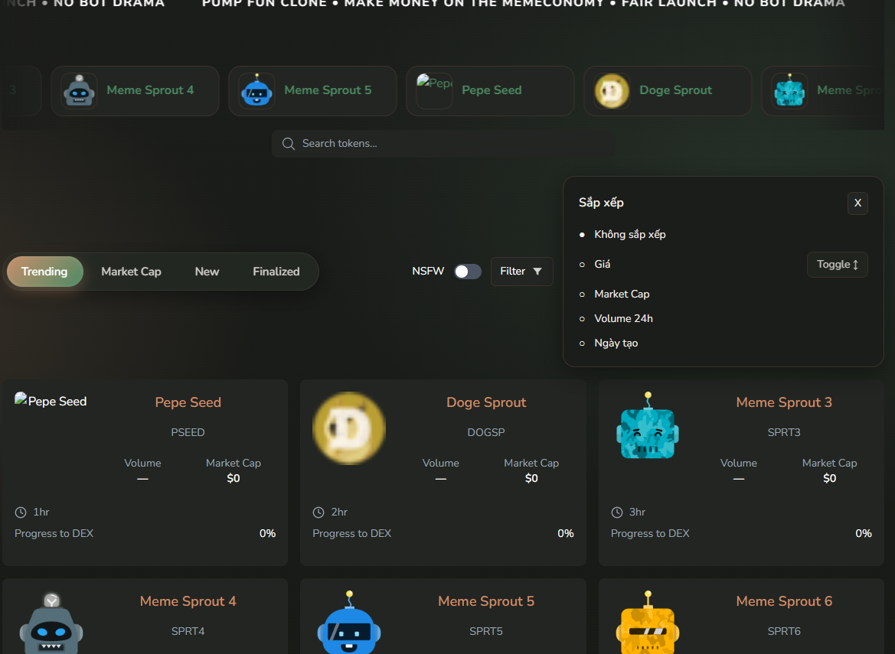

**Yêu cầu:**

```
CHO user xem danh sách tokens
KHI user click nút Sort (bên cạnh nút Filter)
THÌ hệ thống PHẢI mở Sort Panel với:

Các tùy chọn sort:
○ Không sắp xếp (default)
○ Giá
○ Market Cap
○ Volume 24h
○ Ngày tạo

Toggle Direction Behavior:
- Mặc định: Tăng dần
- Click lần 1: Giảm dần (Cao → Thấp) ↓
- Click lần 2: Tăng dần (Thấp → Cao) ↑


VÀ sort PHẢI:
- Áp dụng cùng với: Tab → Filter → Search → Sort
- Không reset pagination (giữ scroll position)
- Hiển thị sort hiện tại trên nút Sort

Khi sort sẽ override hiển thị của tab hiện tại
```

**Acceptance Criteria:**

- [ ] Sort options hiển thị và hoạt động đúng
---

### 3.6. Tìm kiếm (Search)

**FR-TL-001.8: Search**

**Mô tả:**  
Tính năng search tiến hành search và cập nhật danh sách đầy đủ khi nhấn Enter.

**Giao diện:**

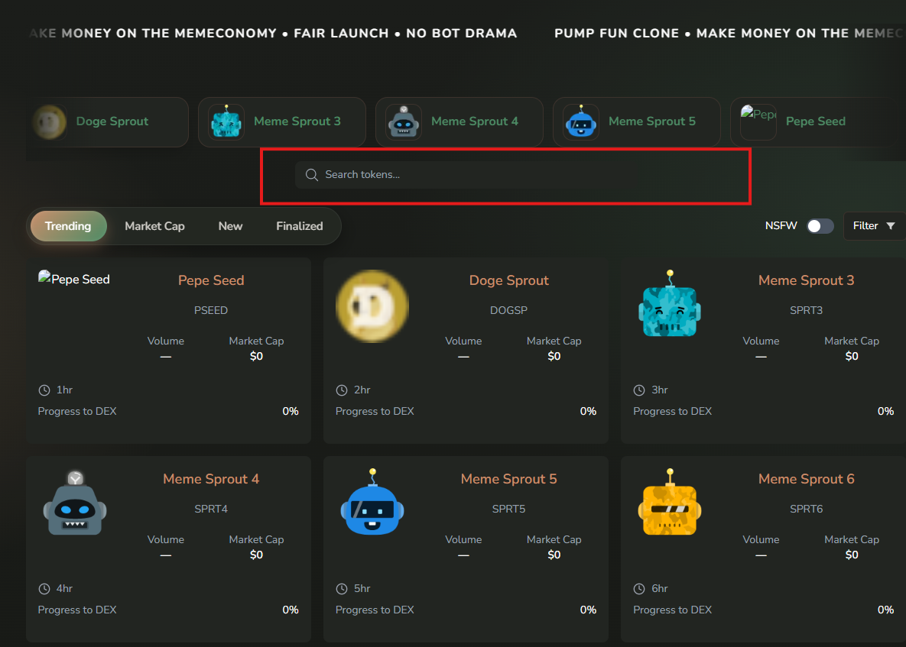

**Yêu cầu:**

```
CHO user ở Token List page
KHI user gõ vào search field và nhấn Enter

Hiển thị Search Results (Enter)

Khi user nhấn Enter hoặc click Search button:
- Xóa danh sách hiện tại
- Hiển thị loading skeleton
- Hiển thị kết quả bên dưới

Kết quả search:
- Bao gồm tất cả tokens khớp query
- Tuân filter constraints

VÀ search PHẢI:
- Hoạt động trên tất cả tabs
- Hỗ trợ ký tự đặc biệt trong query
```

**Business Rules:**

- Chỉ tokens public 


**Acceptance Criteria:**
- [ ] Enter update main list với results
- [ ] Số kết quả hiển thị chính xác


# FR-002: CHI TIẾT TOKEN

## 1. Mô tả

Trang chi tiết token hiển thị đầy đủ thông tin về một token cụ thể bao gồm chart giá, metrics, trust level, community chat, danh sách holders, lịch sử giao dịch, và trading panel.

**User Story:**

```
Là một trader,
Tôi muốn xem chi tiết đầy đủ về một token,
Để đánh giá và quyết định có nên mua/bán token này không.
```

----------

## 2. Giao diện
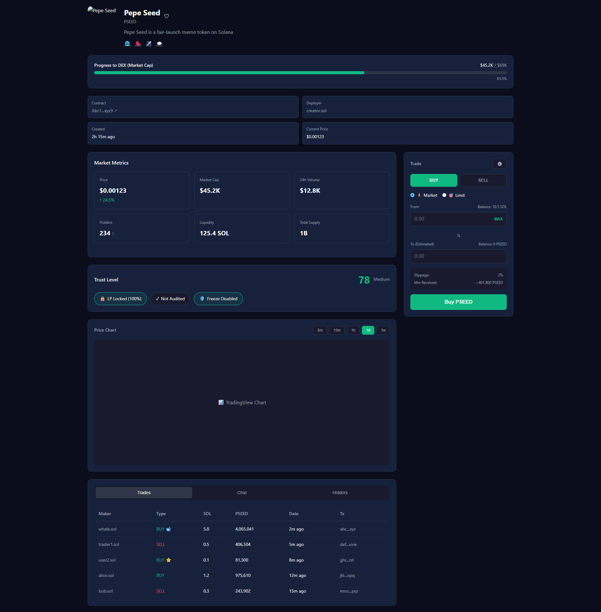
## 3. ĐIỂM TRUY CẬP (ENTRY POINTS)

Users có thể truy cập Token Detail từ:

1. **Token List (FR-001)** - Click vào token card
2. **My Profile (FR-004)** - Holdings/Created/Staking tabs
3. **Public Profile (FR-005)** - Holdings/Created tabs
4. **Leaderboard (FR-008)** - Click vào token trong bảng xếp hạng
5. **Direct URL** - /token/[address]

----------

## 4. YÊU CẦU CHỨC NĂNG

### 4.1. Hiển thị meta data của Token

**FR-TD-002.1: Thông tin meta data của token**

**Mô tả:**  
Hiển thị thông tin cơ bản của token ở đầu trang.

**Yêu cầu:**

```
Header hiển thị:

1. Avatar Token
   - Ảnh đại diện token
   - Fallback: Default avatar nếu không có

2. Tên Token + Symbol
   - Format: "Token Name ($SYMBOL)"
   - Typography: Large, prominent

3. Creator Info
   - Avatar creator (nhỏ)
   - Username hoặc wallet address (rút gọn)
   - Click → Navigate to Public Profile (FR-005)
     * If creator's profile is PRIVATE: Show limited profile (lock icon message + created tokens only)
     * If creator's profile is PUBLIC: Show full profile based on granular settings
   - Label: "Created by"

4. Token description (statement)

5. Favorite Button
   - Icon: ♡ (chưa favorite) / ♥ (đã favorite)
   - Click toggle → Update state
   - Login required
   - Sync với danh sách Favorite

6. Social Links (nếu có)
   - Website, Twitter, Telegram, Discord
   - Icon buttons
   - Click → Open in new tab

```

**Acceptance Criteria:**

- [ ] Hiển thị đầy đủ thông tin
- [ ] Creator link navigate đúng
- [ ] Social links mở đúng

----------

### 4.2. Biểu đồ Giá

**FR-TD-002.2: Price Chart**

**Mô tả:**  
Hiển thị biểu đồ giá token với các timeframe khác nhau.

**Giao diện:**
Dev tự quyết định  

**Yêu cầu:**
Dev tự quyết định

**Acceptance Criteria:**

- [ ] Chart hiển thị chính xác
- [ ] Timeframe switch hoạt động
- [ ] Interactions mượt
- [ ] Real-time updates đúng

----------

### 4.3. Market Metrics

**FR-TD-002.3: Chỉ số của token**

**Mô tả:**  
Hiển thị các chỉ số quan trọng của token.

**Giao diện:**

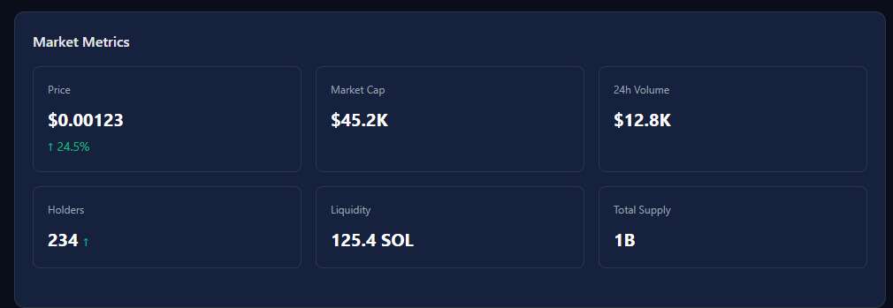

**Yêu cầu:**

```
Metrics hiển thị:

1. Price (USD)
   - Current price
   - Update: Real-time (10s)
   - Pulse animation khi thay đổi

2. 24h Price Change
   - Format: ±X.XX%
   - Màu: Green (dương) / Red (âm) / Gray (0)
   - Icon: ↑ / ↓

3. Market Cap (USD)
   - Format: Rút gọn K/M/B
   - Update: 30s

4. 24h Volume (USD)
   - Format: Rút gọn K/M/B
   - Update: 1 phút

5. Total Holders
   - Số lượng holders
   - Update: 5 phút
   - Trend indicator: ↑ tăng / ↓ giảm / → không đổi

6. Liquidity (SOL)
   - Số SOL trong bonding curve
   - Progress bar đến graduation ($69K MC)

7. Total Supply
   - Fixed supply
   - Static (không update)

VÀ metrics PHẢI:
- Grid layout
- Real-time updates theo frequency
- Animation khi số thay đổi
```

**Acceptance Criteria:**

- [ ] Các số liệu hiển thị đúng
- [ ] Format chính xác
- [ ] Update frequencies đúng
- [ ] Colors và icons đúng
- [ ] Progress bar graduation chính xác

----------

### 4.4. Trust Level (To be decided)

**FR-TD-002.4: Mức độ Tin cậy**

**Mô tả:**  
Hiển thị overall trust score và các badges bảo mật.

**Yêu cầu:**

```
Trust Level hiển thị:

1. Overall TrustScore
   - Score: 0-100
   - Visual: Progress bar hoặc score badge
   - Color coding:
     * 0-49: Low (Red)
     * 50-79: Medium (Yellow)
     * 80-100: High (Green)

2. Trust Badges
   Hiển thị badges nếu đạt tiêu chí:
   
   A. LP Locked 🔒
      - % LP locked
      - Lock duration
      - Unlock date
   
   B. Audited ✓
      - Audit firm name
      - Audit date
      - Link to audit report
   
   C. Freeze Authority Disabled 🛡️
      - Confirmation status

3. Badge Details
   - Click badge → Tooltip hiển thị giải thích

```

**Acceptance Criteria:**

- [ ] TrustScore tính đúng
- [ ] Badges hiển thị chính xác
- [ ] Color coding đúng
- [ ] Tooltips hoạt động

----------

### 4.5. Community Chat

**FR-TD-002.5: Chat Room**

**Mô tả:**  
Chat room real-time để users thảo luận về token.

**Giao diện:**

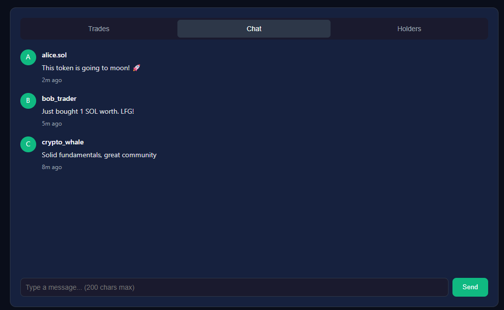

**Yêu cầu:**

```
Chat Room bao gồm:

1. Message List
   - Auto-scroll to bottom khi có message mới
   - Infinite scroll up để load history
   - Format message:
     * Avatar user (nhỏ)
     * Username (click → Public Profile)
       - If user's profile is PRIVATE: Show limited profile view
       - If user's profile is PUBLIC: Show full profile view
     * Message content
     * Timestamp (relative: "2m ago")

2. Send Message
   - Input field dưới cùng
   - Max length: 200 characters
   - Enter to send

3. Features
   - Click username → Public Profile (FR-005)
     * Respects user's privacy settings (see FR-005 section 4.1.1)
   - Message reactions (optional - future)


VÀ chat PHẢI:
- Real-time (<500ms latency)
- Handle high traffic
- Profanity filter active
- Chống spam chat
```

**Acceptance Criteria:**

- [ ] Chat real-time hoạt động
- [ ] Messages hiển thị đúng format
- [ ] Rate limiting work
- [ ] Navigate to profile work

----------

### 4.6. Holders List

**FR-TD-002.6: Danh sách Holders**

**Mô tả:**  
Hiển thị top holders của token với thông tin chi tiết.

**Giao diện:**
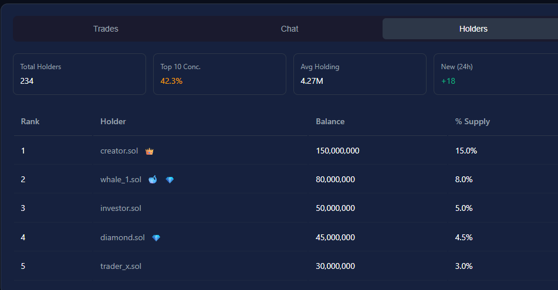

**Yêu cầu:**

```
Holders List hiển thị:

1. Summary Stats
   - Total holders
   - Top 10 concentration % (risk indicator - top 10 chiếm bao nhiêu phần trăm)

2. Top 100 Holders Table
   Columns:
   - Rank
   - Avatar + Username/Address
   - Balance (số lượng tokens)
   - % of supply
   - Badges (xem xét):
     * 👑 Creator
     * 🐋 Whale (>5% supply)
     * 💎 Diamond Hands (hold >30 days)

3. Features
   - Click holder → Public Profile (FR-005)
     * If holder's profile is PRIVATE: Show limited profile (lock icon + created tokens)
     * If holder's profile is PUBLIC: Show full profile based on privacy settings


VÀ holders list PHẢI:
- Top 100 only (performance)

```

**Top 10 Concentration Risk (hiển thị màu):**

```
Concentration % → Risk Level
< 40%           → Low (Green)
40-60%          → Medium (Yellow)
> 60%           → High (Red)
```

**Acceptance Criteria:**

- [ ] Summary stats chính xác
- [ ] Top 100 hiển thị đúng
- [ ] % of supply tính đúng
- [ ] Click navigate đúng

----------

### 4.7. Transaction History

**FR-TD-002.7: Lịch sử Giao dịch**

**Mô tả:**  
Hiển thị 50 transactions gần nhất của token.

**Giao diện:**
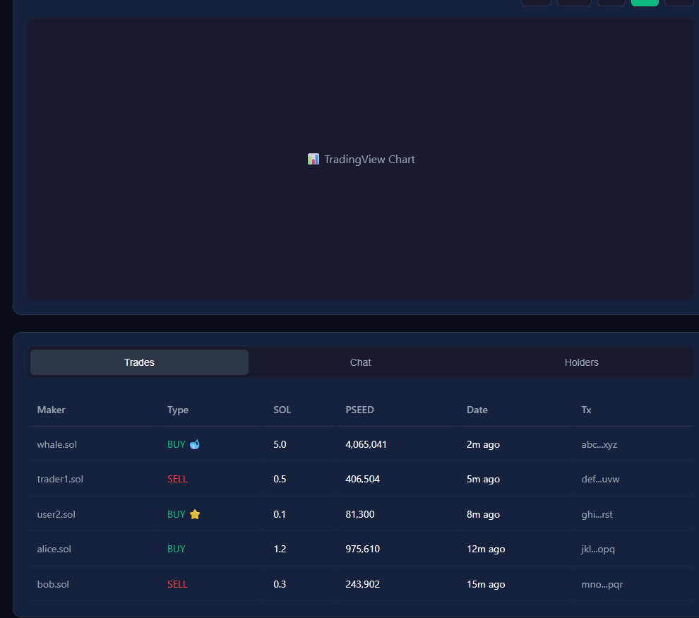

**Yêu cầu:**

```
Transaction History hiển thị:

1. Transaction List (50 gần nhất)
   Columns:
   - Type: BUY (green) / SELL (red)
   - Timestamp (relative: "5m ago")
   - Trader:
     * Username (nếu có)
     * Address rút gọn (nếu không có username)
     * Click → Public Profile (FR-005)
   - Amount (số tokens)
   - Total Value (USD)
   - TX Hash:
     * Rút gọn
     * Click → Solana Explorer (new tab)

2. Highlights
   - Whale transactions (>5% of 24h volume):
     * 🐋 icon
   - First trade ever:
     * ⭐ icon

```

**Acceptance Criteria:**

- [ ] 50 transactions load đúng
- [ ] Trader links navigate đúng
- [ ] TX hash links đúng explorer
- [ ] Whale highlights đúng

----------

### 4.8. Trading Panel

**FR-TD-002.8: Panel Giao dịch**

**Mô tả:**  
Trading panel hiển thị cố định bên phải để user có thể buy/sell ngay.

**Yêu cầu:**

```
Trading Panel:
- Position: Fixed bên phải màn hình
- Luôn visible khi scroll
- Chi tiết xem FR-003: Chức năng Buy/Sell

Buttons:
- BUY button: Enabled luôn (login + wallet required)
- SELL button: Enabled khi user có balance > 0

VÀ trading panel PHẢI:
- Sync với token hiện tại
- Display current price real-time
```

**Acceptance Criteria:**

- [ ] Panel hiển thị cố định bên phải
- [ ] BUY/SELL buttons state đúng


----------

**END OF FR-002**

# FR-003: CHỨC NĂNG BUY/SELL

## 1. Mô tả

Trading panel cho phép user mua (BUY) hoặc bán (SELL) token ngay lập tức với Market Order hoặc đặt lệnh với giá mục tiêu thông qua Limit Order.

**User Story:**

```
Là một trader,
Tôi muốn có thể mua hoặc bán token nhanh chóng.
```

----------

## 2. Giao diện

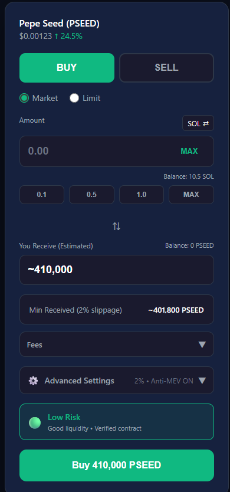

----------

## 3. ĐIỂM TRUY CẬP (ENTRY POINTS)

Nằm trong màn hình Token Detail page (FR-002):

----------

## 4. YÊU CẦU CHỨC NĂNG

### 4.1. Trading Panel Layout

**FR-BS-003.1: Cấu trúc Panel**

**Mô tả:**  
Trading panel hiển thị với layout rõ ràng.

**Yêu cầu:**

```
Panel Structure:

1. Token Context
   - Token name + symbol
   - Current price (real-time)

2. Mode Selector - 2 tầng mode
   
   Tầng 1 - Buy/sell button:
   - [BUY] / [SELL] buttons
   - BUY: Green
   - SELL: Red
   - Click switch → Clear form
   
   Tầng 2 - Market order/Limit order:
   - Market / Limit toggle
   - Market: Default
   - Limit: Phụ, ít dùng hơn
   - Radio buttons hoặc small toggle

3. Form Area
   - Amount input
   - Preview card
   - Settings
   - Risk assessment
   - Execute button
   - (Chi tiết ở sections sau)

VÀ panel PHẢI:
- Sticky scroll: Scroll cùng page hoặc fixed
- Responsive
```

----------

### 4.2. Market Order - Giao dịch Ngay

**FR-BS-003.2: Market Order Form**

**Mô tả:**  
Form giao dịch đơn giản, thực hiện ngay theo giá hiện tại.

**Giao diện:**

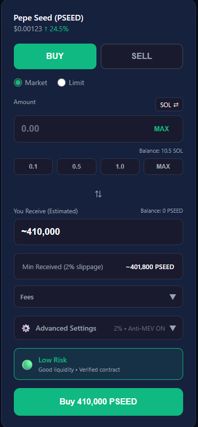

**Yêu cầu:**

```
Market Order Form bao gồm 5 phần:

═══════════════════════════════════════
PHẦN 1: AMOUNT INPUT
═══════════════════════════════════════

1. Currency Switch
   - Toggle: SOL ⇄ [TOKEN]
   - Default: SOL
   - Click để đổi currency
   - Position: Góc phải của label "Amount"

2. Input Field
   - Type: Number

3. Quick Amount Buttons
   - SOL mode: 0.1 / 0.5 / 1 / MAX
   - Token mode: 25% / 50% / 75% / MAX
   - MAX = Balance - estimated fees

4. Balance Display (số dư ví - xem xet)
   - "Balance: X.XX SOL"
   - Real-time update
   - Small text dưới input

5. Swap Icon
   - Icon: ⇅
   - Click để swap From ↔ To

6. You Receive Field (Estimated)
   - Auto-calculate từ amount input
   - Format: ~XXX,XXX [TOKEN]


═══════════════════════════════════════
PHẦN 2: FEES (Collapsible)
═══════════════════════════════════════

Header:
- Chevron: ▼ (click to expand)

Content (khi expand):
- Solana network fee: ~0.00001 SOL
- Anti-MEV fee: 0.005 SOL (nếu enabled)
- Priority fee: +0.0001 SOL (nếu Fast)
- Priority fee: +0.0005 SOL (nếu Instant)


═══════════════════════════════════════
PHẦN 3: ADVANCED SETTINGS (Expandable)
═══════════════════════════════════════

Settings Icon (⚙️) - Click to expand/collapse:

A. Slippage Tolerance
   - Preset: 0.5% / 1% / 2% / 5% / Custom
   - Default: 2%
   - Range: 0.1% - 50%
   - Warnings:
     * < 0.5%: "May fail"
     * > 10%: "High slippage risk"

B. Anti-MEV Protection
   - Toggle: ON / OFF
   - Default: ON
   - Fee: +0.5%
   - Update fees section khi toggle

C. Priority Fee (Speed)
   - Options: Normal (Free) / Fast / Instant
   - Default: Normal
   - Fast: +0.0001 SOL
   - Instant: +0.0005 SOL
   - Update fees section khi change

D. Auto-retry
   - Toggle: ON / OFF
   - Default: OFF
   - Max retries: 3

═══════════════════════════════════════
PHẦN 4: RISK ASSESSMENT
═══════════════════════════════════════

Risk Badge:
- Level: 🟢 Low / 🟡 Medium / 🔴 High
- Based on:
  * Liquidity depth
  * Holder concentration
  * Price volatility
  * Audit status


═══════════════════════════════════════
PHẦN 6: EXECUTE BUTTON
═══════════════════════════════════════

Button:
- Text: "Buy [Amount] [Symbol]" / "Sell [Amount] [Symbol]"
- Color: Green (BUY) / Red (SELL)
- States:
  * Disabled: Invalid input
  * Enabled: Ready to trade
  * Loading: Transaction processing

VÀ market order PHẢI:
- Login + wallet required

```


**Acceptance Criteria:**

- [ ] Form inputs work correctly
- [ ] Currency switch SOL ↔ Token works
- [ ] Quick buttons set correct amounts
- [ ] Min Received updates real-time
- [ ] Fees section expands/collapses
- [ ] Advanced Settings expand/collapse
- [ ] Validation messages clear

----------

### 4.3. Limit Order - Đặt lệnh

**FR-BS-003.3: Limit Order Form**

**Mô tả:**  
Form đặt lệnh với giá mục tiêu, thực hiện khi đạt giá.

**Giao diện:**

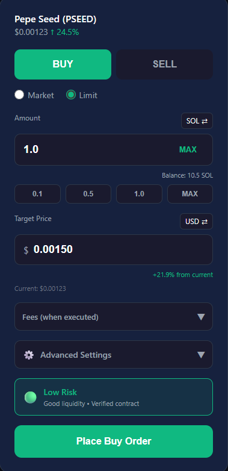

**Yêu cầu:**

```
Limit Order Form = Market Order Form + Target Price

═══════════════════════════════════════
Những phần khác ở LIMIT ORDER
═══════════════════════════════════════

1. TARGET PRICE/PERCENT FIELD (2 Input Modes)

   Toggle Button: [USD ⇄]
   - Click để switch giữa USD và % modes
   
   ────────────────────────────────────
   MODE A: Absolute Price (USD)
   ────────────────────────────────────
   Label: "Target Price [USD ⇄]"
   
   Input Display:
   ┌─────────────────────┐
   │ $ [0.00150_______]  │
   └─────────────────────┘
   
   Info Display (dưới input):
   - "+21.9% from current" (nếu target > current)
   - "-15.5% from current" (nếu target < current)
   - Color: Green (tăng) / Red (giảm)
   
   Reference:
   - "Current: $0.00123"
   
   User Action:
   - Nhập giá tuyệt đối mong muốn
   - System auto-calculate % difference
   
   ────────────────────────────────────
   MODE B: Percentage Change (%)
   ────────────────────────────────────
   Label: "Target Price [% ⇄]"
   
   Input Display:
   ┌─────────────────────┐
   │ [+21.9_______] %    │
   └─────────────────────┘
   
   Info Display (dưới input):
   - "= $0.00150" (calculated price)
   - Color: Always neutral
   
   Reference:
   - "Current: $0.00123"
   
   User Action:
   - Nhập % tăng/giảm
   - Dương (+20): Tăng 20%
   - Âm (-10): Giảm 10%
   - System auto-calculate price
   
   ────────────────────────────────────
   Toggle Behavior:
   ────────────────────────────────────
   - Click [USD ⇄] → Switch mode
   - USD → %: Label changes, input re-format
   - % → USD: Label changes, input re-format
   - Calculation updates real-time

2. FEES SECTION (Collapsible)
   
   Header:
   - Label: "Fees (when executed)"
   - Chevron: ▼ (click to expand)
   - Mặc định: Collapsed (ẩn)
```

**Business Rules:**

```
Order Placement Flow:

1. User fills Amount + Target Price
2. System validates:
   - Amount > 0 and ≤ Available Balance
3. Send notification to user when order is executed

Order Lifecycle:

┌─────────────┐
│   CREATED   │ User places order
└──────┬──────┘
       │
       ▼
┌─────────────┐
│   ACTIVE    │ Monitoring price
└──┬───────┬──┘
   │       │
   │       └─────────────┐
   │                     │
   ▼                     ▼
┌─────────────┐   ┌─────────────┐
│  COMPLETED  │   │  CANCELLED  │
└─────────────┘   └─────────────┘
(Price reached)   (User cancelled)
```

**Acceptance Criteria:**

- [ ] Target Price field hiển thị đúng
- [ ] USD ⇄ % toggle works smoothly
- [ ] % difference calculated accurately
- [ ] Order placement flow được tiến hành đúng

----------
**Error Handling:**

```
Common Errors:

1. Insufficient Balance
   - Message: "Insufficient SOL balance"
   - Action: none

2. Slippage Exceeded
   - Message: "Price moved too much. Transaction failed."
   - Action: Retry button
   - Auto-retry if enabled

3. Network Error
   - Message: "Network error. Please retry."
   - Action: Retry button

4. Transaction Timeout
   - Message: "Transaction timeout. Check your wallet."
   - Action: Retry button

Retry Logic (if auto-retry ON):
- Retry up to 3 times
- Show retry attempt: "Retry 1/3..."
- If all retries fail → Show final error
```

**Success Flow:**

```
Market Order Success:

1. Success Modal Content:
   - ✅ "Transaction Successful!"
   - Transaction hash (clickable → Solana Explorer)
   - You Paid: X.XX SOL
   - You Received: XXX,XXX PSEED
   - 🎟️ +1 Reward Ticket earned
   - Close button

2. Auto Updates:
   - User balance updated
   - Token metrics refreshed
   - Transaction appears in history
   - Form cleared

3. User Actions:
   - Close modal → Continue trading
   - Click TX hash → View on explorer

───────────────────────────────────────

Limit Order Success:

1. Success Modal Content:
   - ✅ "Order Placed Successfully!"
   - Order ID
   - Target Price: $X.XXXX
   - Reserved Balance: X.XX SOL
   - "View in My Profile" button
```

**Acceptance Criteria:**

- [ ] Market order flow completes successfully
- [ ] Limit order flow saves to database
- [ ] Success modal shows correct info
- [ ] Error messages helpful and actionable
- [ ] Retry logic works (if enabled)
- [ ] Balance updates after trades

----------

### 4.5. Real-time Updates

**FR-BS-003.5: Cập nhật Real-time**

**Mô tả:**  
Trading panel updates real-time để reflect current market.

**Yêu cầu:**

```
Real-time Updates:

1. Current Price (Token Header)

2. Min Received (Market Order)

3. You Receive (Market Order)

4. Balance

5. Fees Section Content
   - Update when:
     * Anti-MEV toggled ON/OFF
     * Speed changed (Normal/Fast/Instant)
```

**Acceptance Criteria:**

- [ ] Price updates every xx second
- [ ] Min Received recalculates on input
- [ ] Balance updates after trades

----------

## 5. ĐIỀU KIỆN CHẤP NHẬN (ACCEPTANCE CRITERIA)

**Overall Trading Panel:**

- [ ] BUY/SELL toggle works
- [ ] Market/Limit toggle works
- [ ] All inputs validate properly
- [ ] Preview calculates accurately
- [ ] Settings expand/collapse
- [ ] Transactions process successfully
- [ ] Error handling works
- [ ] Real-time updates smooth

**Data Accuracy:**

- [ ] Prices accurate
- [ ] Fees calculated correctly
- [ ] Slippage applied properly
- [ ] Balance checks work

**User Experience:**

- [ ] Form clear and intuitive
- [ ] Error messages helpful

----------

**END OF FR-003**

# FR-004: HỒ SƠ CỦA TÔI (MY PROFILE)

## 1. Mô tả

Trang hồ sơ cá nhân cho phép user xem các token đang nắm giữ, token đã tạo, token đang stake, chỉnh sửa thông tin cá nhân, và quản lý các limit orders đang hoạt động.

**User Story:**

```
Là một user,
Tôi muốn xem và quản lý hồ sơ cá nhân của mình,
Để theo dõi portfolio, chỉnh sửa thông tin, và quản lý các lệnh đang chờ.
```

----------

## 2. Giao diện

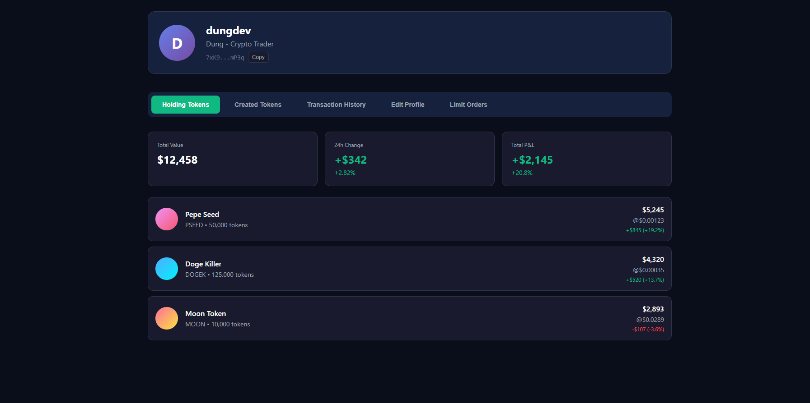

----------

## 3. ĐIỂM TRUY CẬP (ENTRY POINTS)

Users có thể truy cập My Profile từ:

1. **Main Navigation** - Click avatar/username hoặc "My Profile" menu
2. **Direct URL** 

**Default:** Mở tab "Holding Tokens"

----------

## 4. YÊU CẦU CHỨC NĂNG

### 4.1. Page Layout

**FR-MP-004.1: Cấu trúc Trang**

**Mô tả:**  
Layout trang profile với tabs navigation.

**Yêu cầu:**

```
Page Structure:

1. Header Section
   - Avatar (large)
   - Username
   - Display name (nếu có)
   - Wallet address (rút gọn)
   - Copy wallet button

2. Tabs Navigation (5 tabs)
   - Holding Tokens
   - Created Tokens
   - Transaction History
   - Edit Profile
   - Limit Orders
   
   Default: Holding Tokens tab active

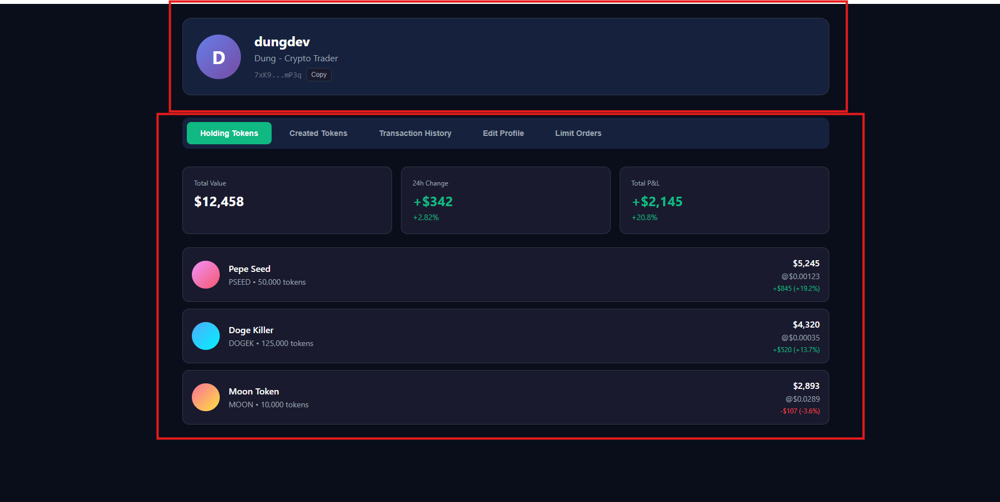

VÀ page PHẢI:
- Login required (redirect if not)
```

**Acceptance Criteria:**

- [ ] Header hiển thị đúng thông tin user
- [ ] 5 tabs hiển thị đầy đủ
- [ ] Tab switching mượt
- [ ] Default tab là Holding Tokens

----------

### 4.2. Holding Tokens Tab

**FR-MP-004.2: Danh sách Token đang Nắm giữ**

**Mô tả:**  
Hiển thị tất cả tokens mà user đang nắm giữ (balance > 0).

**Giao diện:**

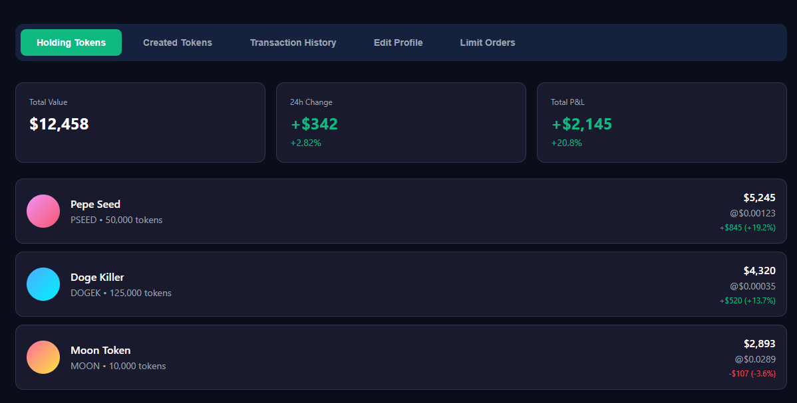

**Yêu cầu:**

```
Holding Tokens List:

1. Portfolio Stats (Top)
   - Total Value: $XXX,XXX
   - 24h Change: ±X.XX%
   - Total P&L: +$XXX (+X.X%)

2. Token List
   Mỗi token hiển thị:
   - Avatar
   - Name + Symbol
   - Balance (số lượng)
   - Value (USD)
   - Current Price
   - 24h Change (%)
   - P&L (Profit/Loss):
     * Amount: +$XXX hoặc -$XXX
     * %: +X.X% hoặc -X.X%
     * Color: Green/Red/Gray

3. Click Behavior
   - Click token → Token Detail (FR-002)

```

**P&L Calculation:**

```
Cost Basis = Average purchase price × Balance
Current Value = Current price × Balance
P&L = Current Value - Cost Basis
P&L % = (P&L / Cost Basis) × 100
```

**Acceptance Criteria:**

- [ ] Portfolio stats chính xác
- [ ] P&L calculation đúng
- [ ] Click navigate đúng

----------

### 4.3. Created Tokens Tab

**FR-MP-004.3: Danh sách Token đã Tạo**

**Mô tả:**  
Hiển thị tất cả tokens mà user đã tạo (read-only view).

**Giao diện:**

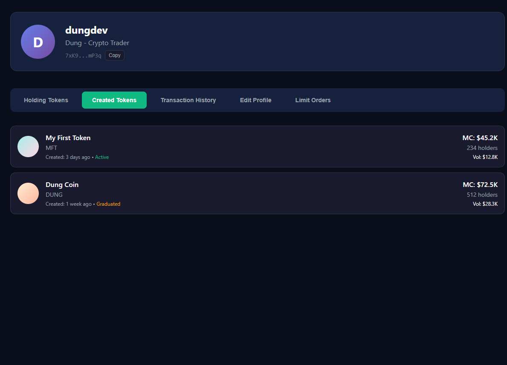

**Yêu cầu:**

```
Created Tokens List:

1. Token Cards
   Mỗi token hiển thị:
   - Avatar
   - Name + Symbol
   - Created date
   - Status: Active / Graduated
   - Current Market Cap
   - Current Price
   - Total Volume
   - Holders count

2. Sorting
   - By Created Date (newest first) - Default
   - By Market Cap
   - By Volume
   - By Holders

3. Click Behavior
   - Click token → Token Detail (FR-002)

Note: 
- Đây chỉ là list view, READ-ONLY
- Quản lý token ở màn Creator Dashboard

```

**Acceptance Criteria:**

- [ ] List hiển thị all created tokens
- [ ] Click navigate đúng

----------

### 4.4. Transaction History Tab

**FR-MP-004.4: Lịch sử Giao dịch**

**Mô tả:**  
Hiển thị lịch sử giao dịch BUY/SELL của user.

**Giao diện:**


**Yêu cầu:**

```
Transaction History List:

1. Transaction Items
   Mỗi transaction hiển thị:
   
   - Type Badge:
     * BUY (green)
     * SELL (red)
   
   - Token Info:
     * Avatar
     * Name
   
   - Timestamp:
     * Relative time: "2h ago", "1 day ago"
   
   - Transaction Details:
     * Amount: +10,000 PSEED (BUY) hoặc -10,000 PSEED (SELL)
     * Value: 0.5 SOL
     * TX Hash (rút gọn): 7xK9...mP3q
   
2. TX Hash Link
   - Click → Solana Explorer (new tab)

3. Sorting
   - Mặc định: Newest first
   - Load more: Pagination

4. Empty State
   - "No transactions yet"
   - "Start trading to see your history"

5. Click Behavior
   - Click transaction → Solana Explorer

```

**Acceptance Criteria:**

- [ ] List hiển thị transactions chính xác
- [ ] Type badges (BUY/SELL) đúng màu
- [ ] TX hash links work
- [ ] Timestamps accurate
- [ ] Empty state helpful

----------

### 4.5. Edit Profile Tab

**FR-MP-004.5: Chỉnh sửa Thông tin**

**Mô tả:**  
Form để user setup username/display name (one-time), chỉnh sửa thông tin cá nhân, và quản lý privacy settings.

**Giao diện:**


**Yêu cầu:**

```
Edit Profile Page Structure:

SECTION 1: Privacy Settings (Đầu tiên)
SECTION 2: Profile Information Form
SECTION 3: Actions (Save/Cancel buttons)
```

----------

#### 4.5.1. Privacy Settings

**FR-MP-004.5.1: Profile Privacy Controls**

**Mô tả:**  
Cho phép user kiểm soát ai có thể xem thông tin profile công khai của mình.

**Yêu cầu:**

```
Privacy Settings Section:

1. Section Header
   - Title: "Privacy Settings"
   - Icon: 🔒
   - Subtitle: "Control who can view your profile"

2. Privacy Toggle
   - Label: "Privacy Settings"
   - Toggle Label: "Public" (default) / "Private"
   - Default: Public (Unchecked)
   
   States:
   * Unchecked (Public): "Anyone can view your profile"
   * Checked (Private): "Only you can view your profile"

3. Helper Text
   - Public State: "Anyone can view your profile"
   - Private State: "Only you can view your profile"

4. Always Public Notice
   - Info box (blue background):
     * Icon: ℹ️
     * Text: "Tokens you create are always public for transparency"
     * Cannot be changed

5. Behavior
   - Settings saved when user clicks "Save Changes" button
   - No auto-save
```

**Privacy Logic:**

```
IF hiddenProfile === ON (Private):
  → Hide entire profile on Public Profile page
  → Show "🔒 This profile is private" message
  → Exception: Created tokens always visible

IF hiddenProfile === OFF (Public):
  → Show full profile (holdings, transactions, created tokens)
```

**Acceptance Criteria:**

- [ ] Privacy toggle works (Public/Private)
- [ ] Default state is Public
- [ ] Settings save with "Save Changes" button
- [ ] Clear helper text for each state
- [ ] Info box about created tokens displays

----------

#### 4.5.2. Profile Information Form

**Mô tả:**  
Form để user setup username và display name (one-time only), ngoài ra có thể edit được các thông tin khác.

**Yêu cầu:**

```
Edit Profile Form:
- Username và Display Name chỉ có thể set 1 LẦN DUY NHẤT
- Sau khi save, không thể thay đổi
- Các thông tin khác (Avatar, Bio, Social Links) thay đổi bình thường
- Username cần check required và uniqueness
```

**Acceptance Criteria:**

- [ ] One-time restriction for Username/Display Name
- [ ] Confirmation modal before first save
- [ ] Username uniqueness check
- [ ] Fields locked after save
- [ ] Avatar, Bio, Social Links always editable

----------

### 4.6. Limit Orders Tab

**FR-MP-004.6: Quản lý Limit Orders**

**Mô tả:**  
Hiển thị và quản lý các ACTIVE limit orders.

**Giao diện:**

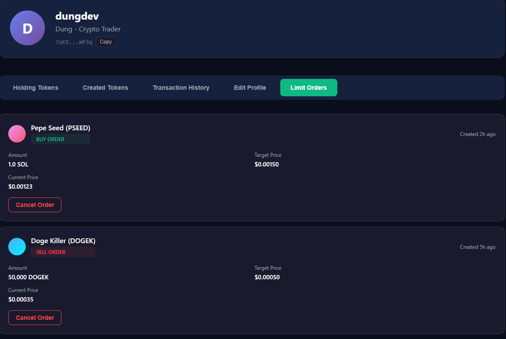

**Yêu cầu:**

```
Limit Orders List:

1. Order Cards (ACTIVE only)
   Mỗi order hiển thị:
   
   - Token Info:
     * Avatar
     * Name + Symbol
   
   - Order Type:
     * BUY (green) / SELL (red)
   
   - Order Details:
     * Amount
     * Target Price
     * Current Price
   
   - Created: "2h ago"
   
   - Actions:
     * "Cancel Order" button


2. Empty State
   - "You don't have any active limit orders"

3. Cancel Order Flow
   - Click "Cancel"
   - Confirmation modal:
     * Order details
     * "Confirm" / "Cancel"

VÀ limit orders PHẢI:
- Show ACTIVE orders only
```


**Acceptance Criteria:**

- [ ] List shows active orders only
- [ ] Order details accurate
- [ ] Cancel works

----------

## 5. ĐIỀU KIỆN CHẤP NHẬN (ACCEPTANCE CRITERIA)

**Overall:**

- [ ] All tabs functional
- [ ] Tab switching smooth
- [ ] Login required
- [ ] Responsive layout


**Interactions:**

- [ ] All clicks work
- [ ] Forms validate
- [ ] Empty states helpful

----------

**END OF FR-004**

# FR-005: HỒ SƠ CÔNG KHAI (PUBLIC PROFILE)

## 1. Mô tả

Trang hồ sơ công khai hiển thị thông tin của một user bất kỳ, cho phép xem holdings, created tokens, và transaction history của 1 user bât kỳ.

**User Story:**

```
Là một user,
Tôi muốn xem thông tin công khai của users khác,
Để tìm hiểu về traders/creators và quyết định có follow strategies của họ không.
```

----------

## 2. Giao diện

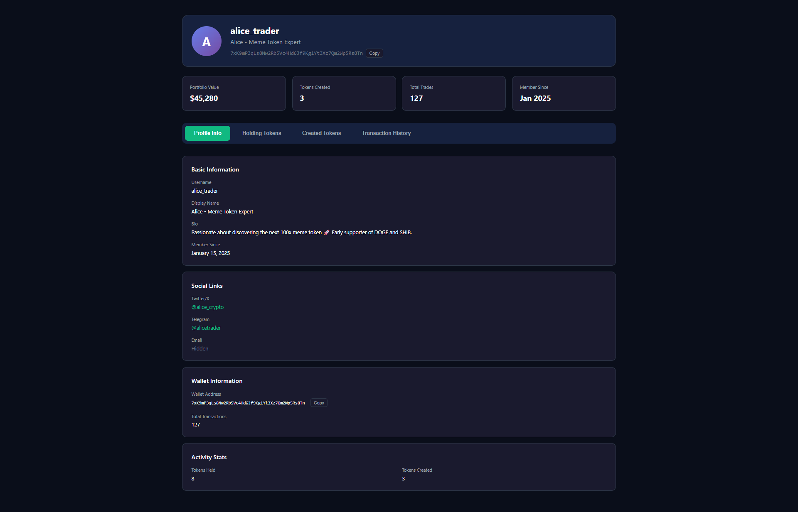

----------

## 3. ĐIỂM TRUY CẬP (ENTRY POINTS)

Users có thể truy cập Public Profile từ:

1. **Token Detail (FR-002)** - Click creator info hoặc holder name
2. **Community Chat (FR-002)** - Click username trong chat
3. **Holders List (FR-002)** - Click holder name
4. **Transaction History (FR-002)** - Click trader name
5. **Referrals (FR-010)** - Click referred user
6. **Direct URL** 

**Default:** Mở tab "Profile Info"

----------

## 4. YÊU CẦU CHỨC NĂNG

### 4.1. Page Layout

**FR-PP-005.1: Cấu trúc Trang**

**Mô tả:**  
Layout trang public profile - entirely read-only.

**Yêu cầu:**

```
Page Structure:

1. Header Section 
   - Avatar 
   - Username
   - Display name
   - Wallet address (rút gọn)
   - Copy wallet button

2. Stats Overview (Below header)
   - Tokens Created: X
   - Total Trades: X
   - Member Since: Date

3. Tabs Navigation (4 tabs)
   - Profile Info
   - Holding Tokens
   - Created Tokens
   - Transaction History
   
   Default: Profile Info tab active

VÀ page PHẢI:
- No login required to view
- Handle private profiles gracefully
```

**Acceptance Criteria:**

- [ ] Header hiển thị đúng user info
- [ ] Stats overview correct
- [ ] 4 tabs accessible (if profile is public)
- [ ] Private profile handled correctly

----------

### 4.1.1. Private Profile Handling

**FR-PP-005.1.1: Private Profile Display**

**Mô tả:**  
Xử lý hiển thị khi user đã set profile thành private.

**Yêu cầu:**

```
Private Profile Check:

1. Profile Visibility Check
   
   IF user.hiddenProfile === ON (Hidden):
   → Show Private Profile View (see below)
   → Hide all tabs except Created Tokens
   
   IF user.hiddenProfile === OFF (Public):
   → Show Full Profile View
   → Respect granular privacy settings

2. Private Profile View Layout
   
   A. Header (Still Visible)
      - Avatar (default/placeholder if not set)
      - Username
      - Wallet address (rút gọn)
      - Copy wallet button
      - No badges shown
   
   B. Main Content Area
      - Large lock icon 🔒 (centered)
      - Title: "This profile is private"
      - Subtitle: "This user has chosen to keep their profile private"
      - Spacing: Generous padding, centered layout
   
   C. Created Tokens Section (Always Visible)
      - Separator line
      - Section title: "Created Tokens"
      - Token count: "X tokens created"
      - Token list (same format as Created Tokens tab)
      - If no tokens: "This user hasn't created any tokens yet"

3. What's Hidden When Private
   - Stats overview (Portfolio value, Total trades, etc.)
   - Profile Info tab
   - Holdings tab
   - Transaction History tab
   - All badges (Creator, Whale)

4. What's Always Visible (Even When Private)
   - Username
   - Wallet address
   - Created tokens list (transparency requirement)

VÀ private profile PHẢI:
- Clear privacy message with lock icon
- Respect user's privacy choice completely
- Still show created tokens (cannot hide)
- Clean, centered layout for privacy message
- No access to any personal data
```

**Acceptance Criteria:**

- [ ] Private profile shows lock icon and message
- [ ] All tabs hidden except created tokens
- [ ] Created tokens always visible
- [ ] Stats overview hidden when private
- [ ] Clear, user-friendly privacy message
- [ ] Wallet address still copyable

----------

### 4.2. Profile Info Tab

**FR-PP-005.2: Thông tin Cá nhân**

**Mô tả:**  
Hiển thị metadata của user (read-only).

**Giao diện:**


**Yêu cầu:**

```
Profile Info Display:

1. Basic Info
   - Username
   - Display Name
   - Bio
   - Member Since: Date

2. Social Links (nếu có)
   - Twitter/X (clickable)
   - Telegram (clickable)
   - Website (nếu có)

3. Wallet Info
   - Wallet Address (full, với copy button)
   - Total Transactions: X

4. Activity Stats
   - Tokens Held: X
   - Tokens Created: X

VÀ profile info PHẢI:
- Social links open in new tab
- Privacy-aware (không hiển thị thông tin nhạy cảm)
```

**Acceptance Criteria:**

- [ ] All info displayed correctly
- [ ] Social links work
- [ ] Copy wallet works
- [ ] Stats accurate

----------

### 4.3. Holding Tokens Tab

**FR-PP-005.3: Token đang Nắm giữ**

**Mô tả:**  
Hiển thị tokens mà user này đang nắm giữ (read-only).

**Giao diện:**

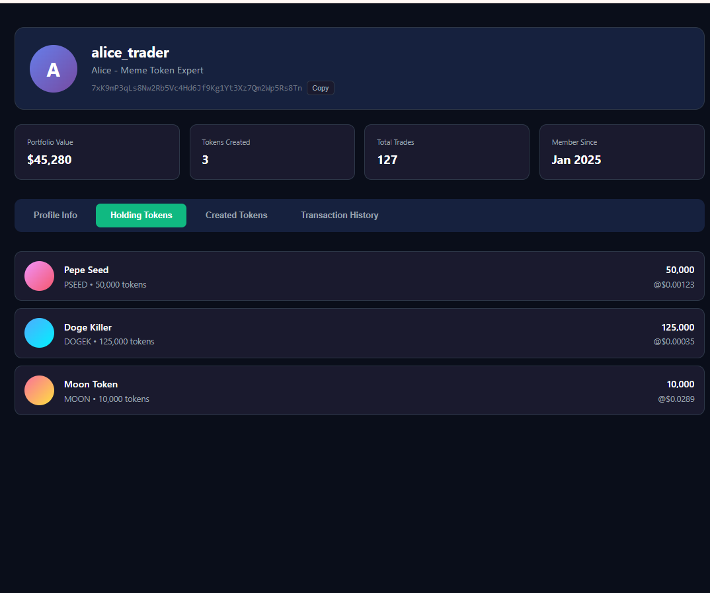

**Yêu cầu:**

```
Holding Tokens List (Read-only):

1. Token List
   Mỗi token hiển thị:
   - Avatar
   - Name + Symbol
   - Balance (số lượng)
   - Value (USD) - nếu public
   - Current Price

2. Click Behavior
   - Click token → Token Detail (FR-002)

Note:
- This tab is HIDDEN if profile is PRIVATE
- Không hiển thị P&L (private info)
- Chỉ show holdings, không show cost basis
```

----------

### 4.4. Created Tokens Tab

**FR-PP-005.4: Token đã Tạo**

**Mô tả:**  
Hiển thị tokens mà user này đã tạo.

**Giao diện:**

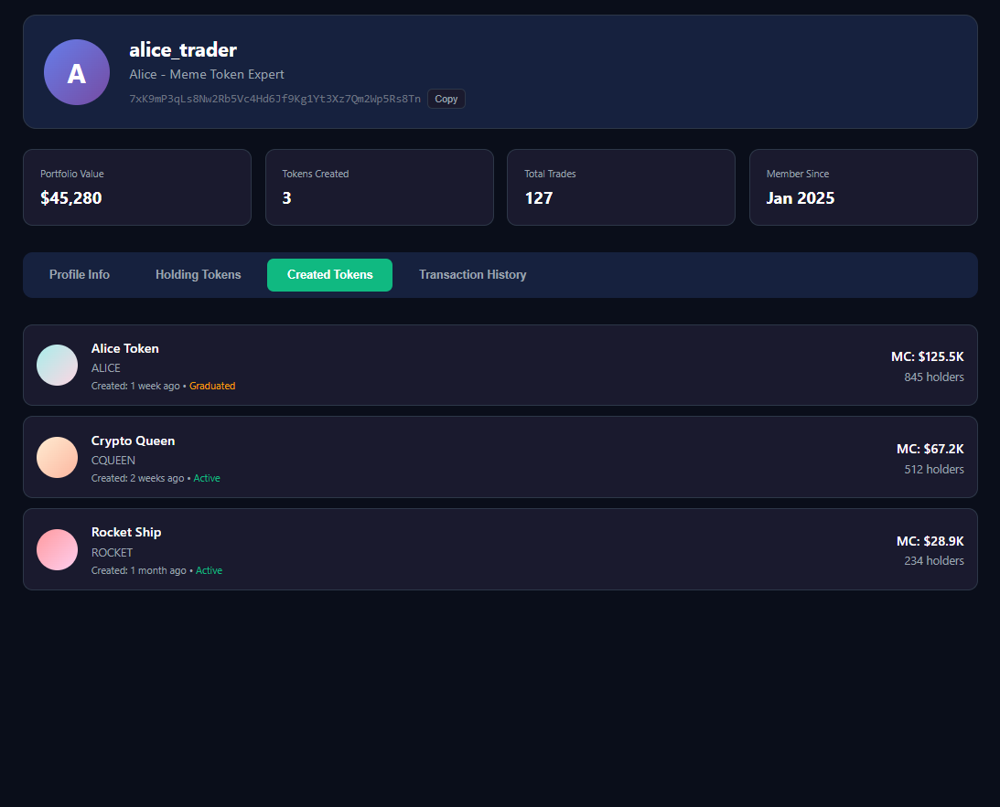

**Yêu cầu:**

```
Created Tokens List:

1. Token Cards
   Mỗi token hiển thị:
   - Avatar
   - Name + Symbol
   - Created date
   - Status: Active / Graduated
   - Current Market Cap
   - Current Price
   - Total Volume

2. Empty State
   - "This user hasn't created any tokens yet"

3. Click Behavior
   - Click token → Token Detail (FR-002)

```

**Acceptance Criteria:**

- [ ] List shows all created tokens
- [ ] Empty state helpful
- [ ] Click navigates correctly

----------

### 4.5. Transaction History Tab

**FR-PP-005.5: Lịch sử Giao dịch**

**Mô tả:**  
Hiển thị lịch sử giao dịch BUY/SELL của user này.

**Giao diện:**

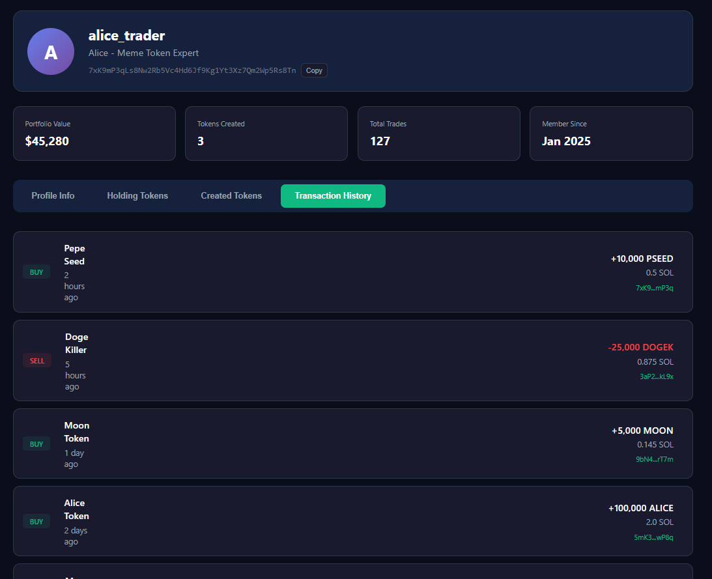

**Yêu cầu:**

```
Transaction History List:

1. Transaction Items
   Mỗi transaction hiển thị:
   
   - Type Badge:
     * BUY (green)
     * SELL (red)
   
   - Token Info:
     * Avatar
     * Name
   
   - Timestamp:
     * Relative time: "2h ago", "1 day ago"
   
   - Transaction Details:
     * Amount: +10,000 PSEED (BUY) hoặc -10,000 PSEED (SELL)
     * Value: 0.5 SOL
     * TX Hash (rút gọn): 7xK9...mP3q

2. TX Hash Link
   - Click → Solana Explorer (new tab)

3. Sorting
   - Newest first (default)

4. Empty State
   - "No transactions yet"

5. Click Behavior
   - Click TX hash → Solana Explorer
   - Click token → Token Detail (FR-002)

Note:
- This tab is HIDDEN if profile visibility is PRIVATE
- This tab shows privacy message if transaction visibility is OFF

VÀ transaction history PHẢI:
- Respect privacy settings
- Show up to 50 recent transactions
```

**Acceptance Criteria:**

- [ ] Privacy respected
- [ ] Type badges correct
- [ ] TX hash links work
- [ ] Timestamps accurate
- [ ] Click token navigates correctly

----------

## 5. ĐIỀU KIỆN CHẤP NHẬN (ACCEPTANCE CRITERIA)

**Overall:**

- [ ] No login required to view
- [ ] All tabs functional
- [ ] Privacy settings respected
- [ ] Responsive layout

**Privacy:**

- [ ] Profile hidden when private
- [ ] Full info shown when public

**Navigation:**

- [ ] All clicks work
- [ ] External links open new tab
- [ ] Token navigation correct

----------

**END OF FR-005**

# FR-006: BẢNG ĐIỀU KHIỂN CREATOR (CREATOR DASHBOARD)

## 1. Mô tả

Bảng điều khiển cho creators quản lý tokens đã tạo, theo dõi revenue, và tương tác với community.

**User Story:**

```
Là một creator,
Tôi muốn quản lý các tokens đã tạo và thu revenue,
Để theo dõi performance và tương tác với community.
```

----------

## 2. Giao diện

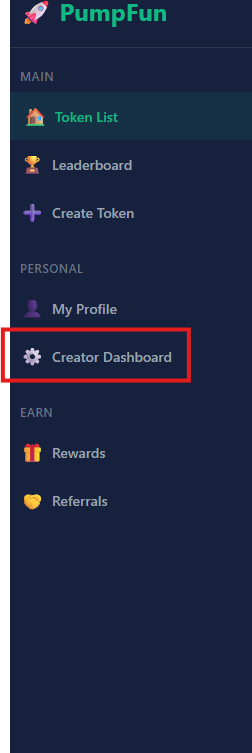

↓

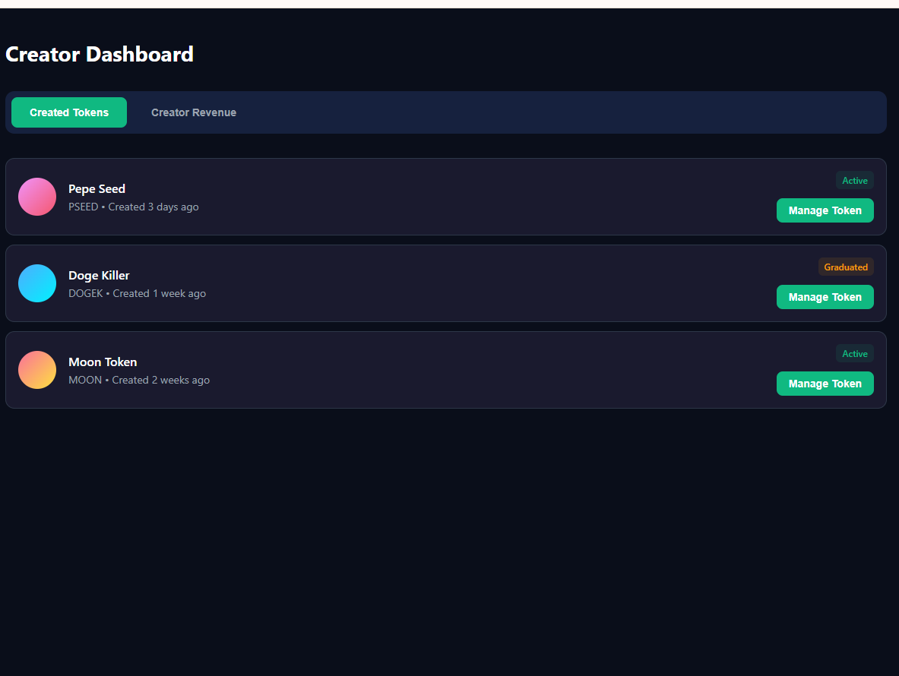

----------

## 3. ĐIỂM TRUY CẬP (ENTRY POINTS)

Users có thể truy cập Creator Dashboard từ:

1. **Main Navigation** - Sidebar menu "Creator Dashboard"
2. **Direct URL** 

**Default:** Mở - Created Tokens tab

----------

## 4. YÊU CẦU CHỨC NĂNG

### 4.1. - Creator Dashboard

**FR-CD-006.1: Dashboard Overview**

**Mô tả:**  
Trang tổng quan quản lý tất cả tokens đã tạo và revenue.

**Giao diện:**

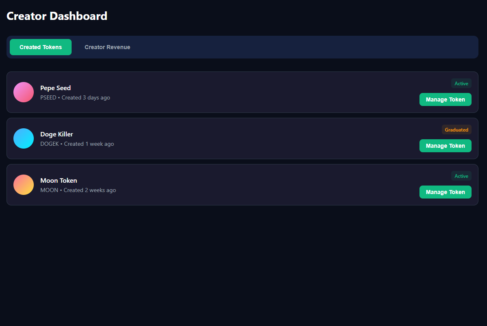

**Yêu cầu:**

```
Page Structure:

1. Header
   - Title: "Creator Dashboard"

2. Tabs Navigation (2 tabs)
   - Created Tokens
   - Creator Revenue
   
   Default: Created Tokens tab active

VÀ dashboard PHẢI:
- Login required
```

**Acceptance Criteria:**

- [ ] Header hiển thị đúng
- [ ] 2 tabs functional
- [ ] Default tab correct

----------

### 4.2. Created Tokens Tab

**FR-CD-006.2: Danh sách Tokens**

**Mô tả:**  
Hiển thị tất cả tokens creator đã tạo với "Manage Token" button.

**Giao diện:**

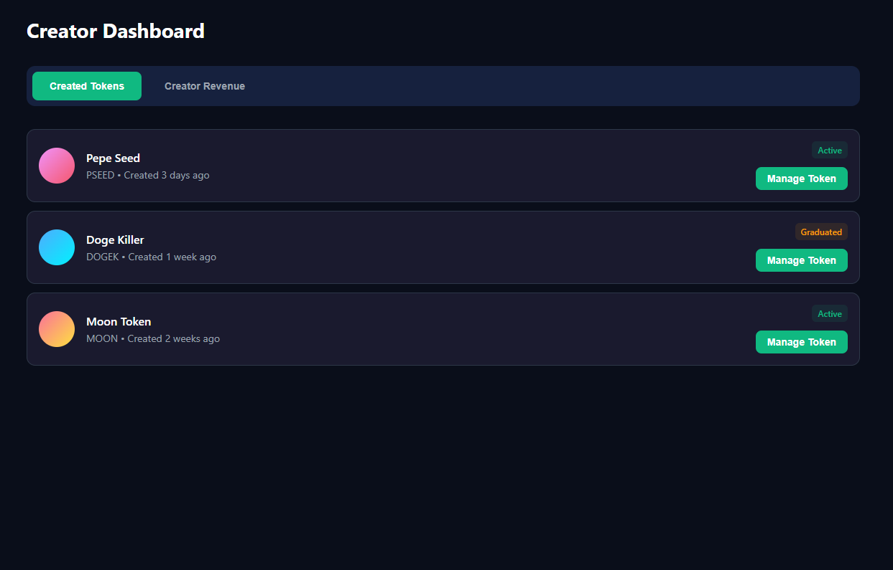

**Yêu cầu:**

```
Token List:

1. Token Items
   Mỗi token hiển thị:
   - Avatar
   - Name + Symbol
   - Created date
   - Status badge: Active / Graduated
   - "Manage Token" button

2. Status Badges
   - Active (green): Token đang trong bonding curve
   - Graduated (yellow): Đã đạt $69K MC

3. Click Behavior
   - Click "Manage Token" → Navigate to (Token Management)
   - Click token info → Token Detail (FR-002)

4. Empty State
   - "You haven't created any tokens yet"
   - "Create Token" button → FR-007

VÀ token list PHẢI:
- Show all tokens user created
- Sorted by created date (newest first)
- Real-time status updates
```

**Acceptance Criteria:**

- [ ] List shows all created tokens
- [ ] Status badges accurate
- [ ] Manage Token button navigates to Token Mananagement page
- [ ] Empty state helpful

----------

### 4.3. Creator Revenue Tab

**FR-CD-006.3: Quản lý Revenue**

**Mô tả:**  
Hiển thị tổng revenue và cho phép claim earnings.

**Giao diện:**

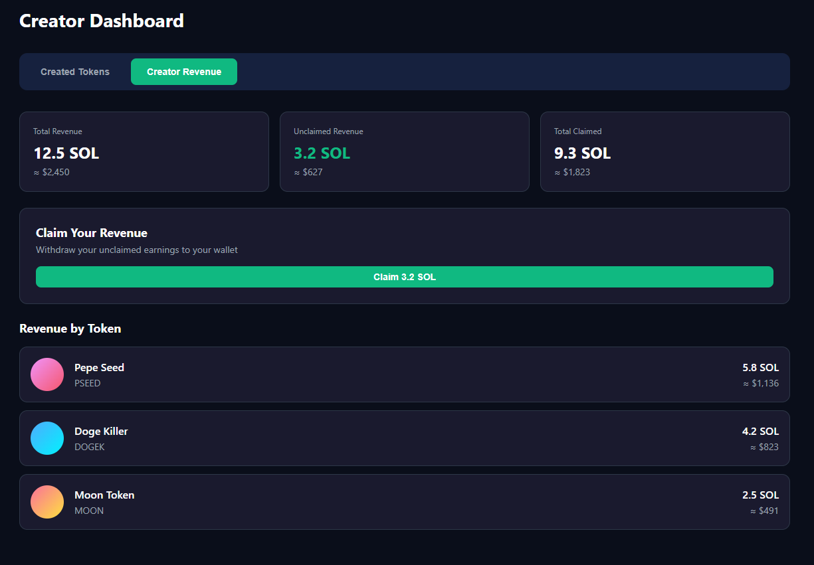

**Yêu cầu:**

```
Revenue Overview:

1. Stats Cards (3)
   - Total Revenue: X SOL (≈ $XXX)
   - Unclaimed Revenue: X SOL (≈ $XXX) - Green
   - Total Claimed: X SOL (≈ $XXX)

2. Claim Section
   - Title: "Claim Your Revenue"
   - Description: "Withdraw your unclaimed earnings to your wallet"
   - Button: "Claim X.X SOL"
   - Requires: Connected wallet
   - Action: Transfer unclaimed revenue to wallet

3. Revenue Breakdown
   - Title: "Revenue by Token"
   - List tokens với revenue per token:
     * Token name + symbol
     * Revenue amount: X SOL (≈ $XXX)
   - Sorted by revenue (highest first)

4. Empty State
   - "No revenue yet"
   - "Start trading to earn creator fees"

VÀ revenue PHẢI:
- Real-time updates
- Accurate calculations
- Wallet connection required for claim
```

**Acceptance Criteria:**

- [ ] Stats accurate
- [ ] Claim button works
- [ ] Wallet connection required
- [ ] Revenue breakdown correct
- [ ] Empty state helpful

----------

### 4.4. Token Management

**FR-CD-006.4: Token Detail Management**

**Mô tả:**  
Quản lý chi tiết một token cụ thể với 3 tabs.

**Giao diện:**

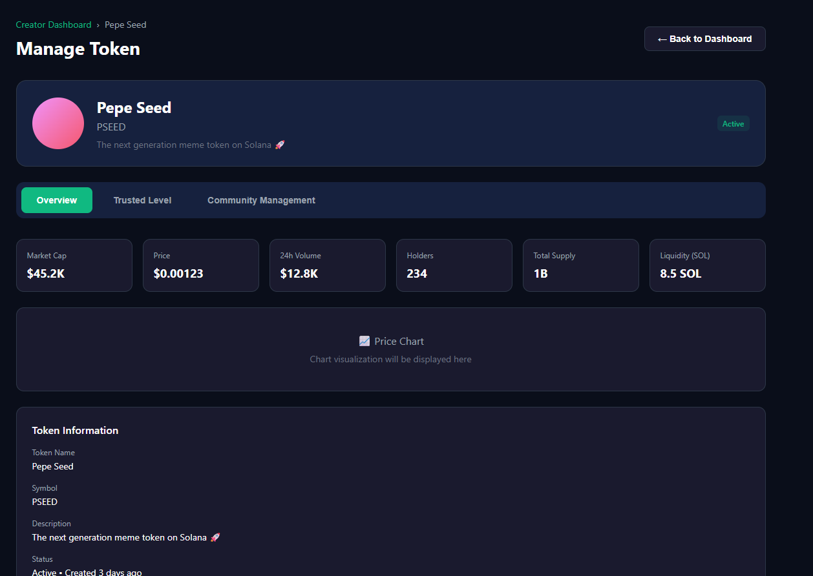

**Yêu cầu:**

```
Page Structure:

1. Breadcrumb Navigation
   - "Creator Dashboard › [Token Name]"
   - Clickable link back to Dashboard

2. Back Button
   - "← Back to Dashboard"
   - Returns to Dashboard page

3. Token Header
   - Avatar (large)
   - Name + Symbol
   - Description
   - Status badge

4. Tabs Navigation (3 tabs)
   - Overview
   - Trusted Level
   - Community Management
   
   Default: Overview tab active

VÀ token management PHẢI:
- All changes save immediately
```

**Acceptance Criteria:**

- [ ] Breadcrumb navigation works
- [ ] Back button returns to Dashboard
- [ ] Token header accurate
- [ ] 3 tabs functional

----------

### 4.5. Overview Tab

**FR-CD-006.5: Token Metrics Overview**

**Mô tả:**  
Hiển thị metrics và thông tin chi tiết của token.

**Giao diện:**

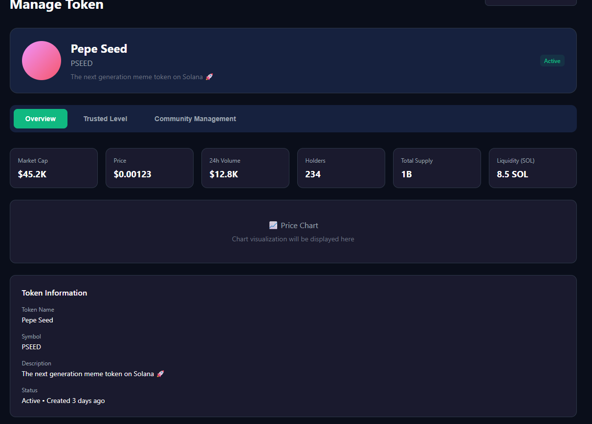

**Yêu cầu:**

```
Overview Content:

1. Metrics Grid (6 cards)
   - Market Cap: $XX.XK
   - Price: $X.XXXXX
   - 24h Volume: $XX.XK
   - Holders: XXX
   - Total Supply: XXX
   - Liquidity (SOL): X.X SOL

2. Chart (Future)
   - Placeholder: "📈 Price Chart"

3. Token Information Section
   - Token Name (read-only)
   - Symbol (read-only)
   - Description (read-only)
   - Status (read-only)

```

**Acceptance Criteria:**

- [ ] Metrics accurate
- [ ] Real-time updates work
- [ ] Token info correct

----------

### 4.6. Trusted Level Tab

**FR-CD-006.6: Security Settings**

**Mô tả:**  
Quản lý các security features để tăng trust score.

**Giao diện:**

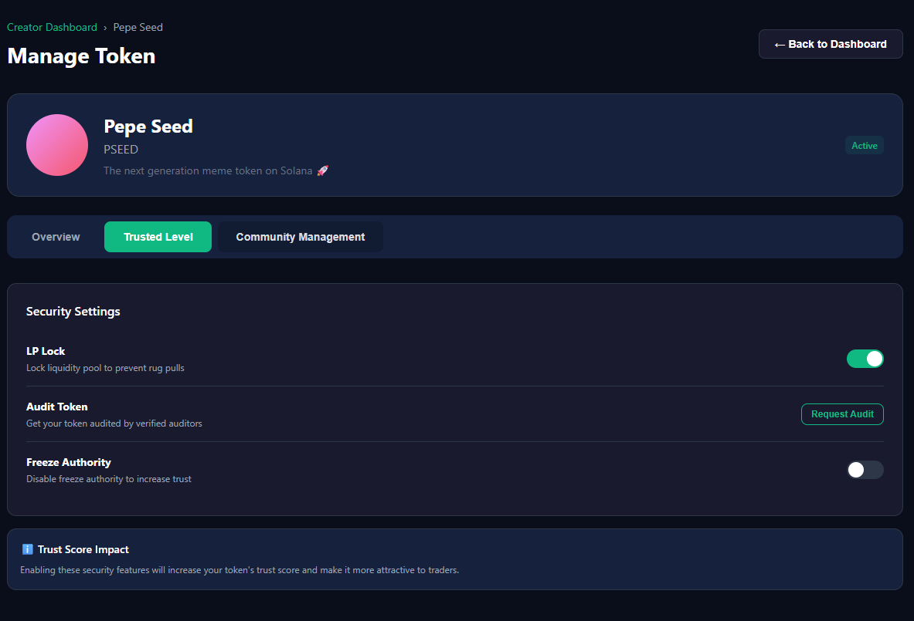

**Yêu cầu:**

```
Security Settings:

1. LP Lock
   - Toggle switch
   - Description: "Lock liquidity pool to prevent rug pulls"
   - Default: OFF
   - Action: Enable/disable LP lock

2. Audit Token
   - Button: "Request Audit"
   - Description: "Get your token audited by verified auditors"
   - Action: Submit audit request
   - Status: Not Audited / Pending / Audited

3. Freeze Authority
   - Toggle switch
   - Description: "Disable freeze authority to increase trust"
   - Default: ON (enabled)
   - Action: Disable freeze authority (permanent)

4. Info Box
   - "ℹ️ Trust Score Impact"
   - Explanation: "Enabling these security features will increase your token's trust score and make it more attractive to traders."

VÀ security settings PHẢI:
- Toggle changes save immediately
- Show confirmation for toggle actions
- Update trust score accordingly
```

----------

### 4.7. Community Management Tab

**FR-CD-006.7: Quản lý Posts**

**Mô tả:**  
Tạo và quản lý community posts.

**Giao diện:**

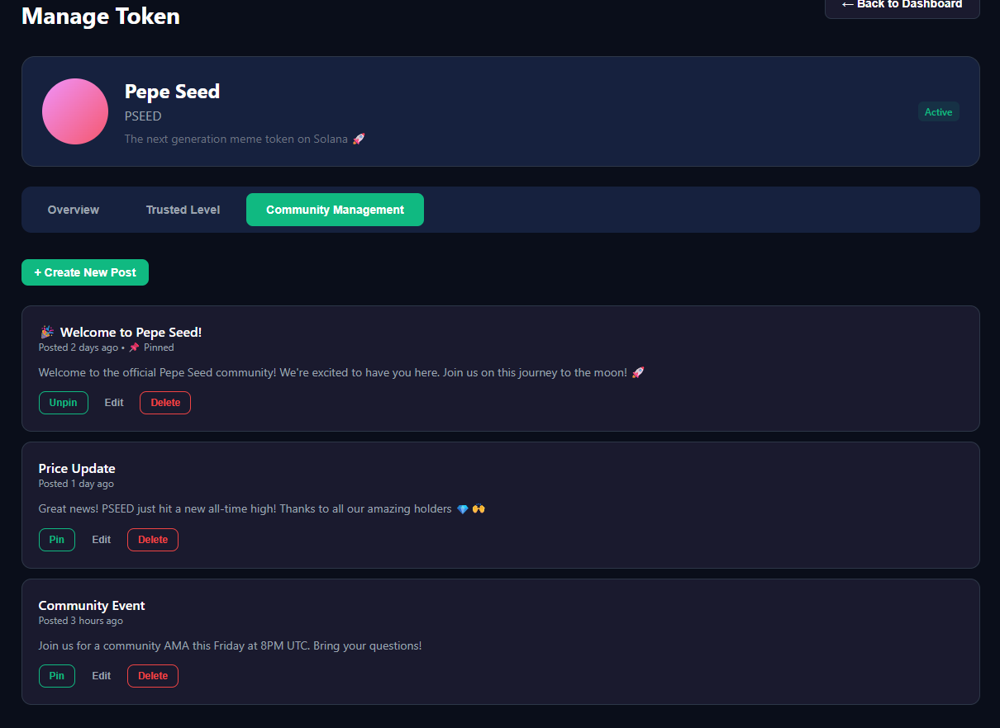

**Yêu cầu:**

```
Community Posts:

1. Create Post Button
   - "+ Create New Post"
   - Opens create post modal

2. Create Post Modal
   - Title field (required, max 100 chars)
   - Content field (required, max 1000 chars)
   - "Create" / "Cancel" buttons

3. Posts List
   Mỗi post hiển thị:
   - Title
   - Meta: "Posted X ago" + Pin status
   - Content preview
   - Actions:
     * Pin/Unpin button
     * Edit button
     * Delete button

4. Post Actions
   
   Pin/Unpin:
   - Max 1 pinned post at a time
   - Pinned post shows "📌 Pinned"
   - Pinned post appears first in list
   
   Edit:
   - Opens edit modal
   - Same fields as create
   - Save changes
   
   Delete:
   - Confirmation modal
   - "Are you sure?"
   - Permanent action

5. Empty State
   - "No posts yet"
   - "Create your first post to engage with your community"

VÀ community management PHẢI:
- Posts visible in Token Detail (FR-002)
```

**Acceptance Criteria:**

- [ ] Create post works
- [ ] Post list displays correctly
- [ ] Pin/Unpin works (max 1 pinned)
- [ ] Edit saves changes
- [ ] Delete confirmation shown
- [ ] Empty state helpful

----------

## 5. ĐIỀU KIỆN CHẤP NHẬN (ACCEPTANCE CRITERIA)

**Overall:**

- [ ] All tabs functional
- [ ] Login required
- [ ] Only accessible by token creators

**Dashboard:**

- [ ] Token list complete
- [ ] Revenue stats accurate
- [ ] Claim function works

**Token Management:**

- [ ] Navigation clear
- [ ] Metrics real-time
- [ ] Security settings work
- [ ] Community posts functional

----------

**END OF FR-006**

# FR-007: TẠO TOKEN (CREATE TOKEN)

## 1. Mô tả

Flow tạo token mới với 5 bước: Basic Info, Avatar, Security Settings, Initial Buy, và Review & Create.

**User Story:**

```
Là một user,
Tôi muốn tạo token meme của riêng mình,
Để launch project và kiếm revenue từ trading fees.
```

----------

## 2. Giao diện

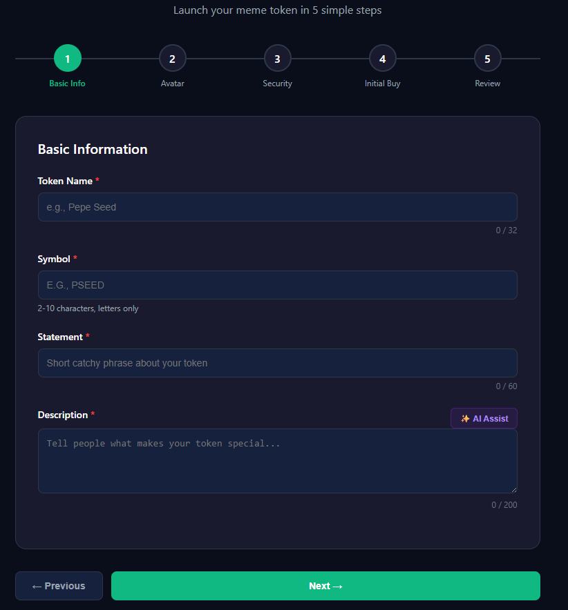

----------

## 3. ĐIỂM TRUY CẬP (ENTRY POINTS)

Users có thể truy cập Create Token từ:

1. **Main Navigation** - Sidebar menu "Create Token"

**Default:** Mở Step 1 (Basic Info)

----------

## 4. YÊU CẦU CHỨC NĂNG

### 4.1. Overall Flow

**FR-CT-007.1: 5-Step Wizard**

**Mô tả:**  
Wizard flow với progress indicator và navigation.

**Yêu cầu:**

```
Flow Structure:

1. Progress Steps (Top)
   - 5 steps indicator
   - Progress line animation
   - States:
     * Active (current step - green)
     * Completed (checkmark - green)
     * Pending (gray)

2. Navigation
   - Previous button (disabled on step 1)
   - Next button (validates before proceeding)
   - Step labels:
     1. Basic Info
     2. Avatar
     3. Security
     4. Initial Buy
     5. Review

3. Validation
   - Validate each step before Next
   - Show error messages inline
   - Required fields marked with *

VÀ wizard PHẢI:
- Save progress (draft)
- Allow Previous navigation
- Clear validation errors
- Smooth transitions
```

**Acceptance Criteria:**

- [ ] Progress indicator works
- [ ] Navigation buttons functional
- [ ] Validation before Next
- [ ] Draft saving works

----------

### 4.2. Step 1 - Basic Information

**FR-CT-007.2: Token Metadata**

**Mô tả:**  
Form nhập thông tin cơ bản của token.

**Giao diện:**


**Yêu cầu:**

```
Form Fields:

1. Token Name * (required)
   - Input text
   - Max 32 characters
   - Character counter
   - Placeholder: "e.g., Pepe Seed"
   - Validation: Not empty, unique

2. Symbol * (required)
   - Input text
   - Max 10 characters
   - Auto uppercase
   - Placeholder: "e.g., PSEED"
   - Validation: 2-10 chars, unique

3. Statement * (required)
   - Input text
   - Max 60 characters
   - Character counter
   - AI Assist button (top right)
   - Placeholder: "Short catchy phrase about your token"

4. Description * (required)
   - Textarea
   - Max 200 characters
   - Character counter
   - AI Assist button (top right)
   - Placeholder: "Tell people what makes your token special..."
   - Validation: Not empty

```

**AI Assist:**

```
Click "✨ AI Assist" button: Gọi API tới AI để tự gen nội dung cho user, base trên các field đang được nhập lúc đó (token name, symbol, description, statement)
```

**Acceptance Criteria:**

- [ ] All fields validate correctly
- [ ] Symbol uniqueness check works
- [ ] AI Assist generates content

----------

### 4.3. Step 2 - Avatar Upload

**FR-CT-007.3: Token Avatar**

**Mô tả:**  
Upload hoặc generate avatar cho token.

**Giao diện:**

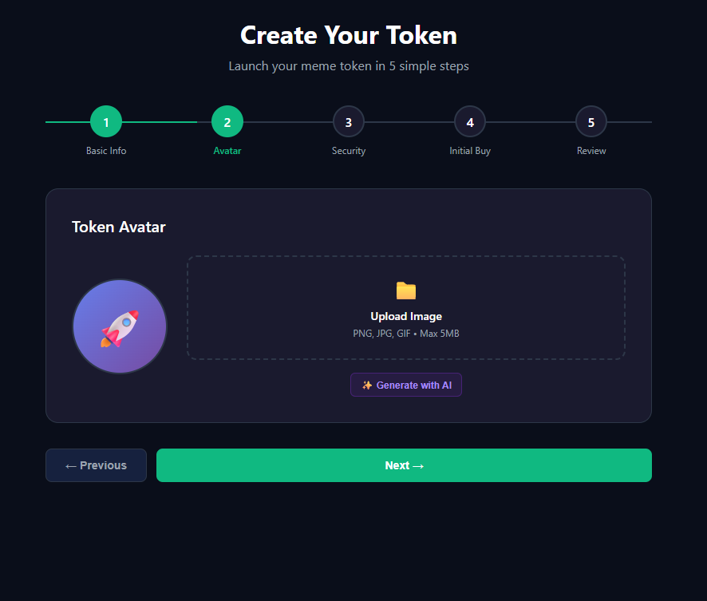

**Yêu cầu:**

```
Avatar Options:

1. Preview
   - Large circle (120px)
   - Default: Emoji placeholder 🚀
   - Updates when image uploaded/generated

2. Upload Image
   - Upload box (dashed border)
   - Click to select file
   - Supported: PNG, JPG, GIF
   - Max size: 5MB
   - Auto crop to square
   - Preview after upload

3. AI Generator
   - Button: "✨ Generate with AI"
   - Click → dùng AI gen cho user ảnh avatar dựa vào các thông tin trước đó

VÀ avatar PHẢI:
- Validate file type and size
- Crop to square automatically

```

**Acceptance Criteria:**

- [ ] Upload works
- [ ] File validation correct
- [ ] AI generation works
- [ ] Preview updates
- [ ] Image optimized

----------

### 4.4. Step 3 - Security Settings

**FR-CT-007.4: Trusted Level Initial Setup**

**Mô tả:**  
Cài đặt security features ban đầu.

**Giao diện:**

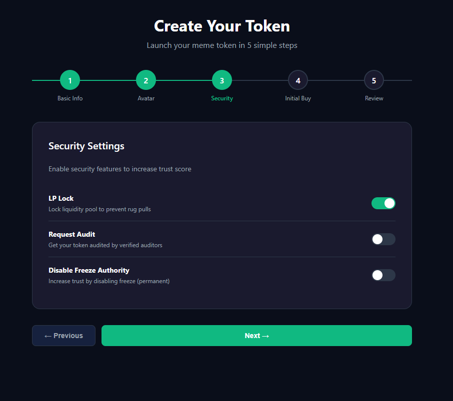

**Yêu cầu: (cần bàn sau)**

```
Security Features:

1. LP Lock (Toggle)
   - Default: ON (enabled)
   - Label: "LP Lock"
   - Description: "Lock liquidity pool to prevent rug pulls"
   - Impact: +20 trust score

2. Request Audit (Toggle)
   - Default: OFF
   - Label: "Request Audit"
   - Description: "Get your token audited by verified auditors"
   - Impact: +30 trust score when completed

3. Disable Freeze Authority (Toggle)
   - Default: OFF
   - Label: "Disable Freeze Authority"
   - Description: "Increase trust by disabling freeze (permanent)"
   - Impact: +25 trust score
   - Warning: Permanent action

VÀ security settings PHẢI:
- Toggles save state
- Show trust score impact
- Warn about permanent actions
```

**Acceptance Criteria:**

- [ ] Toggles work
- [ ] Default states correct
- [ ] Trust score displayed
- [ ] Warnings shown

----------

### 4.5. Step 4 - Initial Buy (Optional)

**FR-CT-007.5: Initial Purchase**

**Mô tả:**  
Option để mua tokens ngay khi tạo.

**Giao diện:**

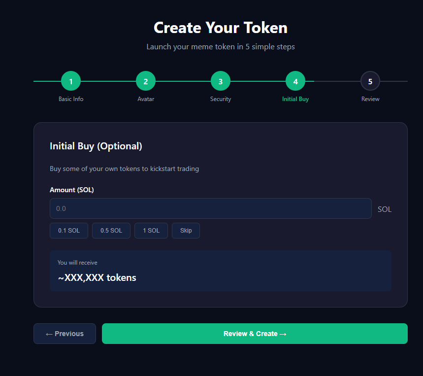

**Yêu cầu:**

```
Initial Buy Form:

1. Amount Input
   - Label: "Amount (SOL)"
   - Input: Number, min 0, step 0.1
   - Unit: SOL
   - Validation: ≥ 0, ≤ wallet balance

2. Quick Amounts
   - Buttons: [0.1 SOL] [0.5 SOL] [1 SOL] [Skip]
   - Click fills amount input
   - Skip → Proceed without buying

3. Preview
   - "You will receive"
   - "~XXX,XXX tokens" (calculated)
   - Based on bonding curve formula

VÀ initial buy PHẢI:
- Calculate tokens accurately
- Check wallet balance
- Allow skip
- Update preview real-time
```

**Acceptance Criteria:**

- [ ] Amount input validates
- [ ] Quick buttons work
- [ ] Token calculation accurate
- [ ] Skip button works
- [ ] Balance check works

----------

### 4.6. Step 5 - Review & Create

**FR-CT-007.6: Final Review**

**Mô tả:**  
Review tất cả thông tin trước khi create.

**Giao diện:**

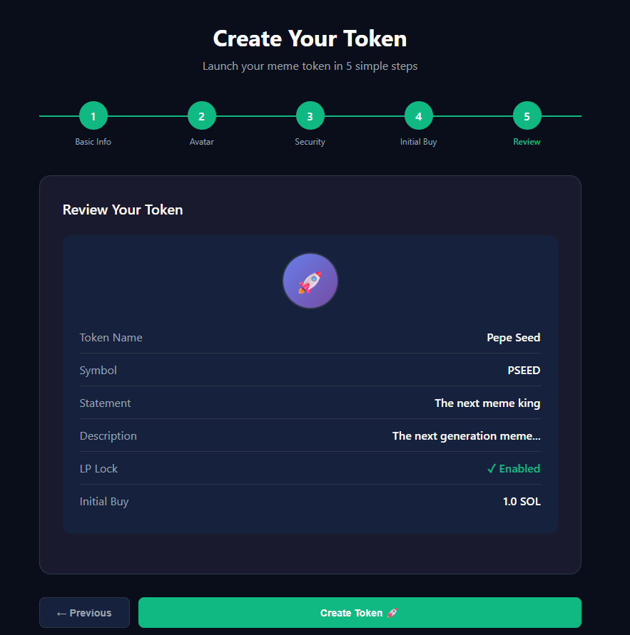

**Yêu cầu:**

```
Review Content:

1. Summary Card
   - Avatar preview
   - Token info list:
     * Token Name
     * Symbol
     * Statement
     * Description (truncated)
     * LP Lock: ✓ Enabled / ✗ Disabled
     * Audit: ✓ Requested / ✗ Not Requested
     * Freeze: ✓ Disabled / ✗ Enabled
     * Initial Buy: X SOL or "Skipped"

2. Create Button
   - "Create Token 🚀"
   - Large, primary button
   - Requires wallet connection
   - Shows loading state

3. Transaction Flow
   - Click Create
   - Connect wallet (if not connected)
   - Sign transaction
   - Show loading: "Creating token..."
   - Deploy contract
   - Initialize bonding curve
   - Execute initial buy (if any)
   - Show success screen

```

**Acceptance Criteria:**

- [ ] Summary displays all info
- [ ] Create button works
- [ ] Wallet connection required
- [ ] Transaction processes
- [ ] Loading states shown

----------

### 4.7. Success Screen

**FR-CT-007.7: Token Created**

**Mô tả:**  
Celebration screen sau khi token được tạo thành công.

**Giao diện:**

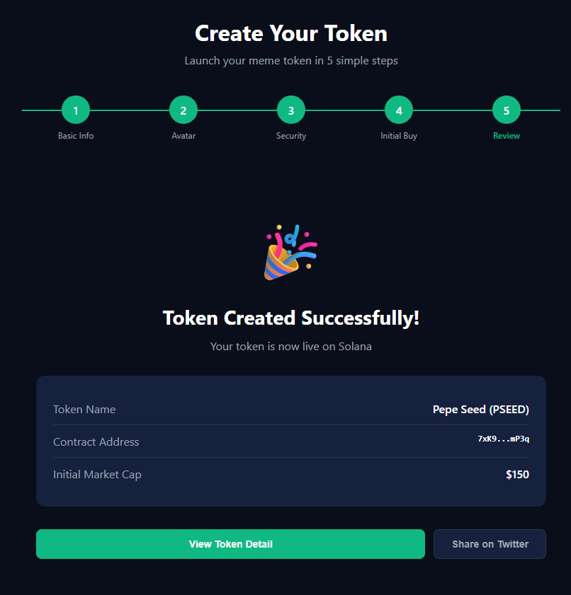

**Yêu cầu:**

```
Success Content:

1. Celebration
   - Icon: 🎉 (large)
   - Title: "Token Created Successfully!"
   - Message: "Your token is now live on Solana"

2. Token Info Card
   - Token Name + Symbol
   - Contract Address (monospace, clickable)
   - Initial Market Cap (USD)

3. Action Buttons
   - "View Token Detail" (primary)
     → Navigate to Token Detail (FR-002)
   - "Share on Twitter" (secondary) -> cần xem xét
     → Open Twitter with pre-filled tweet

```

**Twitter Share Text:**

```
🚀 I just launched [TOKEN_NAME] ($[SYMBOL]) on @PumpFunSOL!

Contract: [ADDRESS]
Market Cap: $[MC]

Trade now: [URL]

#Solana #MemeCoin
```

**Acceptance Criteria:**

- [ ] Success message shows
- [ ] Token info accurate
- [ ] View Token works
- [ ] Share Twitter works
- [ ] Copy address works

----------

## 5. ĐIỀU KIỆN CHẤP NHẬN (ACCEPTANCE CRITERIA)

**Overall Flow:**

- [ ] 5 steps complete successfully
- [ ] Navigation works smoothly
- [ ] Validation prevents errors
- [ ] Draft saving works

**Steps:**

- [ ] Basic Info validates all fields
- [ ] Avatar upload/generate works
- [ ] Initial buy calculates correctly
- [ ] Review shows complete summary


**Post-Creation:**

- [ ] Creator dashboard updated

----------

**END OF FR-007**

# FR-008: BẢNG XẾP HẠNG (LEADERBOARD)

## 1. Mô tả

Bảng xếp hạng tokens theo Market Cap, hiển thị top 3 nổi bật và 17 tokens tiếp theo.

**User Story:**

```
Là một user,
Tôi muốn xem các tokens xếp hạng cao nhất,
Để phát hiện và trade các tokens tiềm năng.
```

----------

## 2. Giao diện

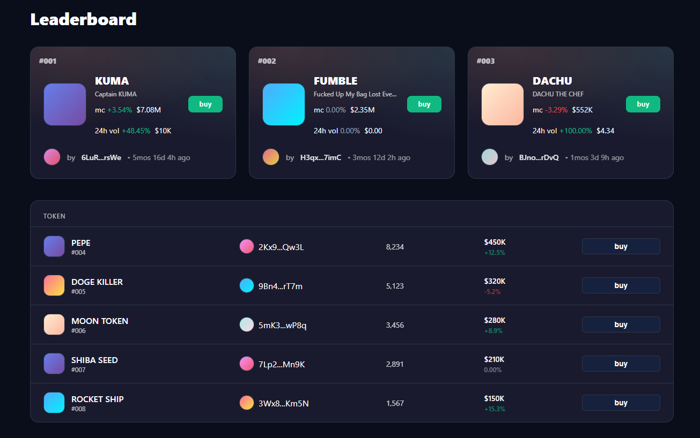

----------

## 3. ĐIỂM TRUY CẬP (ENTRY POINTS)

Users có thể truy cập Leaderboard từ:

1. **Main Navigation** - Sidebar menu "Leaderboard"
2. **Direct URL** - /leaderboard

**Default:** Hiển thị tất cả tokens ranked by công thức

----------

## 4. YÊU CẦU CHỨC NĂNG

### 4.1. Page Layout

**FR-LB-008.1: Cấu trúc Trang**

**Mô tả:**  
Layout với top 3 featured cards và table list.

**Giao diện:**


**Yêu cầu:**

```
Page Structure:

1. Header
   - Title: "Leaderboard"

2. Top 3 Featured Cards
   - Grid layout (3 columns)

3. Table List
   - Compact table format
   - 5 columns

VÀ leaderboard PHẢI:
- Rank theo công thức
- Real-time updates
- Responsive layout
```

**Acceptance Criteria:**

- [ ] Header displays correctly
- [ ] Top 3 cards prominent
- [ ] Table shows rank #4+
- [ ] Layout responsive

----------

# FR-010: GIỚI THIỆU (REFERRALS)

## 1. Mô tả

Chương trình giới thiệu bạn bè, kiếm % từ trading fees của người được giới thiệu.

**User Story:**

```
Là một user,
Tôi muốn giới thiệu bạn bè và kiếm thêm thu nhập,
Để tăng earnings từ trading activities của họ.
```

----------

## 2. Giao diện


----------

## 3. ĐIỂM TRUY CẬP (ENTRY POINTS)

Users có thể truy cập Referrals từ:

1. **Main Navigation** - Sidebar menu "Referrals"
2. **Direct URL** - /referrals

**Default:** Hiển thị tất cả sections

----------

## 4. YÊU CẦU CHỨC NĂNG

### 4.1. Page Layout

**FR-REF-010.1: Cấu trúc Trang**

**Mô tả:**  
Layout với stats overview và 3 sections chính.

**Giao diện:**

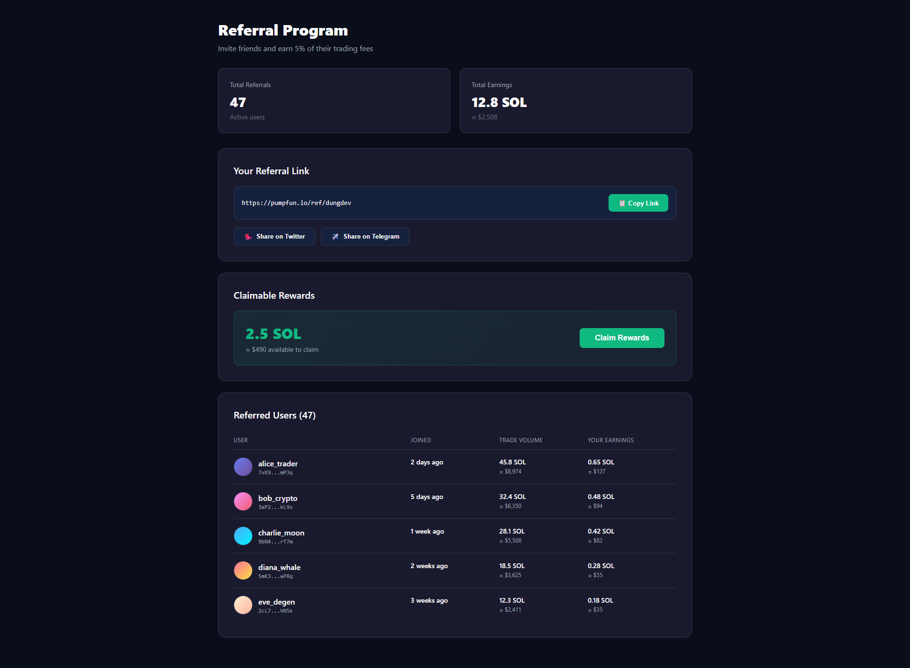

**Yêu cầu:**

```
Page Structure:

1. Header
   - Title: "Referral Program"
   - Subtitle: "Invite friends and earn 20% of the 1% trading fee from your referrals"

2. Stats Overview ( cards)
   - Total Referrals
   - Total Earnings


3. Sections (3)
   - Your Referral Link
   - Claimable Rewards
   - Referred Users

```

----------

### 4.2. Stats Overview

**FR-REF-010.2: Thống kê Tổng quan**

**Mô tả:**  
Hiển thị thống kê referral performance.

**Giao diện:**

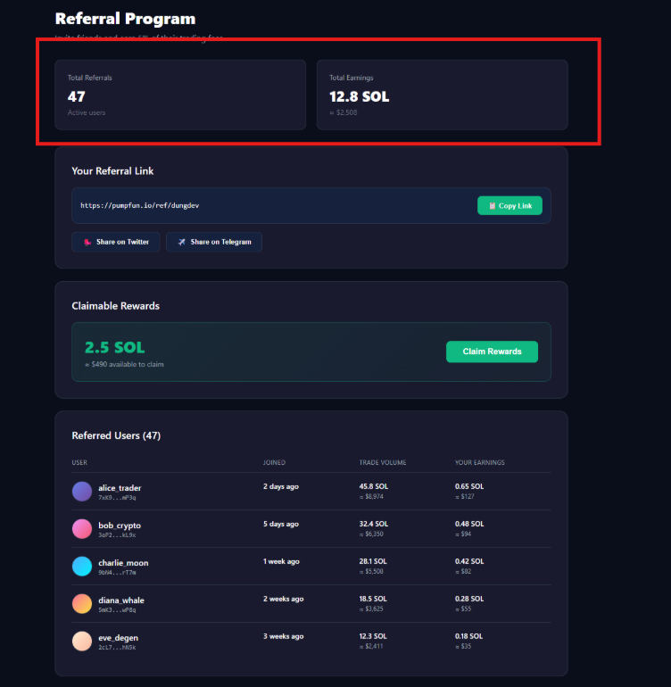

**Yêu cầu:**

```
Stats Cards (3):

1. Total Referrals
   - Value: XX users
   - Sub: "Active users"

2. Total Earnings
   - Value: XX.X SOL
   - Sub: ≈ $X,XXX (USD equivalent)

```

----------

### 4.3. Referral Link Section

**FR-REF-010.3: Link Giới thiệu**

**Mô tả:**  
Copy và share referral link.

**Giao diện:**

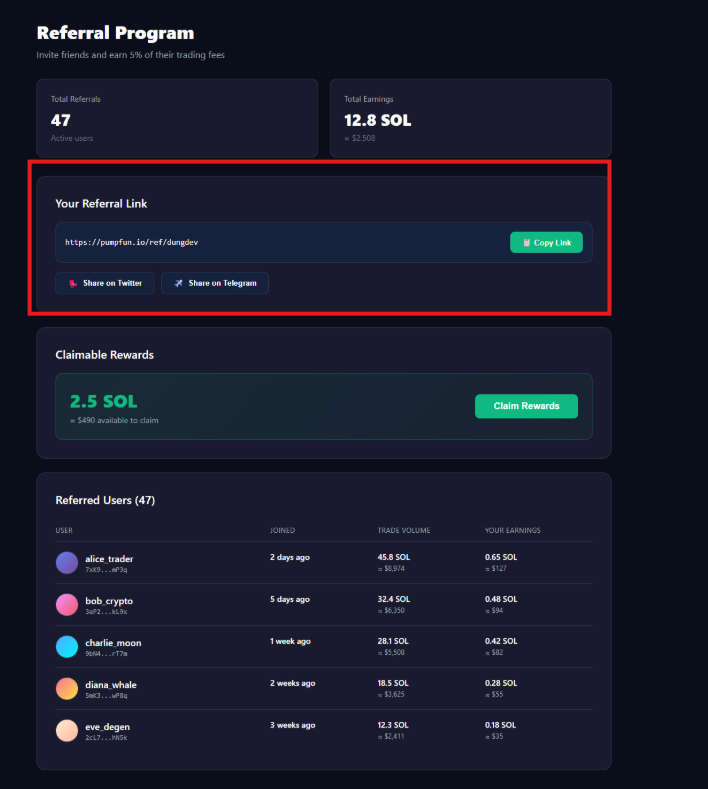

**Yêu cầu:**

```
Referral Link:

1. Link Box
   - URL: https://pumpfun.io/ref/[username]

2. Copy Function
   - Click → Copy to clipboard
   - Show success: "✓ Copied!" (2 seconds)
   - Then revert to "📋 Copy Link"

VÀ referral link PHẢI:
- Generate unique per user
- Based on username
- Copy function works
```

**Acceptance Criteria:**

- [ ] Link generates correctly

----------

### 4.4. Claimable Rewards Section

**FR-REF-010.4: Claim Rewards**

**Mô tả:**  
Hiển thị và claim referral earnings.

**Giao diện:**

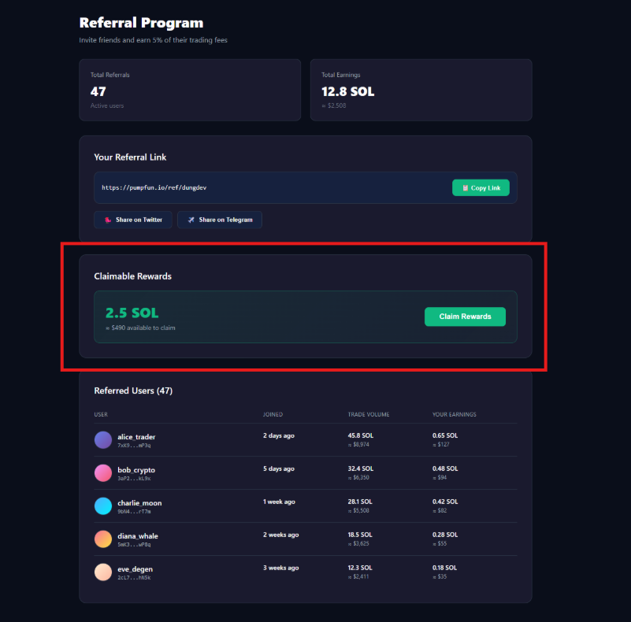

**Yêu cầu:**

```
Claimable Rewards:


1. Claim Function
   - Requires: Wallet connection
   - Click → Wallet signature
   - Transfer claimable to wallet
   - Update balance
   - Show success message

2. States
   - Has claimable: Button enabled
   - No claimable: Button disabled

VÀ claim PHẢI:
- Accurate balance
- Require wallet
- Update real-time
- Handle errors
```

**Acceptance Criteria:**

- [ ] Balance displays correctly
- [ ] USD conversion accurate
- [ ] Claim button works
- [ ] Wallet connection required
- [ ] Balance updates after claim
- [ ] Error handling works

----------

### 4.5. Referred Users Section

**FR-REF-010.5: Danh sách Người giới thiệu**

**Mô tả:**  
Hiển thị tất cả users đã được giới thiệu.

**Giao diện:**

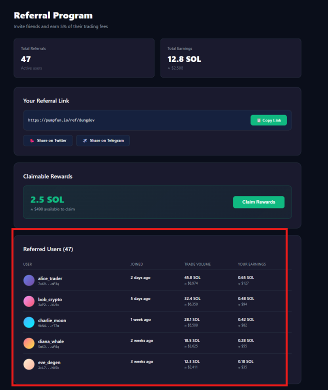

**Yêu cầu:**

```
Referred Users List:

1. Table Header
   - Title: "Referred Users (XX)"
   - Count: Total referred

2. Table Columns (4)
   
   User:
   - Avatar
   - Username
   - Wallet address (truncated)
   
   Joined:
   - Relative time: "2 days ago"
   
   Trade Volume:
   - SOL amount
   - USD equivalent
   
   Your Earnings:
   - SOL earned from this user
   - USD equivalent

3. Sorting
   - Default: Joined date (newest first)
   - Optional: By earnings

4. Click Behavior
   - Click row → Public Profile (FR-005)
     * If referred user's profile is PRIVATE: Show limited profile view (lock icon + created tokens)
     * If referred user's profile is PUBLIC: Show full profile based on privacy settings
   - Cursor: Pointer
   - Hover: Background highlight"
   - Empty State
   - "No referrals yet"
   - "Share your link to start earning"

VÀ users list PHẢI:
- Show all referred users
- Accurate earnings
- Clickable to profile
```

**Earnings Calculation:**

```
Earnings Formula:
Referrer Earnings = Referred user's Trade Volume × 1% (trading fee) × 20%

Example:
- Referred user trades: 100 SOL
- Trading fee (1%): 1 SOL
- Referrer earnings (20× of fee): 0.2 SOL
```

----------

## 5. ĐIỀU KIỆN CHẤP NHẬN (ACCEPTANCE CRITERIA)

**Referral Link:**

- [ ] Link generates correctly
- [ ] Copy function works

**Claim:**

- [ ] Balance accurate
- [ ] Claim function works
- [ ] Wallet connection required

**Users List:**

- [ ] All users shown
- [ ] Earnings accurate
- [ ] Navigation works

----------

**END OF FR-010**
# FR-011: ĐIỂM THƯỞNG (POINTS)

## 1. Mô tả

Hệ thống điểm thưởng khuyến khích users trade và tham gia activities, tiến bộ qua các ranks.

**User Story:**

```
Là một user,
Tôi muốn kiếm điểm và qua các ranks,
Để nhận rewards và unlock benefits.
```

----------

## 2. Giao diện

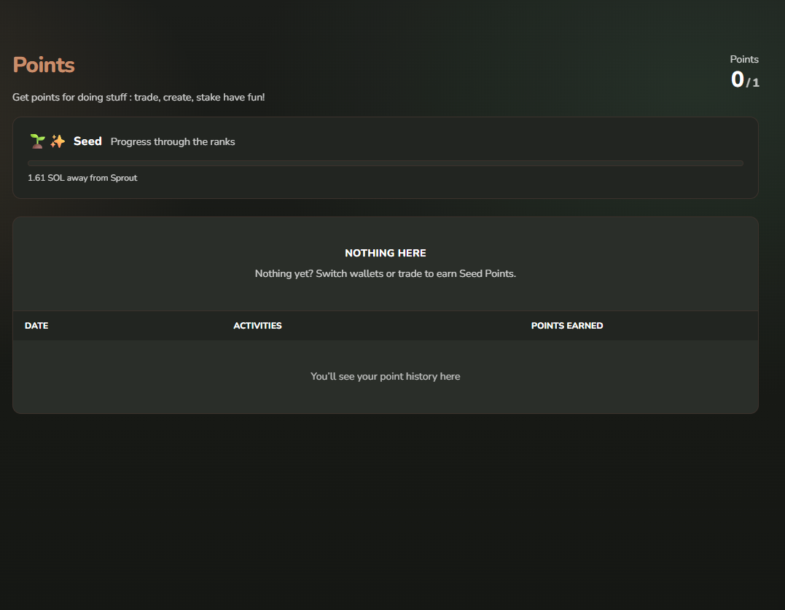

----------

## 3. ĐIỂM TRUY CẬP (ENTRY POINTS)

Users có thể truy cập Points từ:

1. **Main Navigation** - Sidebar menu "Points"
2. **Direct URL** - /points 

----------

## 4. YÊU CẦU CHỨC NĂNG

### 4.1. Page Layout

**FR-PTS-009.1: Cấu trúc Trang**

**Mô tả:**  
Layout với header, rank card, và history table.


**Yêu cầu:**

```
Page Structure:

1. Header (2 columns)
   Left:
   - Title: "Points"
   - Subtitle: "Get points for doing stuff : trade, create, stake have fun!"
   
   Right:
   - Label: "Points"
   - Value: XXX / XXX (current / next level)

2. Rank Card
   - Current rank display
   - Progress bar
   - Next rank info

3. History Section
   - Empty state or table
   - Points earning history

VÀ points page PHẢI:
- Login required
```

**Acceptance Criteria:**

- [ ] Header displays correctly
- [ ] Points value accurate
- [ ] Rank card shows current level

----------

### 4.2. Rank System

**FR-PTS-009.2: Rank Display**

**Mô tả:**  
Hiển thị current rank và progress.


**Yêu cầu:**

```
Rank Card:

1. Rank Info
   - Emoji icon: 🌱✨ (Seed)
   - Name: "Seed"
   - Subtitle: "Progress through the ranks"

2. Progress Bar
   - Height: 
   - Fill: Primary green
   - Width: Percentage (current / next level)

3. Progress Text
   - Format: "X.XX SOL away from [Next Rank]"
   - Calculate remaining volume needed

VÀ rank card PHẢI:
- Show accurate calculations
- Smooth progress animation
```

**Rank Levels:**

```
Ranks (5 tiers):

Tier 1: 🌱 Seed
- Points: 0
- Reward: –

Tier 2: 🌿 Sprout
- Points: 500 pts
- Reward: 🎁 1 Ticket + 0.005 SOL

Tier 3: 🌳 Sapling
- Points: 2,000 pts
- Reward: 🎁 3 Tickets + 0.02 SOL

Tier 4: 🌲 Tree
- Points: 10,000 pts
- Reward: 🎁 5 Tickets + 0.05 SOL

Tier 5: 🪷 Ancient Tree
- Points: 50,000 pts
- Reward: 🎁 10 Tickets + 0.2 SOL

Points Calculation:

(A) Referral Points (strongest)
- Formula: NetVolume × 10
- NetVolume = Total BUY - Total SELL
- Examples:
  * 0.1 SOL → 1 point
  * 1 SOL → 10 points
  * 10 SOL → 100 points

(B) Trade Points
- Formula: Volume × 5
- Example: 1 SOL trade → 5 points

(C) Token Creation Points
- Create token: 20 pts
- Upload image + full description: 10 pts
- Token Trust Score: 20 pts
- Token reaches 10 first buys: 30 pts
- Rules:
  * Only count when token is ACTIVE
  * ACTIVE = has 2nd buyer 
  * 2nd buyer must BUY ≥ xx SOL

**Acceptance Criteria:**

- [ ] Rank displays correctly
- [ ] Progress bar accurate
- [ ] Remaining volume calculated
- [ ] Next rank shown
- [ ] Smooth animations

----------

### 4.3. Points History

**FR-PTS-009.3: Lịch sử Điểm**

**Mô tả:**  
Hiển thị history kiếm điểm.

**Giao diện:**

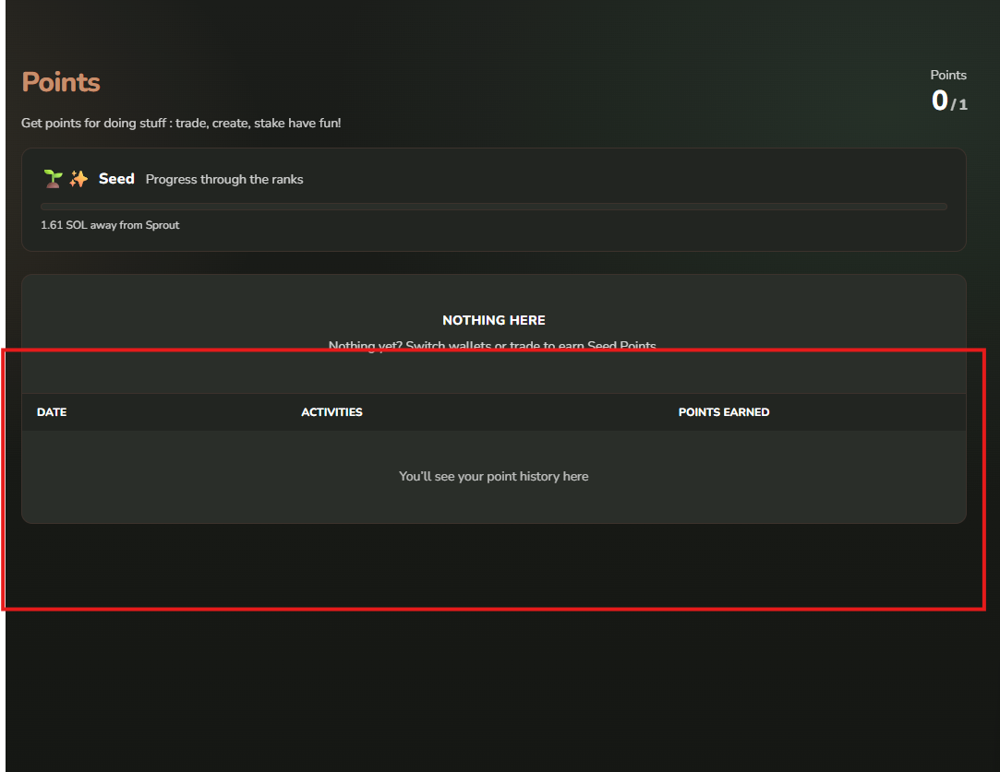

**Yêu cầu:**

```
History Table:

1. Empty State
   - Title: "NOTHING HERE" (uppercase, bold)
   - Subtitle: "Nothing yet? Switch wallets or trade to earn Seed Points."
   - Empty table with headers
   - Message: "You'll see your point history here"

2. Table Headers (3 columns)
   - DATE (min-width: 140px)
   - ACTIVITIES (min-width: 200px)
   - POINTS EARNED (min-width: 160px)

3. Data Rows (when has data)
   Each row shows:
   - Date: "Jan 15, 2025"
   - ACTIVITES: kiểm points nhờ action gì (referral, buy/sell, create token v.v)
   - Points: "+125 points" (green color)


VÀ history PHẢI:
- Show all point-earning activities
- Real-time updates
```

**Points Earning Activities:**

Activities that earn points:

1. Referral
   - NetVolume × 10

2. Trading
   - Volume × 5

3. Creating Tokens
   - Create token: 20 pts
   - Upload image + description: 10 pts
   - Token Trust Score: 20 pts
   - Token reaches 10 buys: 30 pts
   - Total possible: 80 pts per token
   - Only count when token ACTIVE

**Acceptance Criteria:**

- [ ] Points calculation accurate

----------

## 5. ĐIỀU KIỆN CHẤP NHẬN (ACCEPTANCE CRITERIA)

**Overall:**

- [ ] Login required
- [ ] Points accurate


**Rank System:**

- [ ] Current rank correct
- [ ] Progress bar accurate
- [ ] Next rank displayed
- [ ] Volume calculation correct

**History:**

- [ ] Empty state helpful
- [ ] Table displays correctly
- [ ] All activities logged
- [ ] Points calculation accurate

----------

**END OF FR-011**

