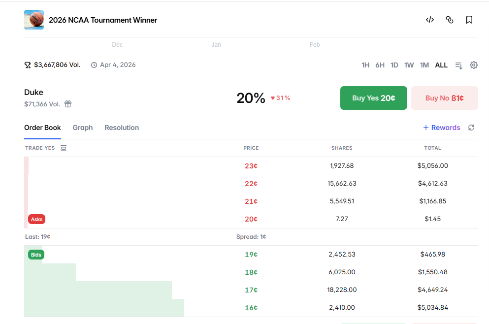

## Tổng quan 4 mô hình

| # | Tên mô hình | User đấu với ai | Độ phức tạp |
|---|-------------|-------------|-------------|
| 1 | Parimutuel Pool | Users vs Users | Thấp |
| 2 | AMM / LMSR | Users vs Pool toán học | Trung bình |
| 3 | CLOB Orderbook | Users vs Users (khớp lệnh) | Rất cao |
| 4 | Platform làm nhà cái (House Bet) | Users vs Protocol Pool | Trung bình |

---

## Chấm điểm


| Mô hình | Dễ build | UX người dùng | An toàn cho platform | Bảo mật | **Tổng** |
|---------|:---------:|:-------------:|:--------------------:|:-------:|:-----------:|
| 1. Parimutuel     | ★★★★★ | ★★☆☆☆ | ★★★★★ | ★★★★★ | **4.3 / 5** |
| 2. AMM/LMSR       | ★★★☆☆ | ★★★★☆ | ★★★☆☆ | ★★★★☆ | **3.5 / 5** |
| 3. CLOB Orderbook | ★☆☆☆☆ | ★★★★☆ | ★★★★★ | ★★★☆☆ | **3.3 / 5** |
| 4. House betting  | ★★★★☆ | ★★★★★ | ★☆☆☆☆ | ★★☆☆☆ | **3.0 / 5** |

---

## Mô hình 1: Parimutuel Pool

### Tổng quan
> Tất cả tiền cược gom vào 1 cái pool chung. Bên thắng chia đều tiền của bên thua.

### Cách hoạt động

```
Bước 1: War mở cửa
        Token A (PEPE) ←→ Token B (WOJAK)
        Thời gian: 24 giờ

Bước 2: Người dùng đặt cược
        └─ Phe PEPE: 600 SOL (từ 200 người)
        └─ Phe WOJAK: 400 SOL (từ 150 người)
        └─ Tổng nồi: 1,000 SOL

Bước 3: War kết thúc, tính kết quả
        Sau 24h: PEPE tăng 45%, WOJAK tăng 22%
        → PEPE THẮNG

Bước 4: Phân chia tiền thưởng
        Phí platform 3% = 30 SOL
        Nồi còn lại = 970 SOL
        → Chia hết cho phe PEPE theo tỷ lệ đóng góp
```

### Ví dụ số cụ thể

User cược **100 SOL** vào PEPE (bên thắng):

```
Tỷ lệ thắng = 970 SOL / 600 SOL = 1.617x
User nhận   = 100 × 1.617 = 161.7 SOL
Lợi nhuận  = +61.7 SOL (+61.7%)
```

User cược **100 SOL** vào WOJAK (bên thua):
```
User nhận = 0 SOL
Thua = -100 SOL
```

> Điểm yếu **:** User không biết cụ thể odd của mình. Số tiền ăn được thay đổi theo thời gian. Ít có incentive vào sớm.

### Ưu điểm
- ✅ Platform không mất tiền
- ✅ Dễ triển khai

### Nhược điểm
- ❌ Không biết tỷ lệ thắng trước (người dùng pro sẽ ko thích mô hình này)

---

## Mô hình 2: AMM

### Tổng quan
> Người dùng cược với một công thức toán tự động (AMM).

---

### Thông số khởi tạo (Seed)

| Tham số | Giá trị | Ý nghĩa |
|---------|---------|---------|
| **Seed liquidity (b)** | 1 SOL | Số SOL platform bơm vào pool để "mồi" thị trường |
| **Mệnh giá vé** | 1 vé = 0.1 SOL | Mua 1 vé để nhận 0.11 SOL nếu thắng, hoặc 0 nếu thua |
| **Giá khởi điểm** | PEPE_YES = **0.05 SOL/vé** \| WOJAK_YES = **0.05 SOL/vé** | Hai phe cân bằng 50/50 ban đầu |
| **Rule** | Giá PEPE_YES + Giá WOJAK_YES = **0.1 SOL** luôn luôn | Tổng xác suất = 100% |

> **Về Seed**
> Seed quyết định độ ổn định của giá. Seed càng lớn → giá càng ít trượt khi có người mua.
---

### Luồng hoạt động:

```
Bước 1: Platform tạo 2 loại vé cược
        └─ PEPE_YES  (mua nếu tin PEPE thắng)
        └─ WOJAK_YES (mua nếu tin WOJAK thắng)

        Giá mỗi vé khởi điểm: PEPE_YES = 0.05 SOL | WOJAK_YES = 0.05 SOL
        (Tổng 2 loại luôn = 0.1 SOL - mệnh giá)

─────────────────────────────────────────────────────
Bước 2: Platform bơm seed
        Seed: 1 SOL

─────────────────────────────────────────────────────
Bước 3: Alice mua 5 vé PEPE_YES
        Trả: ~0.28 SOL
        → Giá PEPE_YES tăng lên ~0.062 SOL/vé  (+24%)
        → Giá WOJAK_YES giảm xuống ~0.038 SOL/vé

─────────────────────────────────────────────────────
Bước 4: Bob mua 5 vé WOJAK_YES
        Trả: ~0.22 SOL  (rẻ hơn Alice vì WOJAK đang bị undervalue)
        → Giá cân bằng lại dần về 50/50

        → mua WOJAK_YES lúc này được lợi giá

─────────────────────────────────────────────────────
Bước 5: War kết thúc — PEPE thắng
        Mỗi vé PEPE_YES → đổi được 0.1 SOL
        Mỗi vé WOJAK_YES → = 0 SOL (vô giá trị)

        Alice: mua 5 vé PEPE_YES với 0.28 SOL → nhận 0.5 SOL → lời 0.22 SOL
        Bob:   mua 5 vé WOJAK_YES với 0.22 SOL → nhận 0 SOL → lỗ 0.22 SOL
```

---


### Điểm yếu:
- **LP (platform)** chịu rủi ro nếu người dùng mua nhiều vé của bên phía thắng hơn. q. Rủi ro tối đa ≈ 69% seed nếu tất cả mọi người đặt đúng 1 phía duy nhất.

### Điểm yếu với meme coin
Creator của token có thể thao túng được thị trường để ăn tiền bet.

### Ưu điểm
- ✅ User biết odd
- ✅ Hoạt động ngay cả khi ít người chơi (không cần bot)

### Nhược điểm
- ❌ Platform phải bơm seed mỗi war
- ❌ LP có nguy cơ mất tiền khi bị insider exploit
- ❌ Phức tạp hơn để code (Có công thức, cần test kỹ xem có kẽ hở gì trong công thức không)

---

## Mô hình 3: CLOB Orderbook

### Ý tưởng
> Như sàn chứng khoán, giao dịch xảy ra khi 2 người khớp giá với nhau.

---

### Một vài khái niệm lõi:

```
Mỗi war tạo ra 2 loại share:
  PEPE_WIN share  = "tôi tin PEPE thắng"
  WOJAK_WIN share = "tôi tin WOJAK thắng"

Quy tắc:
  Giá PEPE_WIN + Giá WOJAK_WIN = 1 SOL (luôn luôn)

Ý nghĩa giá:
  PEPE_WIN giá 0.65 SOL  →  thị trường đang tin PEPE thắng 65%
  WOJAK_WIN giá 0.35 SOL →  thị trường đang tin WOJAK thắng 35%

Khi kết thúc:
  Bên thắng → mỗi share = 1 SOL
  Bên thua  → mỗi share = 0 SOL
```

---

### Luồng hoạt động:

```
Bước 1: 
        User A: đặt mua với giá 0.65 SOL

        User A đặt lệnh MUA:
          2 PEPE_WIN shares @ 0.65 SOL/share
          → User A lock: 2 × 0.65 = 1.3 SOL vào pool
          → Lệnh nằm chờ trên orderbook

        [Orderbook:]
        BID: User A muốn mua 2 PEPE_WIN @ 0.65 SOL  ← chờ người bán
        ASK: (trống)

────────────────────────────────────────────────────
Bước 2: User B vào xem orderbook, thấy lệnh của User A

        [Orderbook lúc này]
        BID: User A muốn mua 2 PEPE_WIN @ 0.65 SOL 

        User B đọc: "User A trả 0.65/share cho PEPE_WIN"
        → User B chấp nhận tỷ lệ này, muốn cược WOJAK

        User B đặt lệnh MUA WOJAK_WIN:
          2 WOJAK_WIN shares @ 0.35 SOL/share
          → User B lock: 2 × 0.35 = 0.7 SOL vào pool
          → 0.65 + 0.35 = 1.0 ✓ → MATCH!

────────────────────────────────────────────────────
Bước 3: Hệ thống tự động xử lý khi lệnh khớp

        User A nạp: 1.3 SOL → nhận 2 PEPE_WIN shares
        User B nạp:   0.7 SOL → nhận 2 WOJAK_WIN shares
        Tổng pool: 2.0 SOL locked trong contract

────────────────────────────────────────────────────
Bước 4: War kết thúc — PEPE THẮNG

        User A (giữ YES/PEPE_WIN):
          2 YES × 1 SOL = 2 SOL nhận về
          Bỏ vào: 1.3 SOL → Lợi: +0.7 SOL (+54%)

        User B (giữ NO/WOJAK_WIN):
          2 NO × 0 SOL = 0 SOL nhận về
          Net chi phí: 0.7 SOL → Thua: -0.7 SOL
```

---

### Bảng tóm tắt

| | Alice (tin PEPE) | Bob (tin WOJAK) |
|--|--|--|
| Bỏ vào | 1.3 SOL | 0.7 SOL |
| Nếu PEPE thắng | +0.7 SOL lời | -0.7 SOL thua |
| Nếu WOJAK thắng | -1.3 SOL thua | +1.3 SOL lời |
| Odds (giá share) | 0.65 SOL | 0.35 SOL |


---

### Mô phỏng trường hợp khác, có nhiều user và nhiều mức giá đặt hơn:

> Quy tắc khớp: PEPE_WIN bid + WOJAK_WIN bid = **1.0** thì MATCH

```
══════════════════════════════════════════════════════════════
T=1: User A đặt lệnh MUA PEPE_WIN

  A đặt: MUA 3 PEPE_WIN @ 0.60 SOL → lock 1.8 SOL

  [Orderbook]
  PEPE_WIN  BID: A @ 0.60 (3 shares)
  WOJAK_WIN BID: (trống)
  → Chưa ai đối ứng → chờ

══════════════════════════════════════════════════════════════
T=2: User B đặt lệnh MUA PEPE_WIN, giá cao hơn A

  B đặt: MUA 2 PEPE_WIN @ 0.65 SOL → lock 1.3 SOL

  [Orderbook — sắp theo giá cao → thấp]
  PEPE_WIN  BID: B @ 0.65 (2 shares)  ← ưu tiên khớp trước
                  A @ 0.60 (3 shares)
  WOJAK_WIN BID: (trống)
  → Vẫn chưa ai đặt WOJAK_WIN → chờ

══════════════════════════════════════════════════════════════
T=3: User C vào, muốn cược WOJAK

  C thấy orderbook: lệnh cao nhất là B @ 0.65 cho PEPE_WIN
  → Phía ngược lại: WOJAK_WIN = 1 - 0.65 = 0.35
  → C chấp nhận, đặt: MUA 2 WOJAK_WIN @ 0.35 → lock 0.7 SOL

  Kiểm tra: 0.65 (B) + 0.35 (C) = 1.0 ✓ → MATCH với B!

  Kết quả:
    B: bỏ 1.3 SOL → nhận 2 PEPE_WIN
    C: bỏ 0.7 SOL → nhận 2 WOJAK_WIN

  [Orderbook sau T=3]
  PEPE_WIN  BID: A @ 0.60 (3 shares)  ← B đã khớp hết
  WOJAK_WIN BID: (trống)

══════════════════════════════════════════════════════════════
T=4: User D vào, muốn cược WOJAK nhưng ra giá thấp hơn

  D đặt: MUA 5 WOJAK_WIN @ 0.30 → lock 1.5 SOL

  Kiểm tra với lệnh tốt nhất hiện tại:
    A @ 0.60 + D @ 0.30 = 0.90 ≠ 1.0 ✗ → KHÔNG KHỚP
    (Còn thiếu 0.10 SOL để chốt deal)

  [Orderbook sau T=4]
  PEPE_WIN  ASK: B @ 0.72 (2 shares)
  PEPE_WIN  BID: A @ 0.60 (3 shares)
  WOJAK_WIN ASK: C @ 0.45 (2 shares)
  WOJAK_WIN BID: D @ 0.30 (5 shares)

══════════════════════════════════════════════════════════════
T=5: User E vào, muốn cược WOJAK, chấp nhận giá hợp lý hơn

  E thấy A đang bid 0.60 cho PEPE_WIN
  → E chấp nhận đối ứng: MUA 3 WOJAK_WIN @ 0.40 → lock 1.2 SOL

  Kiểm tra: 0.60 (A) + 0.40 (E) = 1.0 ✓ → MATCH với A! (3 shares)

  Kết quả:
    A: bỏ 1.8 SOL → nhận 3 PEPE_WIN
    E: bỏ 1.2 SOL → nhận 3 WOJAK_WIN

  [Orderbook sau T=5]
  PEPE_WIN  ASK: A @ 0.68 (1 share)
              B @ 0.72 (2 shares)
  PEPE_WIN  BID: (trống)
  WOJAK_WIN ASK: E @ 0.42 (2 shares)
              C @ 0.45 (2 shares)
  WOJAK_WIN BID: D @ 0.30 (5 shares)

══════════════════════════════════════════════════════════════
T=6: User F vào — Partial Fill (F nhỏ hơn D)

  F muốn cược PEPE mạnh, đặt: MUA 3 PEPE_WIN @ 0.70 → lock 2.1 SOL

  Kiểm tra: 0.70 (F) + 0.30 (D) = 1.0 ✓ → có thể MATCH với D

  Nhưng: F muốn 3 shares, D còn 5 shares
  → Chỉ khớp được 3 shares (theo số nhỏ hơn) → PARTIAL FILL

  Kết quả:
    F: bỏ 2.1 SOL → nhận 3 PEPE_WIN  (lệnh khớp TOÀN BỘ)
    D: bỏ 0.9 SOL → nhận 3 WOJAK_WIN (lệnh khớp 3/5, còn 2 shares chưa khớp)
       D được hoàn lại: 1.5 - 0.9 = 0.6 SOL (phần chưa khớp vẫn lock chờ)

  [Orderbook sau T=6]
  PEPE_WIN  ASK: A @ 0.68 (1 share)
              B @ 0.72 (2 shares)
              F @ 0.78 (2 shares)
  PEPE_WIN  BID: (trống)
  WOJAK_WIN ASK: E @ 0.42 (2 shares)
              C @ 0.45 (2 shares)
  WOJAK_WIN BID: D @ 0.30 (2 shares còn lại)

══════════════════════════════════════════════════════════════
T=7: Một lệnh lớn khớp với nhiều counterparty liên tiếp

  [Tiếp từ T=6 — orderbook: WOJAK_WIN BID: D @ 0.30 (2 shares)]

  Y vào: MUA 2 WOJAK_WIN @ 0.40 → lock 0.8 SOL
  Z vào: MUA 3 WOJAK_WIN @ 0.40 → lock 1.2 SOL

  [Orderbook]
  PEPE_WIN  ASK: A @ 0.68 (1 share)
              B @ 0.72 (2 shares)
              F @ 0.78 (2 shares)
  PEPE_WIN  BID: (trống)
  WOJAK_WIN ASK: E @ 0.42 (2 shares)
              C @ 0.45 (2 shares)
  WOJAK_WIN BID: Y @ 0.40 (2 shares)
              Z @ 0.40 (3 shares)
              D @ 0.30 (2 shares)

  X vào: MUA 8 PEPE_WIN @ 0.60 → lock 4.8 SOL
  → cần đối ứng WOJAK_WIN @ 0.40 → thấy Y(2) + Z(3) = 5 shares đủ điều kiện
  → D @ 0.30 không thỏa (0.60 + 0.30 ≠ 1.0) → bỏ qua

  Hệ thống khớp lần lượt: Y trước → hết → Z tiếp

  Kết quả:
    Y: nhận 2 WOJAK_WIN (fully filled)
    Z: nhận 3 WOJAK_WIN (fully filled)
    X: nhận 5 PEPE_WIN, còn 3 shares chờ (không còn ai @ 0.40)

  [Orderbook sau T=7]
  PEPE_WIN  ASK: A @ 0.68 (1 share)
              B @ 0.72 (2 shares)
              F @ 0.78 (2 shares)
  PEPE_WIN  BID: X @ 0.60 (3 shares còn lại)
  WOJAK_WIN ASK: E @ 0.42 (2 shares)
              C @ 0.45 (2 shares)
  WOJAK_WIN BID: D @ 0.30 (2 shares)
  → X BID 0.60 < ASK thấp nhất 0.68 → không khớp secondary; primary cũng kẹt (D @ 0.30)

══════════════════════════════════════════════════════════════
T=8: Khớp lệnh secondary market

  G đặt: MUA 2 PEPE_WIN @ 0.72 → MATCH với ASK rẻ nhất (A @ 0.68? Không — A chỉ có 1, G cần 2)
  → Khớp A @ 0.68 (1 share) trước, còn 1 share → tiếp tục lên B @ 0.72 (1 share)
  → Tổng: G nhận 2 PEPE_WIN, trả 0.68 + 0.72 = 1.40 SOL

  [Orderbook sau T=8]
  PEPE_WIN  ASK: B @ 0.72 (1 share)
              F @ 0.78 (2 shares)
  PEPE_WIN  BID: X @ 0.60 (3 shares)
  WOJAK_WIN ASK: E @ 0.42 (2 shares)
              C @ 0.45 (2 shares)
  WOJAK_WIN BID: D @ 0.30 (2 shares)

══════════════════════════════════════════════════════════════
TỔNG KẾT

  Đã khớp:
    B(0.65) + C(0.35) = 1.0 → 2 cặp  (T=3)
    A(0.60) + E(0.40) = 1.0 → 3 cặp  (T=5)
    F(0.70) + D(0.30) = 1.0 → 3 cặp  (T=6, partial — F xong, D còn 2)
    X(0.60) + Y(0.40) = 1.0 → 2 cặp  (T=7, khớp Y trước)
    X(0.60) + Z(0.40) = 1.0 → 3 cặp  (T=7, khớp tiếp Z — X còn 3 chưa xong)
    A @ 0.68 + B @ 0.72  → G nhận 2 PEPE_WIN  (T=8)

  Chưa khớp: X BID 0.60 < ASK thấp nhất 0.72 → spread chưa chạm; D BID 0.30 kẹt

  Giá giao dịch PEPE_WIN: 0.65 → 0.60 → 0.70 → 0.60 → 0.68 / 0.72

══════════════════════════════════════════════════════════════
SETTLEMENT — War kết thúc, PEPE thắng

  Pool (contract) đứng giữa xử lý tất cả:

  T=3→T=7 — tạo share:
    13 cặp × 1.0 SOL = 13.0 SOL vào pool
    Phí 5%: 0.65 SOL → platform
    Prize pool còn: 12.35 SOL → 13 shares × 0.95 SOL/share

  T=8 — chuyển nhượng share qua pool:
    G nạp 1.40 SOL → pool nhận, trừ 5% fee (0.07 SOL)
    → Pool trả A: 0.646 SOL | B: 0.684 SOL
    (Prize pool 13.0 SOL không đổi — chỉ đổi chủ share A/B → G)

  Trả thưởng PEPE_WIN khi war kết thúc:
    B: 1 share → 0.95 SOL
    A: 2 share → 1.90 SOL
    F: 3 share → 2.85 SOL
    X: 5 share → 4.75 SOL
    G: 2 share → 1.90 SOL
    ─────────────────────
    12.35 SOL ✓

  WOJAK_WIN (C, E, D, Y, Z) → 0 SOL
  Hoàn unmatched: X: 1.80 SOL | D: 0.60 SOL
  Tổng platform thu: 0.65 + 0.07 = 0.72 SOL
```

---

### Vấn đề: "Cold Start"

```
[Orderbook lúc war mới mở — chưa ai đặt]

User X đặt: MUA PEPE_WIN  @ 0.60  → chờ ai mua WOJAK_WIN @ 0.40
User Y đặt: MUA WOJAK_WIN @ 0.20  → chờ ai mua PEPE_WIN  @ 0.80

Kiểm tra: 0.60 + 0.20 = 0.80 ≠ 1.0  ← gap 0.20, không khớp
War kết thúc sau 24h mà không có lệnh nào khớp → X và Y được hoàn tiền
```

Cần **bot hoặc người Market Maker** liên tục đặt lệnh cả 2 phía (vừa mua PEPE_WIN vừa mua WOJAK_WIN) để lúc nào cũng có lệnh chờ sẵn trên orderbook — người dùng vào là khớp được ngay, không phải ngồi chờ.


### Ưu điểm
- ✅ Thị trường tự chơi với nhau và Platform không chịu rủi ro
- ✅ Style pro, chuyên nghiệp

### Nhược điểm
- ❌ Nặng và phức tạp để triển khai
- ❌ Cần MM (bot) để có thanh khoản
- ❌ Nhiều tính toán phức tạp, cần test kĩ để tránh lỗ hổng.
---

## Mô hình 4: Platform làm nhà cái (House Betting)


### Cách hoạt động — từng bước

```
Bước 1: Platform tự đưa odd:
        PEPE: 50% → odds 1.85x
        WOJAK: 50% → odds 1.85x
        (Odds thấp hơn xác suất thật để platform có margin)

Bước 2: User A đặt cược
        User A cược 100 SOL vào WOJAK @ odds 2.1x

Bước 3: Odds tự điều chỉnh
        WOJAK được nhiều người cược → odds giảm xuống 1.8x
        (Nhà cái tự bảo vệ bằng cách giảm hấp dẫn của phía đang được cược nhiều)

Bước 4: Kết quả
        WOJAK thắng → Alice nhận 210 SOL từ pool
        PEPE thắng → 100 SOL của Alice ở lại pool (LP được chia)
```

### Ai chịu rủi ro?
**Platform** 


### Ưu điểm
- ✅ UX tốt nhất: instant, biết odds trước, không cần đối ứng
- ✅ Giống bet thể thao

### Nhược điểm
- ❌ **Nguy hiểm với meme coin** 
- ❌ Cần vốn để trả user
- ❌ Thuần bet


---

## Kết luận & Đề xuất

> *House betting nếu áp dụng cho kèo ngoài platform thì sẽ an toàn hơn.
> AMM nếu để creator tạo seed thì cộng thêm 1★ An toàn.

### Điểm yếu từng phương án

| Mô hình | Điểm yếu |
|---------|-----------|
| CLOB Orderbook | Quá phức tạp, không có MM cho meme coin → orderbook trống |
| AMM/LMSR | LP chịu rủi ro, bị exploit bởi insider meme coin |
| House betting | Rủi ro nhất |

### Phương án đề xuất: Parimutuel Pool với mức phí thấp (2-3%)


---


**Cải tiến thêm — Time-Tranche:**
```
Cược sớm (0-8h đầu)   → nhân hệ số 1.2x Pool Shares ← khuyến khích vào sớm
Cược bình thường      → hệ số 1.0x
Cược muộn (2h cuối)   → nhân hệ số 0.8x Pool Shares ← hạn chế whale last-minute
```

> **Ghi chú:** Có thể xem xét kết hợp AMM nếu để creator tạo seed — tặng thêm 1 điểm an toàn cho AMM/LMSR.


