# FRD updated

**Date:** 13/04/2026 (cập nhật: 16/04/2026)  
**URL:** https://fe-dev.pumpfunclone2025.win/  
**Version:** MVP  

---

## MỤC LỤC

| # | Module | Route | Trạng thái |
|---|--------|-------|------------|
| G | [Global Components](#g-global-components) | — | 🟢 |
| 1 | [Token List (Home)](#1-fr-001-token-list-homepage) | `/` | 🟡 Partial |
| 2 | [Token Detail](#2-fr-002-token-detail) | `/token/[address]` | 🟡 Partial |
| 3 | [Buy/Sell Trading](#3-fr-003-buysell-trading) | (Panel trong Token Detail) | 🟡 Partial |
| 4 | [My Profile / Public Profile](#4-fr-004005-user-profile) | `/profile/[wallet]` | 🟢 UI Ready |
| 5 | [Creator Dashboard](#5-fr-006-creator-dashboard) | `/dashboard` | 🟡 Partial |
| 6 | [Create Token](#6-fr-007-create-token) | `/create` | 🟡 Partial |
| 7 | [Leaderboard](#7-fr-008-leaderboard) | `/leaderboard` | 🔴 Empty |
| 8 | [Rewards & Games](#8-fr-009-rewards--games) | Sidebar button | 🟢 UI Ready |
| 9 | [Referrals](#9-fr-010-referrals) | `/referrals` | 🟢 UI Ready |
| 10 | [Points System](#10-fr-011-points-system) | Sidebar button | 🟢 UI Ready |
| 11 | [Arena](#11-arena-prediction-market-mới) | `/arena` | 🟢 UI Ready |
| 12 | [Events & Quests](#12-fr-015-events--quests-mới) | `/events` | 🟢 UI Ready |
| 13 | [Clubs](#13-fr-014-clubs-mới) | `/clubs` | 🟢 UI Ready |
| 14 | [Staking](#14-staking-mới) | `/stake` | 🟡 Partial |

**Chú thích:** 🟢 UI Ready | 🟡 Partial | 🔴 Blocked/Empty

---

## G. GLOBAL COMPONENTS
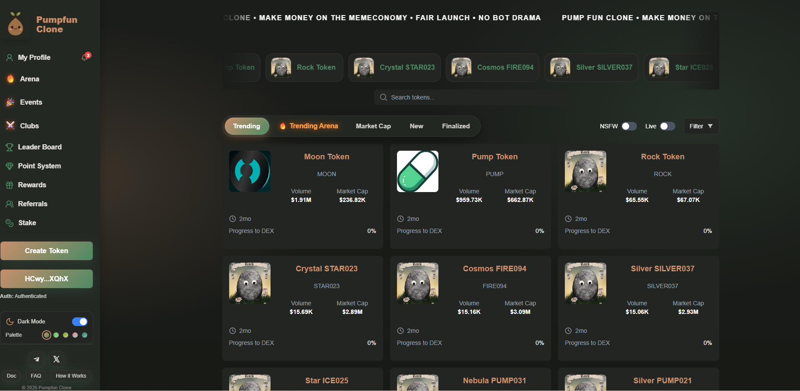
### G.1. Sidebar Navigation
Sidebar cố định bên trái:
- Logo + Brand 
- My Profile (badge notification: 3)
- Arena, Events, Clubs
- Leader Board, Point System, Rewards, Referrals, Stake
- Actions: "Create Token" (green), "Connect Wallet" (green)
- Auth status: "Auth: Not authenticated" / "Auth: Authenticated"
- Dark/Light Mode toggle
- Palette selector (5 options: Seed, Sprout, Bud, Bloom, Canopy)

**Chú ý:** Chưa thấy Creator Dashboard (FR-006) trên sidebar.

### G.2. Wallet Connection
- Modal hỗ trợ: **Phantom**, **Solflare**
- Khi chưa connect: các chức năng sau bị blocked: Create Token, Point System, Rewards & Games

### G.3. Theme System 
- Dark/Light toggle hoạt động
- 5 color palettes thay đổi tone chủ đạo

### G.4. Top Banner 
- Ví dụ: "MEMECONOMY • FAIR LAUNCH • NO BOT DRAMA • PUMP FUN CLONE..."
- Token list carousel phía dưới

---

## 1. FR-001: TOKEN LIST (HOMEPAGE)

**Route:** `/`

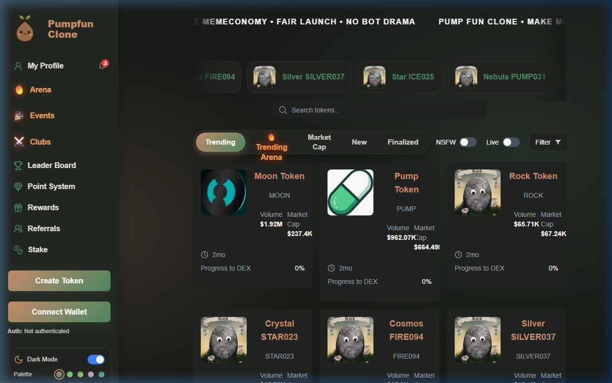

### 1.1. Tabs — So sánh

| Tài liệu BA gốc | MVP thực tế | Status |
|---|---|---|
| Discover (mặc định) | ❌ Không có | Gap |
| Trending | **Trending** (mặc định) ✅ | Default khác tài liệu BA |
| Top Volume | **Market Cap** | Đổi tên |
| Graduated | **Finalized** | Đổi tên |
| Favorite | ❌ Không có | Gap |
| — | **New** ➕ | Mới??? |
| — | **Trending Arena** 🔥 ➕ | Mới??? |

### 1.2. Token Card — So sánh

| Trường trong FRD | MVP | Ghi chú |
|---|---|---|
| Avatar | ✅ | |
| Tên + Symbol | ✅ | |
| Statement | ❌ | |
| Price USD | ❌ | |
| Market Cap | ✅ | Format K/M |
| Volume 24h | ✅ | |
| Price Change 24h | ❌ | |
| Trust Badges | ❌ | |
| Favorite ♡ | ❌ | |
| Progress to DEX | ✅ | ➕ Không có trong bản gốc |
| Created time | ✅ | ➕ Không có trong bản gốc  (có cần thiết không?)　|

### 1.3. Filters
- NSFW toggle ✅, Live toggle ✅ (mới -> để làm gì), Filter button ✅
- Market Cap range ❌, Volume range ❌, Trust Level ❌ -> chưa có

### 1.4. Search
- ✅ Có ô "Search tokens..."

### 1.5. Sorting
- ❌ Chưa thấy có chức năng sort.

---

## 2. FR-002: TOKEN DETAIL

**Route:** `/token/[address]`

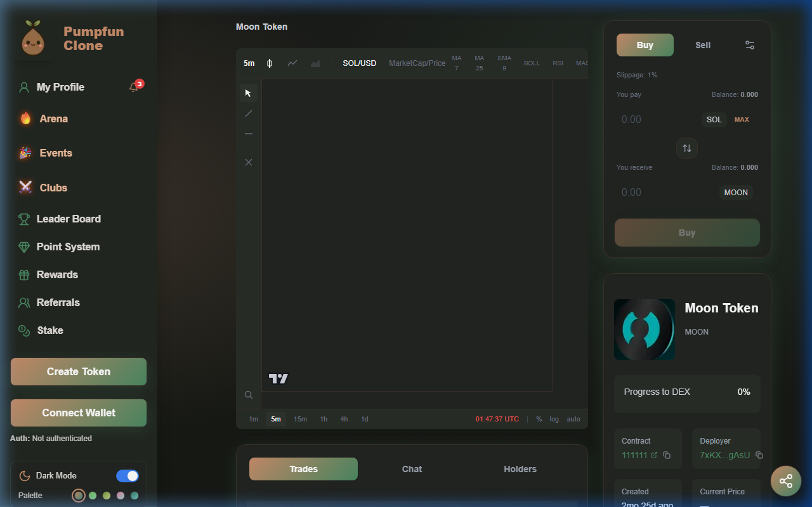

### 2.1. Layout
- Cột trái: Chart + Tabs (Trades/Chat/Holders)
- Cột phải: Trading panel + Token info card

### 2.2. Token Info Card (bên phải)
- Avatar + Tên + Symbol ✅
- Progress to DEX (0%) ✅
- Contract Address + Copy + Solscan link ✅
- Deployer Address (rút gọn) + Copy ✅
- Created date ✅
- Current Price ✅
- Share button (floating) ✅
- Creator Info ❌, Description ❌, Favorite ❌, Social Links ❌ -> chưa có info của creator

### 2.3. Price Chart
- TradingView widget ✅ (khung + logo)
- Timeframes: 1m/5m/15m/1h/4h/1d ✅
- Indicators: MA/EMA/BOLL/RSI/MACD ✅

### 2.4. Tabs

**Trades tab:** Columns visible — Wallet, SOL, Token amount, Timestamp  
**Chat tab:** OK ✅

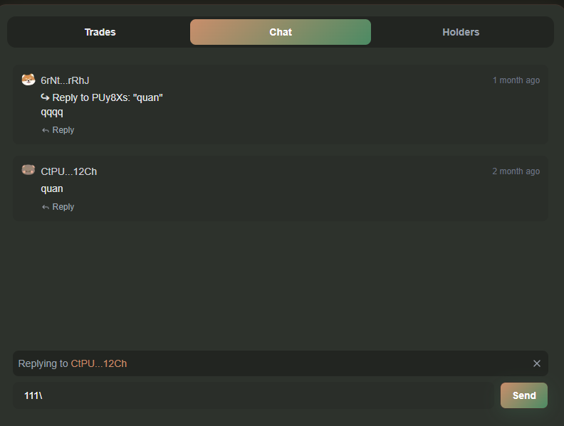

**Holders tab:** Total Holders, Top 10 Concentration, Avg Holders, Bảng top holders ✅
 
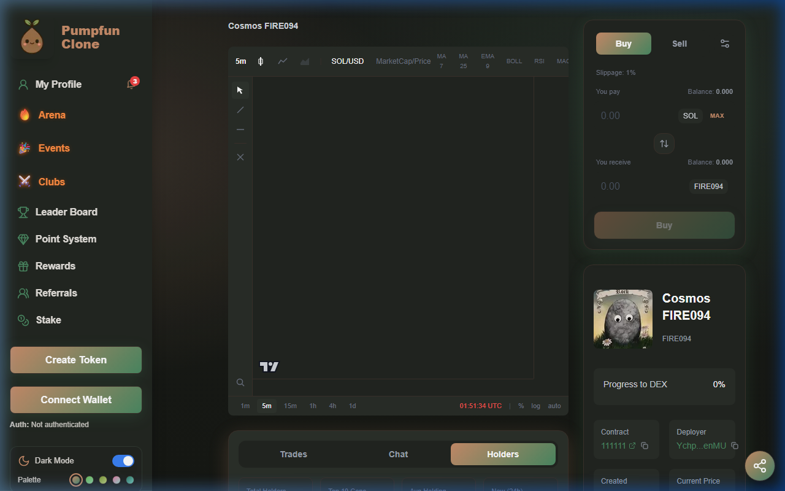

### 2.5. Metrics Grid
- OK ✅
---

## 3. FR-003: BUY/SELL TRADING

**Trading panel cố định bên phải trong Token Detail**

### 3.1. Có trên MVP

| Feature | Status |
|---|---|
| Buy/Sell tabs | ✅ |
| Slippage: 1% | ✅ |
| Settings icon ⚙️ | ✅ |
| "You pay" (SOL) + Balance | ✅ |
| "You receive" (Token) + Balance | ✅ |
| Swap icon ⇅ | ✅ |
| MAX button | ✅ |
| Buy button (green) | ✅ |

### 3.2. Thiếu so với FRD

| Feature | Status |
|---|---|
| Market/Limit Order toggle | ❌ | -> đã bỏ khỏi FRD
| Quick Amount buttons (0.1/0.5/1) | ❌ |
| Currency Switch SOL ⇄ Token | ❌ |
| Fees section (collapsible) | ❌ | -> đã bỏ khỏi FRD
| Anti-MEV toggle | ✅ |
| Priority Fee | ✅ |
| Auto-retry | ❌ |
| Risk Assessment | ❌ | -> đã bỏ khỏi FRD

**Kết luận:** Thiếu vài setting nhỏ

---

## 4. FR-004/005: USER PROFILE

**Route:** `/profile/[wallet_address]`  

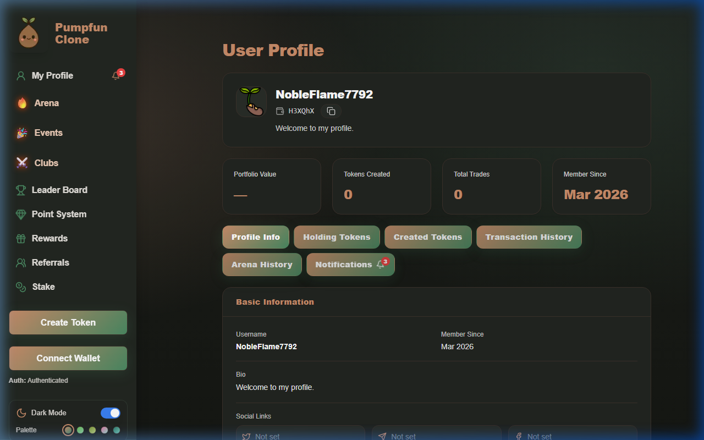

### 4.1. Header
- Avatar (default "A" hoặc custom) ✅
- Username (auto-generated: "NobleFlamme7792" hoặc "Anonymous") ✅
- Wallet address (rút gọn "H3XQhX") + Copy ✅
- Bio ✅

### 4.2. Stats Overview — 4 cards
- Portfolio Value: — ✅
- Tokens Created: 0 ✅
- Total Trades: 0 ✅
- Member Since: Mar 2026 ✅

### 4.3. Tabs — **6 tabs** (FRD yêu cầu 5)

| Tab FRD | Tab MVP | Status |
|---|---|---|
| Holding Tokens | **Holding Tokens** ✅ | |
| Created Tokens | **Created Tokens** ✅ | |
| Transaction History | **Transaction History** ✅ | |
| Edit Profile | (nằm trong Profile Info) | Gộp |
| Limit Orders | ❌ | Gap | -> bỏ
| — | **Profile Info** ➕ | Mới |
| — | **Arena History** ➕ | Mới |
| — | **Notifications** 🔔³ ➕ | Mới |

### 4.4. Profile Info Tab

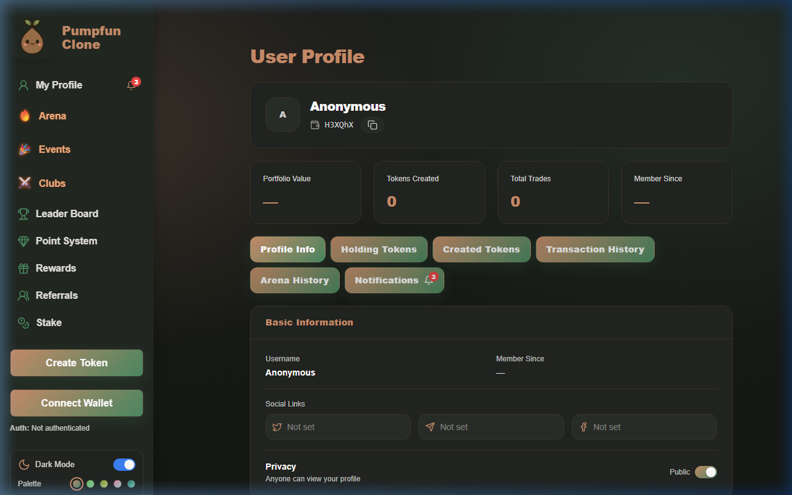

- Basic Information: Username, Member Since ✅
- Social Links: 3 slots (X, Telegram, Website) — "Not set" ✅
- Privacy toggle: Public/Private ✅ — "Anyone can view your profile"

### 4.5. Holding Tokens Tab

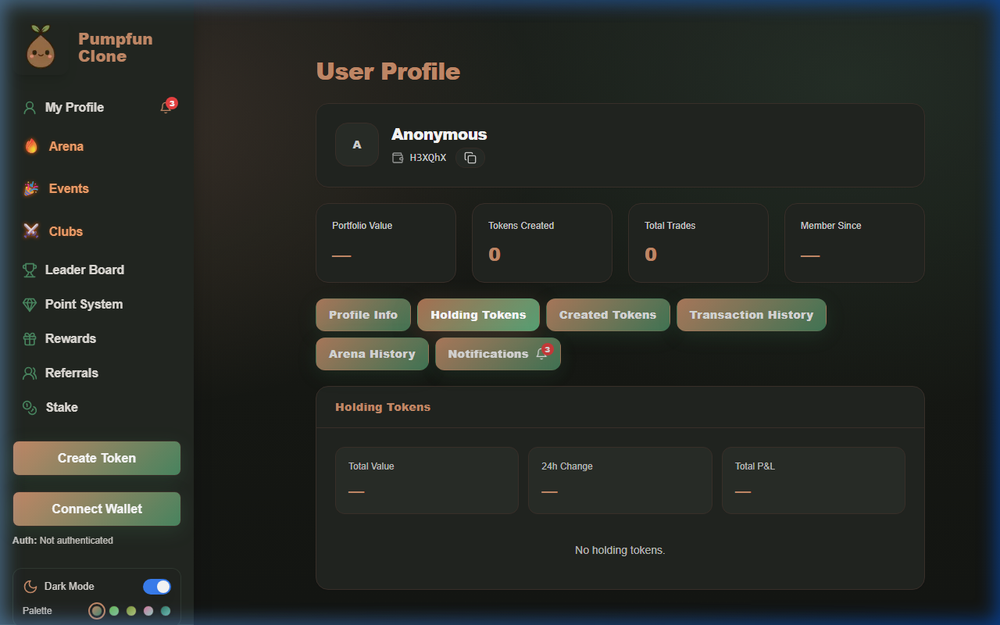

- Stats: Total Value, 24h Change, Total P&L ✅
- Empty state: "No holding tokens." ✅

### 4.6. Thiếu so với FRD
- **Limit Orders tab** ❌ — Không có (vì không có Limit Order) -> bỏ, vì đã bỏ limit order
- **Edit Profile** — gộp vào Profile Info, không tab riêng -> tính là đã đủ

---

## 5. FR-006: CREATOR DASHBOARD

**Route:** `/dashboard`

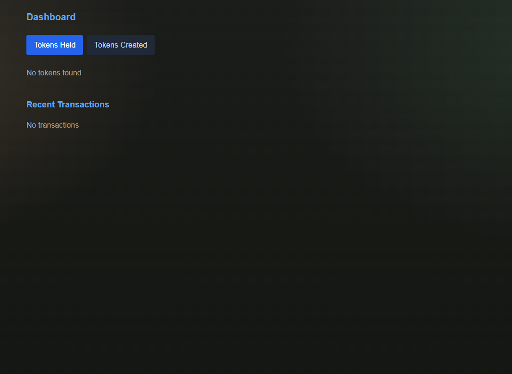
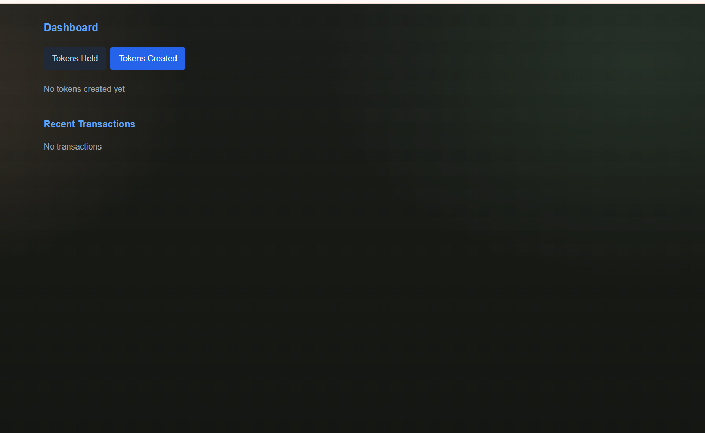

### Trạng thái: 🟡 Partial (cập nhật 16/04)

Khi đã connect wallet, Dashboard hiển thị:

### 5.1. Tabs — 2 tabs
- **Tokens Held** (mặc định) — "No tokens found"
- **Tokens Created** — "No tokens created yet"

### 5.2. Recent Transactions
- Section **"Recent Transactions"** — "No transactions"

### 5.3. So sánh với FRD (FR-006)

| Feature FRD | MVP | Status |
|---|---|---|
| Created Tokens list + Manage button | ❌ Chỉ có tab, chưa rõ logic | Gap |
| Creator Revenue (Total/Unclaimed/Claimed) | ❌ | Gap |
| Claim Revenue function | ❌ | Gap |
| Token Management (Overview/Trusted/Community) | ❌ | Gap |
| Sidebar link | ❌ Không trên sidebar | Gap |

**Kết luận:** Dashboard có route và 2 tabs cơ bản nhưng thiếu toàn bộ logic Creator: Revenue, Claim, Token Management.

---

## 6. FR-007: CREATE TOKEN

**Route:** `/create`

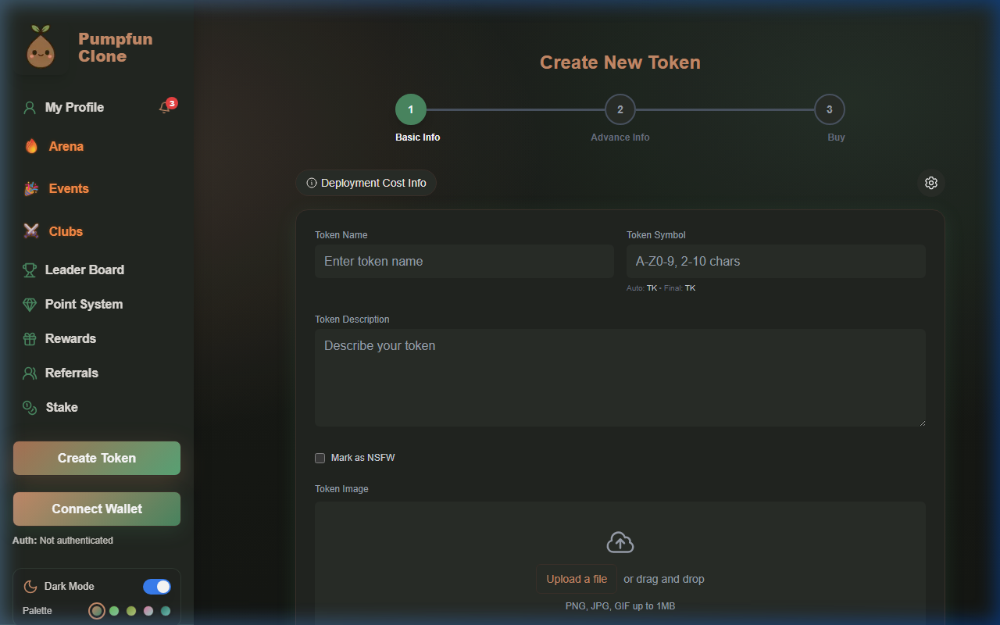

### 6.1. Stepper — 3 steps (FRD: 5 steps)

| FRD | MVP | Status |
|---|---|---|
| 1. Basic Info | **1. Basic Info** ✅ | |
| 2. Avatar | Gộp vào Step 1 | |
| 3. Security | **2. Advance Info** | Đổi tên |
| 4. Initial Buy | **3. Buy** | |
| 5. Review | ❌ | |

### 6.2. Step 1: Basic Info (scrolled)

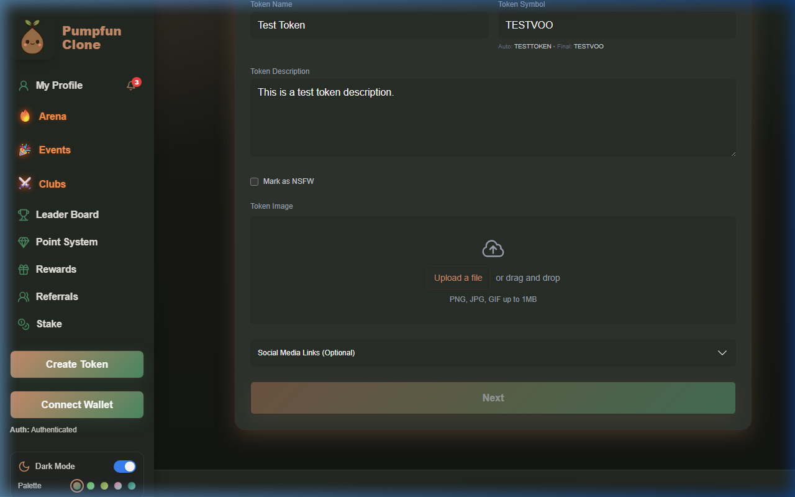

| Field | Status | Chi tiết |
|---|---|---|
| Token Name | ✅ | Input text |
| Token Symbol | ✅ | "A-Z0-9, 2-10 chars" + Auto/Final |
| Token Description | ✅ | Textarea |
| Mark as NSFW | ✅ | Checkbox — ➕ mới |
| Token Image | ✅ | Upload PNG/JPG/GIF ≤1MB |
| Social Media Links | ✅ | Collapsible section (Optional) |
| Deployment Cost Info | ✅ | Banner trên cùng |
| Settings ⚙️ | ✅ | Bên cạnh cost info |
| **Next button** | ✅ | Full-width button cuối trang |
| Statement | ❌ | FRD yêu cầu |
| AI Assist | ❌ | FRD yêu cầu |

### 6.3. Step 2 & 3
- Chưa truy cập được (Step 1 chưa up được ảnh nên chưa đi tiếp được sang các step khác  )

---

## 7. FR-008: LEADERBOARD
Có data đấy, tôi paste ảnh vào rồi, bạn check lại giúp tôi, cả trên trang nữa.
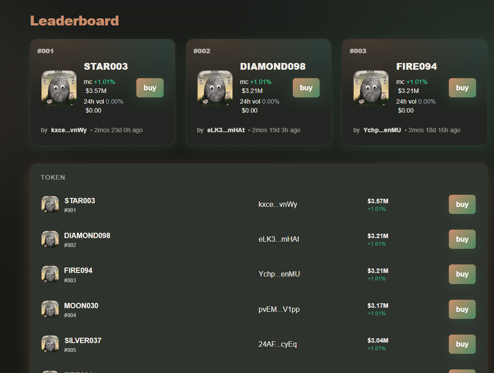
**Route:** `/leaderboard` — 🔴 Trang tồn tại nhưng **"No data"**, không có Top 3 cards, không có table.

---

## 8. FR-009: REWARDS & GAMES

**Sidebar button** — 🟢 UI Ready (cập nhật 16/04)

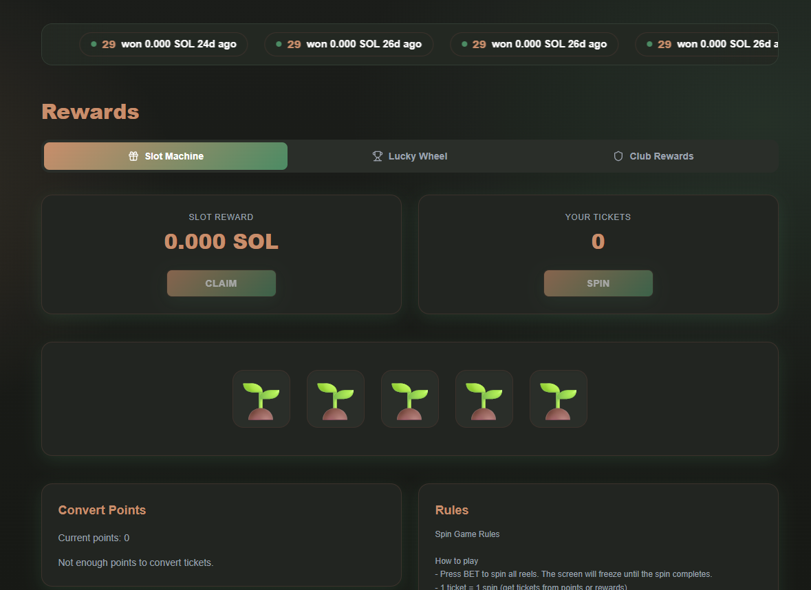
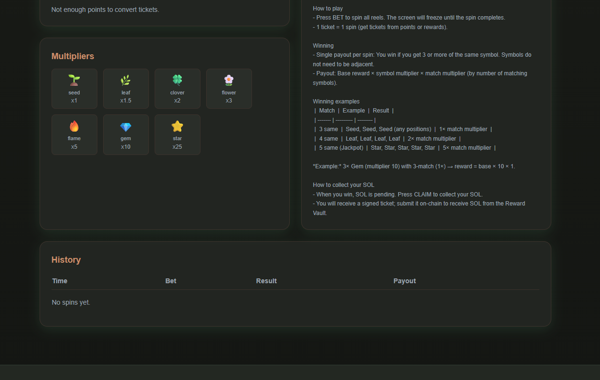
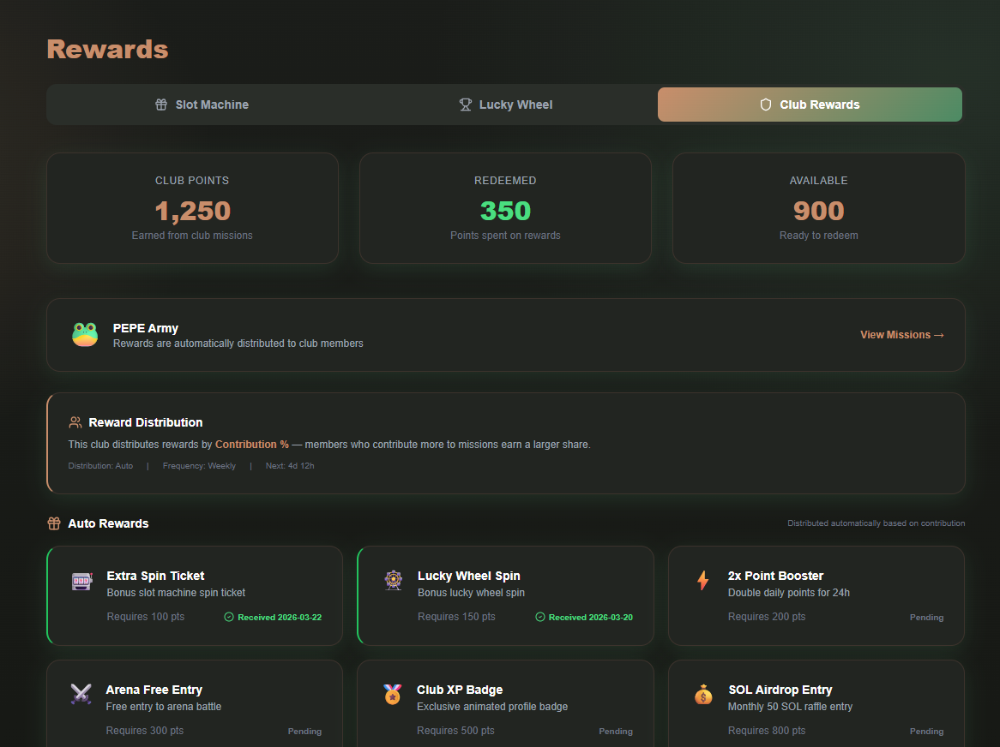
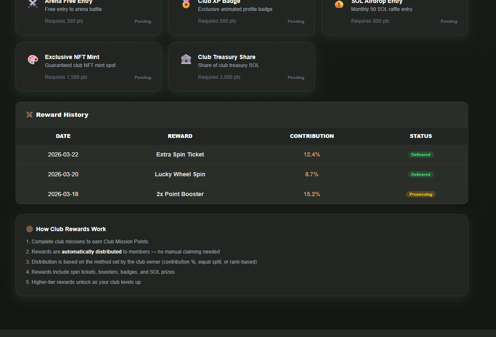

### 8.1. Tabs — **3 tabs** (FRD: 1 game)
- **Slot Machine** (mặc định) ✅
- **Lucky Wheel** ➕ Mới, không trong FRD
- **Club Rewards** ➕ Mới, không trong FRD

### 8.2. Broadcast Banner
- Marquee: "● 29 won 0.000 SOL 24d ago" ✅

### 8.3. Slot Machine Tab

| Feature FRD | MVP | Status |
|---|---|---|
| SLOT REWARD (SOL) | ✅ 0.000 SOL + CLAIM button | |
| YOUR TICKETS count | ✅ 0 + SPIN button | |
| 5 reels slot machine | ✅ 5 reels với plant-themed icons | |
| Multipliers table | ✅ 7 symbols (seed x1, leaf x1.5, clover x2, flower x3, flame x5, gem x10, star x25) | |
| Rules display | ✅ How to play + Winning + How to collect SOL | |
| History table | ✅ Columns: Time, Bet, Result, Payout — "No spins yet." | |
| Convert Points section | ✅ "Current points: 0" + "Not enough points to convert tickets." | |

**So với FRD:** Symbols KHÁC (FRD: 🌱🌿🌳🍀🌼, MVP: seed/leaf/clover/flower/flame/gem/star — 7 loại thay vì 5). Multipliers phong phú hơn.

### 8.4. Club Rewards Tab (MỚI — không trong FRD)
- **Stats:** Club Points: 1,250 / Redeemed: 350 / Available: 900
- **Club info:** PEPE Army — "Rewards are automatically distributed to club members"
- **Reward Distribution:** By Contribution % — Auto, Weekly, Next: 4d 12h
- **Auto Rewards (8 tiers):**
  - Extra Spin Ticket (100 pts) — Received
  - Lucky Wheel Spin (150 pts) — Received
  - 2x Point Booster (200 pts) — Pending
  - Arena Free Entry (300 pts), Club XP Badge (500 pts), SOL Airdrop Entry (800 pts)
  - Exclusive NFT Mint (1,500 pts), Club Treasury Share (3,000 pts)
- **Reward History:** Columns: DATE, REWARD, CONTRIBUTION, STATUS (Delivered/Processing)
- **How Club Rewards Work:** 5-step explanation

---

## 9. FR-010: REFERRALS

**Route:** `/referrals`

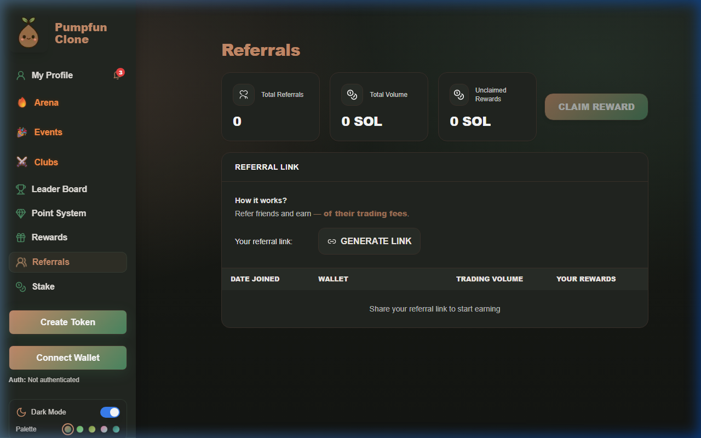

### 9.1. Stats Overview — 3 cards + CTA
- Total Referrals: 0 ✅
- Total Volume: 0 SOL ✅ (FRD: "Total Earnings")
- Unclaimed Rewards: 0 SOL ✅ (➕ mới)
- CLAIM REWARD button ✅

### 9.2. Referral Link Section
- "How it works?" + description ✅
- Your referral link + GENERATE LINK button ✅

### 9.3. Referred Users Table
- Columns: DATE JOINED, WALLET, TRADING VOLUME, YOUR REWARDS ✅
- Empty state: "Share your referral link to start earning" ✅

---

## 10. FR-011: POINTS SYSTEM

**Sidebar button** — 🟢 UI Ready (cập nhật 16/04)

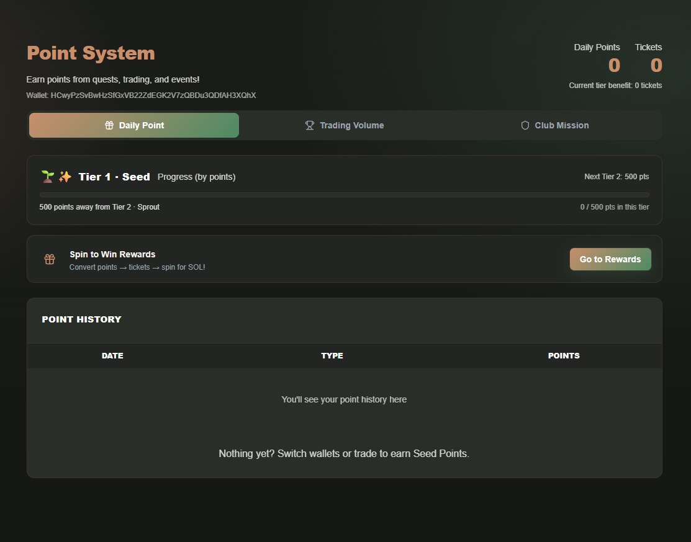
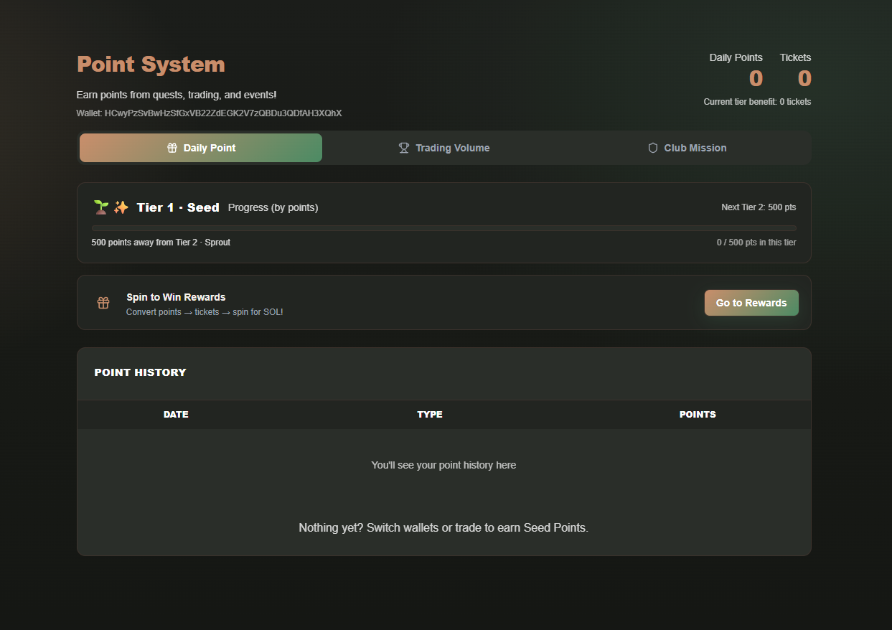
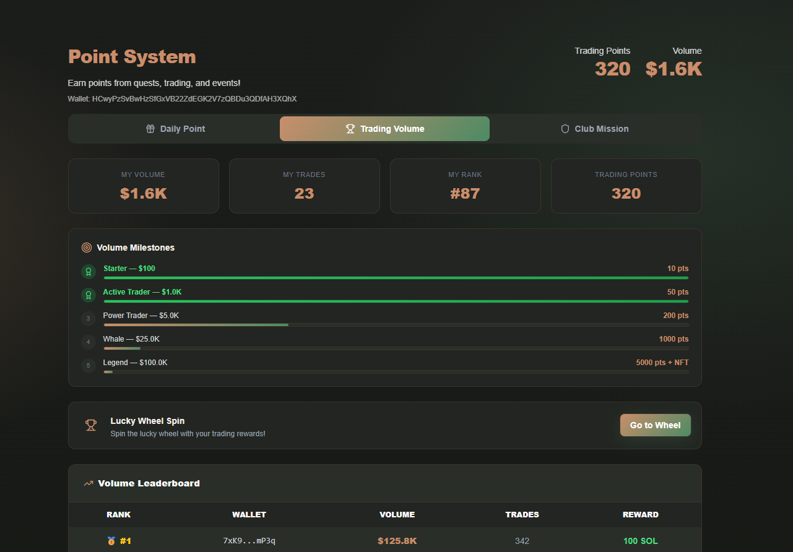
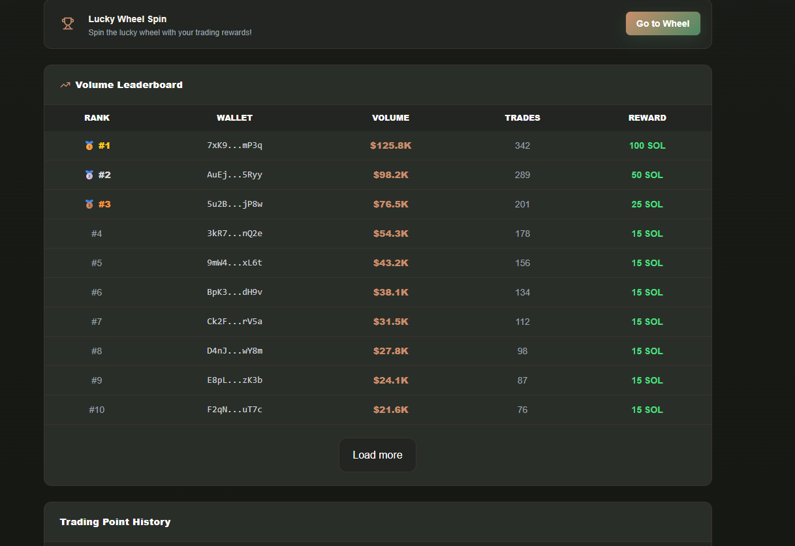
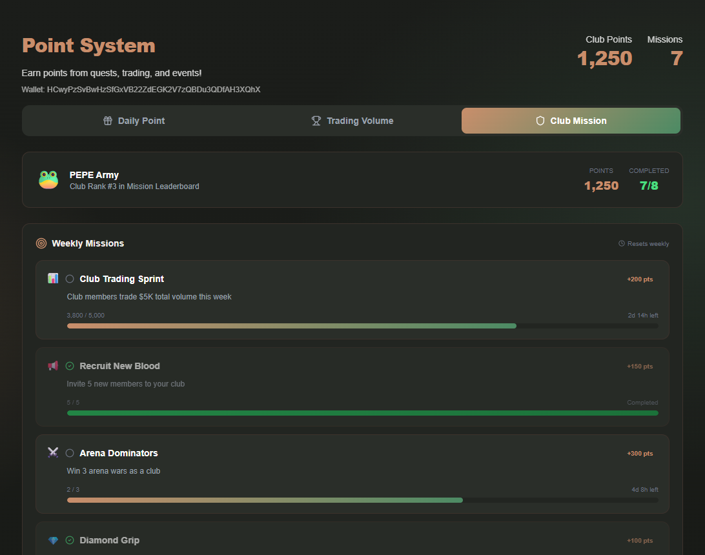
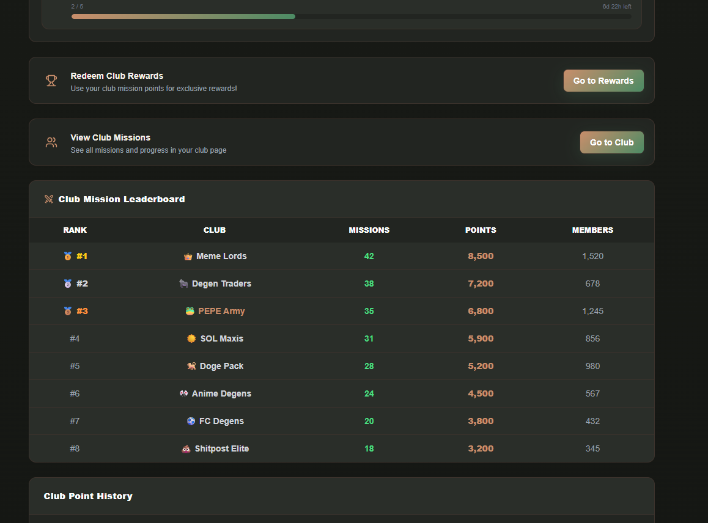
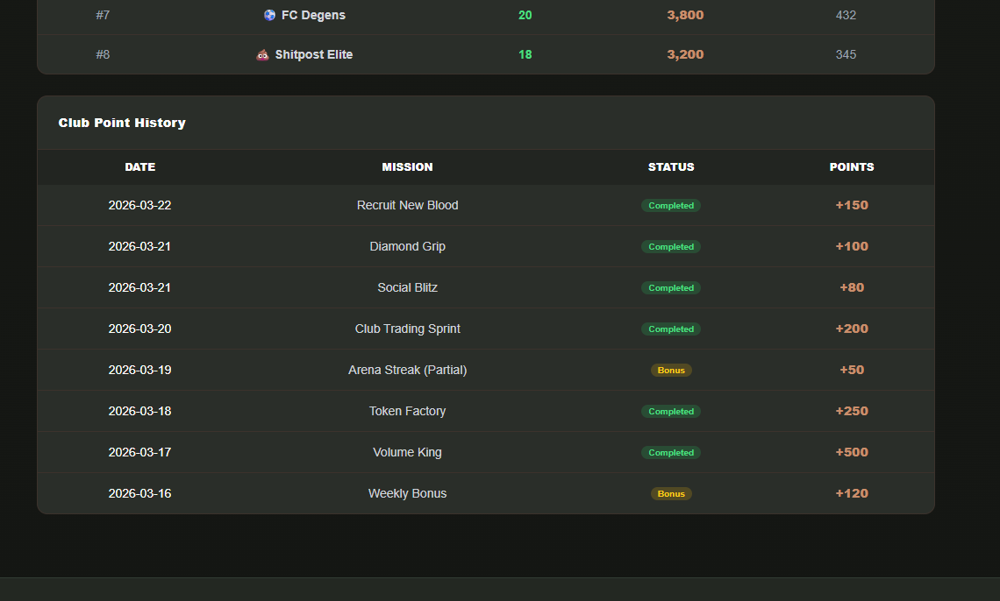

### 10.1. Header
- Title: **"Point System"**
- Subtitle: "Earn points from quests, trading, and events!"
- Wallet address: hiển thị đầy đủ ✅
- Stats (top-right): Daily Points / Tickets / Trading Points / Volume / Club Points / Missions

### 10.2. Tabs — **3 tabs** (FRD không phân chia tabs)
- **Daily Point** (mặc định)
- **Trading Volume** ➕ Mới
- **Club Mission** ➕ Mới

### 10.3. Daily Point Tab
- **Rank card:** 🌱✨ Tier 1 · Seed — Progress bar + Next Tier: 500 pts ✅
- "500 points away from Tier 2 · Sprout" + "0 / 500 pts in this tier" ✅
- **CTA:** "Spin to Win Rewards" → "Go to Rewards" button ✅
- **Point History:** Columns: DATE, TYPE, POINTS ✅
- Empty state: "You'll see your point history here" + "Nothing yet? Switch wallets or trade to earn Seed Points." ✅

### 10.4. Trading Volume Tab (MỚI — không trong FRD)
- **Stats cards:** MY VOLUME ($1.6K) / MY TRADES (23) / MY RANK (#87) / TRADING POINTS (320)
- **Volume Milestones (5 tiers):**
  - 🥇 Starter — $100 → 10 pts
  - 🥈 Active Trader — $1.0K → 50 pts
  - 3. Power Trader — $5.0K → 200 pts
  - 4. Whale — $25.0K → 1000 pts
  - 5. Legend — $100.0K → 5000 pts + NFT
- **CTA:** "Lucky Wheel Spin" → "Go to Wheel" button
- **Volume Leaderboard:** Columns: RANK, WALLET, VOLUME, TRADES, REWARD (SOL)
  - Top 10 hiển thị, #1: $125.8K / 342 trades / 100 SOL
  - "Load more" button
- **Trading Point History:** Columns: DATE, ACTION (Buy/Sell token), VOLUME ($), POINTS (+XX)

### 10.5. Club Mission Tab (MỚI — không trong FRD)
- **Club info:** PEPE Army — Club Rank #3 — Points: 1,250 / Completed: 7/8
- **Weekly Missions (reset weekly):**
  - Club Trading Sprint ($5K volume) — 3,800/5,000, +200 pts, 2d 14h left
  - Recruit New Blood (5 members) — 5/5, Completed, +150 pts
  - Arena Dominators (win 3 wars) — 2/3, +300 pts, 4d 8h left
  - Diamond Grip (hold linked token 3 days) — 3/3, Completed, +100 pts
  - Token Factory (create 3 tokens) — 1/3, +250 pts, 5d 20h left
  - Volume King ($20K volume) — 12,400/20,000, +500 pts, 6d 2h left
  - Social Blitz (20 social posts) — 20/20, Completed, +80 pts
- **CTAs:** "Redeem Club Rewards" → "Go to Rewards" / "View Club Missions" → "Go to Club"
- **Club Mission Leaderboard:** Columns: RANK, CLUB, MISSIONS, POINTS, MEMBERS
  - #1 Meme Lords (42 missions, 8,500 pts, 1,520 members)
  - 8 clubs hiển thị
- **Club Point History:** Columns: DATE, MISSION, STATUS (Completed/Bonus), POINTS

### 10.6. So sánh với FRD (FR-011)

| Feature FRD | MVP | Status |
|---|---|---|
| Rank display (5 tiers) | ✅ Tier 1 Seed hiển thị | |
| Progress bar | ✅ | |
| Points History (DATE/TYPE/POINTS) | ✅ | |
| Points Calculation (Referral/Trade/Creation) | 🟡 Có Trading, chưa thấy rõ Referral/Creation | |
| — Trading Volume tab | ➕ Mới, rất chi tiết | |
| — Volume Milestones (5 tiers) | ➕ Mới, FRD không có | |
| — Volume Leaderboard + SOL Rewards | ➕ Mới | |
| — Club Mission tab | ➕ Mới, liên kết Club system | |
| — Weekly Missions + progress bars | ➕ Mới | |
| — Club Mission Leaderboard | ➕ Mới | |

**Kết luận:** Point System trên MVP **vượt xa FRD gốc**. FRD chỉ mô tả 1 trang đơn giản (rank + history), MVP có 3 tabs phong phú với Trading Volume milestones, leaderboard SOL rewards, và Club Mission system hoàn chỉnh.

---

## 11. ARENA / PREDICTION MARKET (MỚI)

**Route:** `/arena` — Module hoàn toàn mới, không trong FRD gốc.

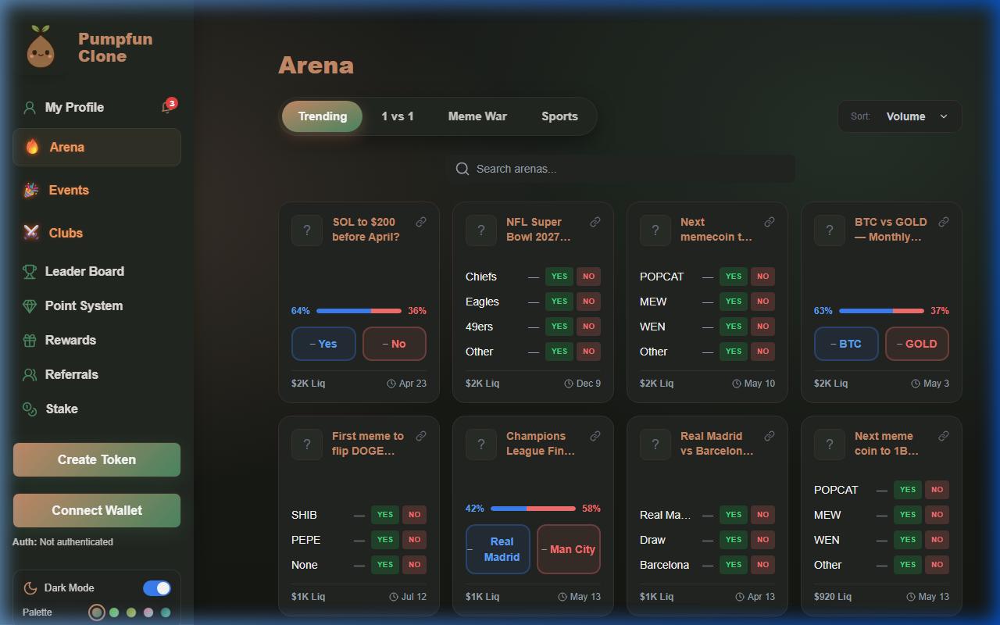

### 11.1. Category Tabs
- **Trending** (mặc định) | **1 vs 1** | **Meme War** | **Sports**

### 11.2. Arena Card
- Tiêu đề câu hỏi + share icon
- Options với nút YES/NO
- Tỷ lệ cược progress bar (64%—36%)
- Liquidity ($2K Liq), Deadline (Apr 23)
- Sort: Volume dropdown
- Search: "Search arenas..."

### 11.3. Types
- Binary (Yes/No): "SOL to $200 before April?"
- Multi-option: "NFL Super Bowl 2027" (Chiefs/Eagles/49ers/Other)
- 1 vs 1: "BTC vs GOLD — Monthly"

---

## 12. FR-015: EVENTS & QUESTS (MỚI)

**Route:** `/events`

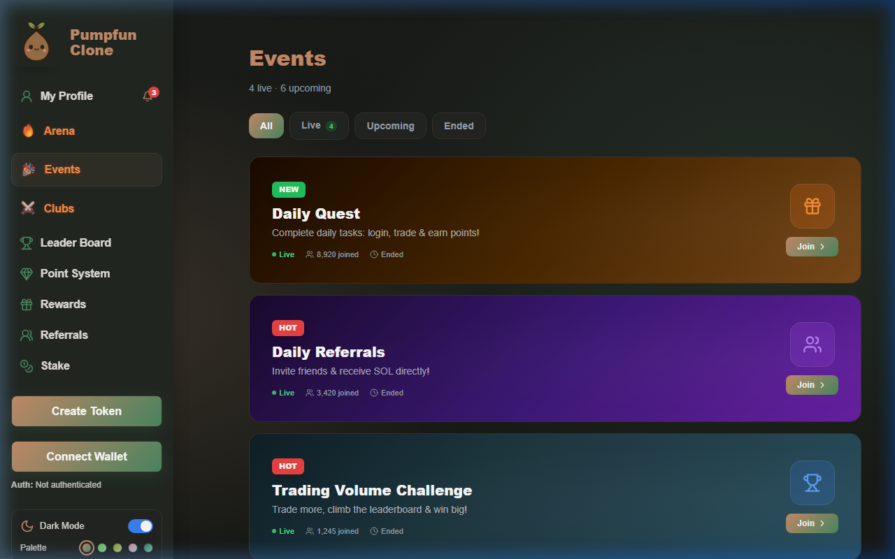

### 12.1. Stats & Tabs
- "4 live · 6 upcoming"
- Tabs: **All** | **Live** (badge 4) | **Upcoming** | **Ended**

### 12.2. Event Cards
- Badge: NEW (green), HOT (red)
- Name, Description, ● Live status, 👥 joined count, ⏰ Ended
- "Join >" button
- Gradient backgrounds (gold, purple, teal)
- Events: Daily Quest, Daily Referrals, Trading Volume Challenge

---

## 13. FR-014: CLUBS (MỚI)

**Route:** `/clubs`

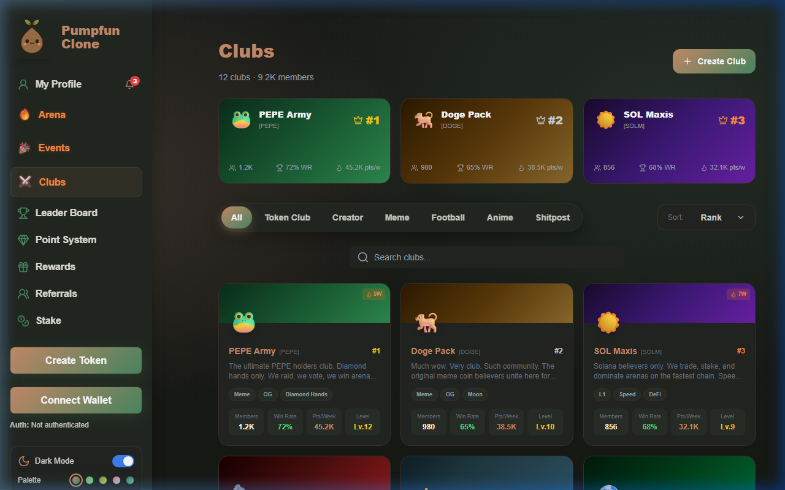

### 13.1. Header
- "12 clubs · 9.2K members", "+ Create Club" button

### 13.2. Top 3 Banner
- #1 PEPE Army [PEPE] — 1.2K members, 72% WR, 45.2K pts/w
- #2 Doge Pack [DOGE] — 980, 65% WR
- #3 SOL Maxis [SOLM] — 856, 68% WR

### 13.3. Category & Sort
- Tabs: All | Token Club | Creator | Meme | Football | Anime | Shitpost
- Sort: Rank, Search: "Search clubs..."

### 13.4. Club Card
- Avatar, Name+Tag, Rank, Age badge, Description, Tags
- Members, Win Rate, Pts/Week, Level

---

## 14. STAKING (MỚI)

**Route:** `/stake`

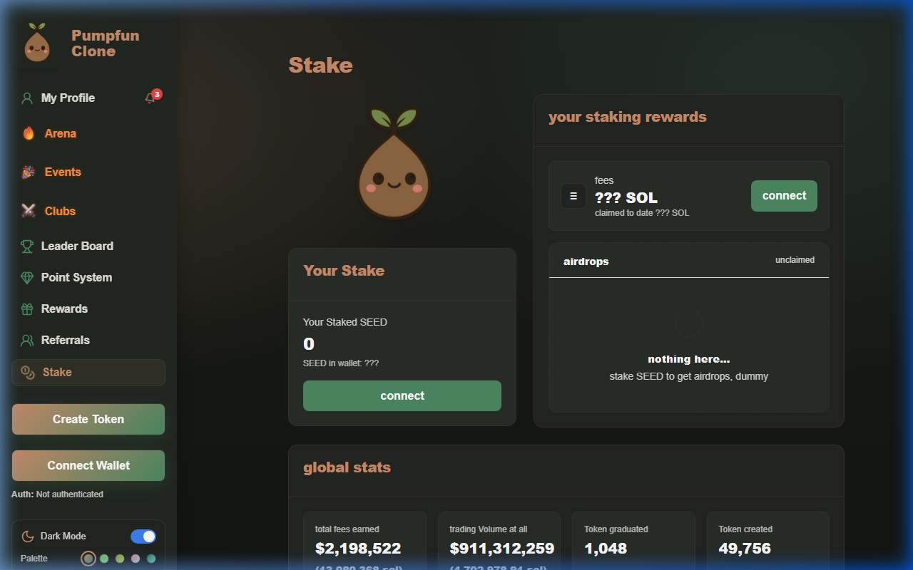

### 14.1. Your Stake
- Your Staked SEED: 0, SEED in wallet: ???, "connect" button

### 14.2. Staking Rewards
- Fees: ??? SOL, claimed to date ??? SOL
- Airdrops: "nothing here... stake SEED to get airdrops, dummy"

### 14.3. Global Stats
| Stat | Value |
|---|---|
| Total fees earned | $2,198,522 |
| Trading Volume | $911,312,259 |
| Token graduated | 1,048 |
| Token created | 49,756 |

---

## BẢNG TỔNG HỢP GAP ANALYSIS

### FRD gốc vs MVP

| FR | Module | UI | Data | Gap |
|---|---|:---:|:---:|---|
| FR-001 | Token List | ✅ | ✅ test | **MEDIUM** — Thiếu Discover/Favorite tabs, card fields |
| FR-002 | Token Detail | ✅ | 🟡 | **MEDIUM** — Thiếu metrics grid |
| FR-003 | Buy/Sell | ✅ | ❌ | **HIGH** — Thiếu Limit Order, advanced settings |
| FR-004/005 | Profile | ✅ | 🟡 | **LOW** — Gộp My/Public, thêm Arena History, Notifications |
| FR-006 | Creator Dashboard | 🟡 | 🔴 | **HIGH** — Có tabs nhưng thiếu Creator logic |
| FR-007 | Create Token | ✅ | 🟡 | **MEDIUM** — 3 steps thay 5, thiếu AI Assist |
| FR-008 | Leaderboard | 🟡 | 🔴 | **HIGH** — No data |
| FR-009 | Rewards | ✅ | ✅ test | **LOW** — Vượt FRD (3 tabs, Club Rewards) |
| FR-010 | Referrals | ✅ | 🟡 | **LOW** |
| FR-011 | Points | ✅ | ✅ test | **LOW** — Vượt FRD (3 tabs, Volume, Club Mission) |

### Modules MỚI (chưa có FRD)

| Module | Route | UI | Data | Cần FRD mới |
|---|---|:---:|:---:|---|
| Arena | `/arena` | ✅ | ✅ test | ✅ |
| Events | `/events` | ✅ | ✅ test | ✅ |
| Clubs | `/clubs` | ✅ | ✅ test | ✅ (đã có FR-014) |
| Staking | `/stake` | ✅ | 🟡 | ✅ |

---

## ROUTES ĐÃ KIỂM TRA

| Route | Kết quả |
|---|---|
| `/` | ✅ Homepage |
| `/arena` | ✅ Arena page |
| `/events` | ✅ Events page |
| `/clubs` | ✅ Clubs page |
| `/clubs/create` | ✅ Create club form |
| `/token/[address]` | ✅ Token detail |
| `/create` | ✅ Create token wizard |
| `/stake` | ✅ Staking page |
| `/referrals` | ✅ Referrals page |
| `/leaderboard` | ✅ Exists (no data) |
| `/dashboard` | ✅ Exists (placeholder) |
| `/profile/[wallet]` | ✅ User profile |
| `/profile` | ❌ 404 |
| `/creator` | ❌ 404 |
| `/creator-dashboard` | ❌ 404 |
| `/notifications` | ❌ 404 |
| `/settings` | ❌ 404 |
| `/rewards` | ❌ 404 (sidebar button only) |
| `/points` | ❌ 404 (sidebar button only) |
| `/wars` | ❌ 404 |
| `/club-war` | ❌ 404 |
| `/quest` | ❌ 404 |

---

## KẾT LUẬN

MVP đi **rộng hơn FRD** (Arena, Events, Clubs, Staking) nhưng **nông hơn ở core** (Trading, Creator Dashboard).

### Ưu tiên hành động:
1. **Fix core:** Token List → Token Detail → Buy/Sell (API, data)
2. **Build Creator Dashboard** (FR-006) — critical gap
3. **Nâng cấp Trading** (Limit Order, Advanced Settings)
4. **Viết FRD bổ sung** cho Arena, Events, Staking
5. **Triển khai Trust Score** trên UI
